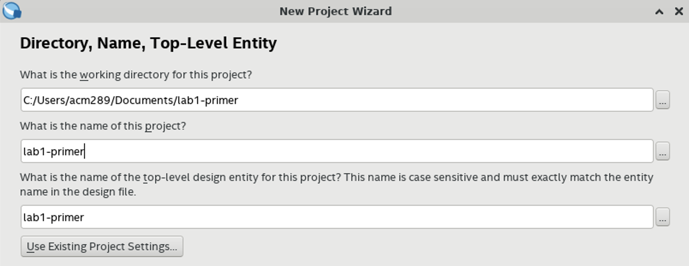

Lab 1 Intro: FPGA Development Primer
==========================================================================

Before jumping into Lab 1, it's important to understand the tools we'll be
working with. All lab assignments will include an FPGA component, where
you'll emulate your design. FPGAs (short for Field Programmable Gate
Arrays) are a special type of hardware that can be programmed to represent
any digital logic function. When we program an FPGA to represent a
specific piece of hardware, the FPGA is _emulating_ our design, and will
perform the same logic functions. Because of this, FPGAs are used
extensively for early prototyping of designs; since they are actual
hardware, they can run much faster than simulations and without forcing
a designer to fabricate their design. In this primer, we'll become
familiar with using FPGAs by emulating a design from lecture.

1. Setting up a Quartus Project
--------------------------------------------------------------------------

FPGAs often come with _development environments_. These environments are
large pieces of software that help get your design from a hardware
description language to something that can be programmed on the FPGA. This
includes:

 - Determining what resources are needed to represent your design (known
   as __synthesis__). An example of this would be determining what your
   design needs 3 AND gates and 2 OR gates.
 - __Placing__ your design - determining which FPGA resources will be
   used to represent your design
 - __Routing__ the different logic components together to represent your
   design

For this class, we will be using Quartus as our development environment.
Quartus is installed on all lab machines, and will be used during the
FPGA portions of lab assignments to put your design on the FPGA.

### 1.1. Creating a New Quartus Project

First, let's use Quartus to create our project. To start Quartus, click
the _Start_ menu, then search for _Quartus_.

!!! info "Quartus Start-Up"

    You may see the following prompt when starting Quartus:
    
    Select "Run the Quartus Prime software", then click _OK_. We've found
    that Quartus often quits the first time after this, so you may need to
    re-open the application.

After starting Quartus, go to _File -> New Project Wizard_. This will
start an interactive prompt menu to help create your project. In the
menu:

 - __Directory, Name, Top-Level Entity__:
    - Using the file searcher, create a new directory for your project
      in your Documents. Name it `lab1_primer`. Select this as the 
      "working directory" for your project - the path should look like
      `C:/Users/netid/Documents/lab1_primer`
    - Name your project `lab1_primer` by typing in the appropriate field.
      The "top-level design entity" should be automatically filled 
      appropriately
    - Click _Next_
   
 - __Project Type__:
    - Select "Empty Project
    - Click _Next_
   
 - __Add Files__:
    - Skip this for now; we'll add our design files later
    - Click _Next_
 - __Family, Device & Board Settings__:
    - Switch to the _Board_ tab:
       - Make sure "Family" is set to _Cyclone V_ and "Development Kit" is
         set to _Any_
       - Select _DE0-CV Development Board_ (this is the FPGA board for the
         class)
       - Make sure "Create top-level design file" is checked
    - Click _Next_
   
 - __EDA Tool Settings__:
    - Skip this section for now. These are extra tools that can be used
      to analyze your design, but we won't be using them
    - Click _Next_
 - __Summary__:
    - Click _Finish_ to finish creating your project

Wait for Quartus to set up your project. After that, you'll be left with
a blank project to work on and configure as we wish.

### 1.2. The Top-Level Module

One of the hardest parts of working with FPGAs is making sure that the
development environment knows how to map your design to the physical
pins on the board. Luckily, Quartus was able to do this for us - when we
selected "Create top-level design file", Quartus automatically created
a template module, and hooked up all of the pins correctly in its
configuration. This module is now the __top-level module__; it is the
module that will actually be put on the board. If we want to create any
extra logic, it must be contained within this module.

To see what this module looks like, go to the _Project Navigator_, and
change the entities from _Hierarchy_ to _Files_. You should see a file
named `DE0_CV_golden_top.v`; this is the file where our top-level module
was generated. Double-click the listing to open the file in Quartus.

!!! warning "Missing Top-Level File"

    If this file is missing, you may not have selected the _DE0-CV 
    Development Board_, or may not have checked "Create top-level design
    file" when creating your project.

The module should look very similar to Verilog modules that you've seen
in lecture, although with _many_ inputs and outputs. These represent all
of the possible inputs and outputs of our FPGA hardware. We won't use all
of these right now, but will instead focus on two signals in particular:

 - `SW`: The physical switches on the board. These are a logical `1` or 
         `0` depending on whether the switch is up or down, respectively.
         These are coming into our FPGA hardware, and are therefore 
         _inputs_ to the top-level module.
 - `LEDR`: The LEDs on the board. These are "on" or "off" depending on
           whether our logic sets them to a `1` or `0`, respectively.
           These are going out of our FPGA hardware, and are therefore
           _outputs_ of the top-level module.

These signals are _arrays_; they represent a collection of multiple
wires. You can access an individual signal using the bracket notation,
similar to many programming languages. For example, if you wanted to
set the 0th LED (the first one in the array, starting at 0) to the
logical AND of the 0th and 1st switches, you might write

```verilog
and(LEDR[0], SW[0], SW[1]);
```

Let's make a module so that we can perform logic with our switch and
LED signals!

2. Integrating a Hardware Design into Quartus
--------------------------------------------------------------------------

In this section, we'll add logic corresponding to the following gate-level
network:


!!! info "Code Re-Use"

    This gate-level network should look familiar; we used this in
    [Section 2](./ece2300-sec02-verilog-gl.md). Feel free to re-use your
    code from then; if you haven't already, make sure to try out the
    [Boolean Equations](./ece2300-sec02-verilog-gl.md#7-to-do-on-your-own),
    as we'll be using them in Lab 1 and beyond.

To add our own logic, we'll create a new module, and instantiate it within
our top-level module. It's good practice to have only one module in a file
(with the filename being the same as the name of the module it contains),
so let's first add a new file to our project

### 2.1. Implementing Hardware Directly within Quartus

To create a new file within your Quartus project:

 - Go to _File -> New_
 - Click on _Verilog HDL File_, then select _OK_
 - You should now see a blank Verilog file. Go to _File -> Save As_, and
   save this file as `PairTripleDetector.v` within your `lab1_primer` 
   directory

We now have a new Verilog file that's included as part of our design - 
from here, we can add or new logic inside of it

!!! info "Existing Files"

    For this primer, we'll be creating and editing our design files
    directly within Quartus. However, this won't be the case for the
    labs, where you will be downloading and using the design you've
    already simulated/tested on `ecelinux`. Later on, when you wish to add
    files that already exist, you can do so by going to 
    _Project -> Add/Remove Files in Project_

When we add new blocks of logic, we want to add them as _modules_. This
involves first creating the module, and then instantiating it wherever we
want that logic.

First, let's define our module. In `PairTripleDetector.v`, define a module
named `PairTripleDetector` that represents the gate-level network above, 
exactly as done in [section](https://github.com/cornell-ece2300/ece2300-sec02).
Make sure that it has three inputs (`in0`, `in1`, and `in2`), and one
output (`out`). Make sure that it contains the logic to implement the
gate-level network above. Lastly, make sure to save the file when
you're done (_File -> Save_)

### 2.2. Connecting to the Top-Level Module

From here, we can _instantiate_ this module - create an instance of the
hardware it represents. In your `DE0_CV_golden_top.v` (which contains
the top-level `DE0_CV_golden_top` module), if you scroll to the bottom,
you'll notice the module is currently empty - it doesn't contain any
logic yet. Let's add some functionality by _instantiating_ our
`PairTripleDetector` module within the `DE0_CV_golden_top` module - let's
give it the name `my_detector`.

!!! info "Instantiation Syntax"

    If you don't quite remember how to instantiate modules, feel free to
    reference [Topic 2, page 18](https://www.csl.cornell.edu/courses/ece2300/handouts/ece2300-T02-logic-gates.pdf#page=18) 
    for a good example.

The module should have the following connections:

 - `in0` should be connected to the 0th switch (`SW[0]`)
 - `in1` should be connected to the 1st switch (`SW[1]`)
 - `in2` should be connected to the 2nd switch (`SW[2]`)
 - `out` should be connected to the 0th LED (`LEDR[0]`)

Once you're done, your top-level module should look like the following:

```verilog
module DE0_CV_golden_top (
  ...
);

  PairTripleDetector my_detector (
    .in0 (SW[0]),
    .in1 (SW[1]),
    .in2 (SW[2]),
    .out (LEDR[0])
  );

endmodule
```

Make sure to save this file as well.

!!! tip "Module Re-Use"

    One of the biggest benefits of modules is that, once they're defined,
    they can be instantiated _multiple_ times. This is super nice for us
    as designers - we can achieve high amounts of code re-use through
    this modularity. This will be a theme in the course, and you'll get
    your first taste of it in Lab 1

### 2.2. Adding Timing Information

In addition to the above, we need to give Quartus information about our
timing constraints, so that it can properly analyze the timing of our
design and analyze the critical path.

 - Similar to before, go to _File -> New_ to create a new file. This time,
   select "Synopsys Design Constraints File"
 - Inside the file, add the following Tcl commands:

```tcl
set_time_format -unit ns -decimal_places 3
create_clock -period 20 [get_ports {CLOCK_50}]

set_input_delay -add_delay -clock { CLOCK_50 } -max 0 [get_ports SW*]
set_input_delay -add_delay -clock { CLOCK_50 } -min 0 [get_ports SW*]

set_output_delay -add_delay -clock { CLOCK_50 } -max 0 [get_ports LEDR*]
set_output_delay -add_delay -clock { CLOCK_50 } -min 0 [get_ports LEDR*]
```

!!! note "Timing Commands"

    We won't delve into these commands too much, but at a high-level,
    we're telling Quartus to not factor in delay from these ports, so out
    timing results should only represent the delay in our design.

 - Go to _File -> Save As_, and save this file as `timing.sdc` within your
   `lab1_primer` directory

With the timing information and our design logic, we should be good to
start putting our design on the FPGA!

3. Synthesizing a Hardware Design using Quartus
--------------------------------------------------------------------------

From here, we can "synthesize" our design for the FPGA. The "synthesis"
step includes:

 - __synthesis__ (determining what resources we need for our design)
 - __placement__ (determining which FPGA resources will be used)
 - __routing__ (connecting the FPGA resources as appropriate)

At the end, we'll be left with a compiled version that can be immediately
put on the FPGA - this is known as a _bitstream_.

In Quartus, you can perform the synthesis step by going to
_Processing -> Start Compilation_, or clicking the blue "play" button in
the top toolbar. This will start the synthesis step - here, the FPGA is 
using many complicated tools, so the entire process may take a few
minutes. You can keep track of the progress in the _Tasks_ bar on the 
left-hand side, as well as with the verbose output log in the bottom. If 
you made any static errors (such as incorrect syntax, or mixing up inputs
and outputs), this is where Quartus will let you know with an errors. 
However, it can't check for dynamic behavior (errors in the logic of your
design), as it doesn't know the correct logic - that's up to you as a
designer.

If you get no errors, after a few minutes, you should see the following
output in the log produced at the bottom of Quartus:

```text
Quartus Prime Full Compilation was successful
```

4. Analyzing a Hardware Design using Quartus
--------------------------------------------------------------------------

Once we've synthesized our design, Quartus will also give us some reports
about our design. These are _CRITICAL_ for us as designers to understand
the tradeoffs between our different designs, and can help us analyze which
one might be "better" in different circumstances.

### 4.1. RTL Viewer

First, Quartus can help us visualize what logic our RTL design maps to.
Go to _Tools -> Netlist Viewers -> RTL Viewer_. This should open up a
new window to view how Quartus implemented our design.


We can see that our RTL design takes in some of the switches as inputs,
and outputs to an LED.

Our modules are initially represented as boxes (abstracting away the
internal logic), but we can also click the "+" to open up the design
and see the underlying gate-level network that Quartus mapped our
design to


When you're finished, you can close this pop-up window.

### 4.2. Technology Map Viewer

The RTL Viewer showed us the gate-level network, but what if we want to
visualize exactly which resources were used on the FPGA? The 
_Technology Map Viewer_ can help us with this.

 - Go to _Tools -> Netlist Viewers -> Technology Map Viewer (Post-Fitting)_.
   This should open up a pop-up window that shows our _entire_ design that
   came with our template top-level module.
 - To focus on our design:
    - Click the "+" at the top to open up a new tab.
    - In the "Netlist Navigator" panel on the left-hand side, under
      *DE0_CV_golden_top -> Instances*, drag the instance of 
      _PairTripleDetector_ to the new tab
 - Click the "+" on the module instance to show the underlying FPGA
   resources

You should see only one block that makes up the logic. This is known as a
"LUT" (Look-Up Table), but we'll reference this as a 
_reconfigurable truth table_. When we configure our FPGA, we tell this
table what outputs it should have for every input, to represent our
design. This design is relatively simple, so it only needs one truth
table, but later designs will require more due to increasing complexity.


When you're finished, you can close this pop-up window.

### 4.3. Chip Planner

Next, let's see if we can visualize exactly which portions of the FPGA are
being used! Navigate to _Tools -> Chip Planner_ to open up the Chip
Planner window.


This helps us visualize exactly which portions of the chip are being
utilized - the highlighted portions are being used for our design.
Our design isn't too large, so very few resources are being used.
Quartus also has different granularities for how much logic is being
used - each of these rectangles is a _"LAB"_ (Logic Array Block)

We can also see what each of these LABs are doing. The upper LAB
was a ground signal that Quartus created, but the other LAB was the
reconfigurable truth table that Quartus used to implement our design.
Zoom on on this block (hold `Ctrl` and use the mouse wheel), and click
on the highlighted portion within it. The smaller highlighted portion
is an _"ALM"_ (Adaptive Logic Module) - each LAB contains multiple ALMs.
Each ALM contains multiple reconfigurable truth tables - you can start
to get a sense of how much logic our FPGA can represent!

On the side, you should be able to see what the ALM is used for
(indicated in the name), as well as the Boolean logic equation that it
implements. In this case, our ALM is determining what the `out` port of
our `my_detector` module should be.


When you're finished, you can close this pop-up window.

### 4.4. Area Reports

Quartus also generates reports for us to gain numerical results for our
design. The first one we'll look at is the _area report_ - we want to know
how many resources our design needs. For this class, we'll approximate a
design's area by how many FPGA resources it uses.

Navigate to _Processing -> Compilation Reports_. In the tab that opens up,
under _Fitter -> Resource Section_, click on _Resource Usage Summary_.
This will open up a report that shows you how many resources are being
used on the FPGA. Here, we can see that 1 ALM is needed for our logic, and
2 LABs are used for logic, matching what we saw in the Chip Planner. While
we could tell our utilization from the Chip Planner in this case, this
report will be much more useful later on when our designs become more
complicated and use more resources.


### 4.5. Timing Reports

5. Configuring a Hardware Design onto the FPGA
--------------------------------------------------------------------------

With our design synthesized, all that's left is to configure our FPGA for
our design. First, make sure your FPGA is turned on and plugged into the
workstation via the USB Blaster.


Go to _Tools -> Programmer_. This should open a new window for configuring
the FPGA:

 - Click on _Hardware Setup_. Under "Currently selected hardware", you
   should see your FPGA as an option (appearing as _USB Blaster [USB-0]_). 
   Select your FPGA, then click _Close_
 - Click on _Start_. This should program the FPGA - notice how this is a
   lot quicker than the compilation step. Quartus has already done the
   difficult part of figuring out _how_ the FPGA should represent our
   design, so all this step needs to do is communicate that information
   to the FPGA

Once that's done, your FPGA should now replicate your design! You should
verify this; try having one, two, or three of the first three switches as
"up" - what does the first output LED show?
