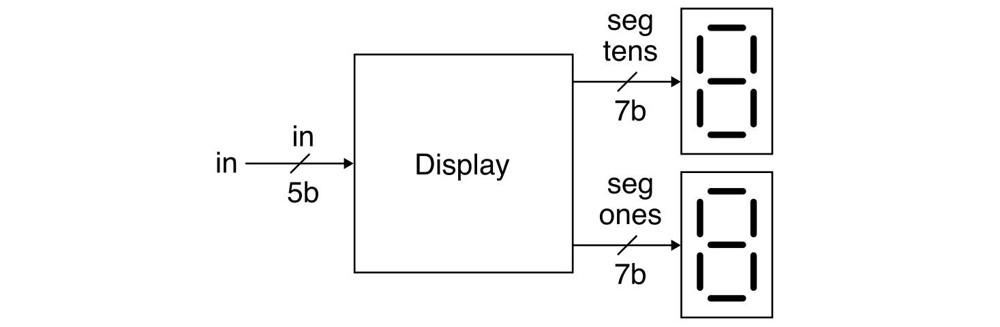
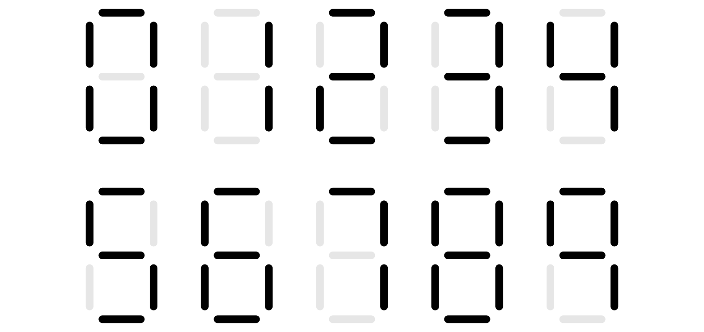

Lab 1.1: Five-Bit Numeric Display Simulation
==========================================================================

Lab 1.1 is a warmup designed to give you experience designing,
implementing, and testing a simple Verilog hardware design using
open-source tools. In this assignment, you will leverage the concepts
from lecture across two key abstraction layers: logic gates and boolean
equations.

You will be implementing a five-bit numeric display that takes as input a
five-bit binary value and displays this value as a decimal number using
two seven-segment displays. Your implementation will exclusively used
combinational logic gates and/or Boolean equations. This five-bit numeric
display will be reused extensively across all of the remaining labs. You
will also gain experience optimizing your design. Lab 1.1 focuses on
using simulation to test your design, while Lab 1.2 will explore
integrating, synthesizing, analyzing, and configuring your design for an
FPGA prototype.

This handout assumes that you have read and understand the course
tutorials and that you have attended the discussion sections. To get
started, log into an `ecelinux` server, source the setup script, and
clone your individual remote repository from GitHub:

```bash
 % source setup-ece2300.sh
 % mkdir -p ${HOME}/ece2300
 % cd ${HOME}/ece2300
 % git clone git@github.com:cornell-ece2300/netid
 % cd ${HOME}/ece2300/netid
 % tree
```

where `netid` should be replaced with your NetID. You can both pull and
push to your individual remote repository. If you have already cloned
your individual remote repository, then use git pull to ensure you have
any recent updates before working on your lab assignment.

```bash
 % cd ${HOME}/ece2300/netid
 % git pull
 % tree
```

Your repo includes the following files:

 - `BinaryToSevenSegUnopt_GL.v`: Binary-to-seven-segment converter (unoptimized)
 - `BinaryToSevenSegOpt_GL.v`: Binary-to-seven-segment converter (optimized)
 - `BinaryToBinCodedDec_GL.v`: Binary-to-BCD converter
 - `DisplayUnopt_GL.v`: Five-bit numeric display (unoptimized)
 - `DisplayOpt_GL.v`: Five-bit numeric display (optimized)
 - `ece2300-test.v`: Course unit testing library
 - `BinaryToSevenSegUnopt_GL-test.v`: Test bench for binary-to-seven-segment (unoptimized)
 - `BinaryToSevenSegOpt_GL-test.v`: Test bench for binary-to-seven-segment (optimized)
 - `BinaryToBinCodedDec_GL-test.v`: Test bench for binary-to-BCD converter
 - `DisplayUnopt_GL-test.v`: Test bench for five-bit numeric display (unoptimized)
 - `DisplayOpt_GL-test.v`: Test bench for five-bit numeric display (optimized)
 - `display-sim.v`: Simulator for five-bit numeric display

The `_GL` suffix indicates that these hardware designs should be
implemented using the gate-level or boolean logic equation layer of
abstraction. This means students are only allowed to use these Verilog
constructs in their Verilog hardware designs:

 - `wire`, `assign`
 - `not`, `and`, `nand`, `or`, `nor`, `xor`, `xnor`
 - `~`, `&`, `|`, `^`
 - literals (e.g., `1'b0`, `1'b1`)
 - module instantiation

Using any other Verilog constructs in your Verilog hardware designs will
result in significant penalties for code functionality and code quality.
If you have any questions on what Verilog constructs can and cannot be
used, please ask an instructor. There are no restrictions on Verilog
constructs in test benches.

The lab assignment is divided into seven steps. Complete each step before
moving on to the next step.

 - Step 1. Construct truth table for binary-to-seven-segment converter
 - Step 2. Implement and test `BinaryToSevenSegUnopt_GL`
 - Step 3. Construct truth table for binary-to-BCD converter
 - Step 4. Implement and test `BinaryToBinCodedDec_GL`
 - Step 5. Implement and test `DisplayUnopt_GL`
 - Step 6. Implement and test `BinaryToSevenSegOpt_GL`
 - Step 7. Implement and test `DisplayOpt_GL`

Students will almost certainly need to spend significant time outside of
their lab session to complete this lab. Students with a lab session early
in the week can use their lab session to get started with the help of the
course staff and then finish on their own before the deadline. Students
with a lab session late in the week can get started on their own and use
their lab session to finish their lab with the help of the course staff.
**Steps 1-5 are due on Thursday at 11:59pm. Steps 6 and 7 are not
due until your lab session during the Lab 1.2 week.**

1. Interface and Implementation Specification
--------------------------------------------------------------------------

You will be implementing a five-bit numeric display that takes as input a
five-bit binary value and displays this value as a decimal number using
two seven-segment displays. This section first describes the required
_interface_ for the five-bit numeric display (i.e., the ports for the
module and the module's functional behavior) before describing the
required _implementation_ (i.e., what goes inside the module).

### 1.1. Five-Bit Numeric Display Interface

Your five-bit numeric display should take as input a five-bit binary
value and output two seven-bit values, each of which can be used to
control a _seven-segment display_.



A seven-segment display includes seven light-emitting diodes (or
"segments") arranged in the following pattern.


Notice how each segment is numbered from 0 to 6. A seven-segment display
has seven input bits (numbered 0 to 6), and each "segment" can be
independently turned on or off by the corresponding input bit. This
enables displaying the numbers from 0 to 9 as shown below.



The specific seven-segment displays we will be using in this course are
_active low_. **This means the segment is turned on when the
corresponding bit is zero and the segment is turned off when the
corresponding bit is one.**

You should display a leading zero for numbers less than 10. So if the
input to our five-bit numeric display is the binary value 00001 (decimal
value 1), then the output for your five-bit numeric display should be
1000000 for the tens position since we want to display 0 (i.e., we want
segments 0-5 on and segment 6 off). If the binary value 00001 (decimal
value 1), then the output for your five-bit numeric display should be
1111001 for the ones position since we want to display 1 (i.e., we want
segments 1-2 to be on, and the remaining segments to be off). These
outputs would result in the following being displayed on the two
seven-segment displays.


So if the input to our five-bit numeric display is the binary value 01111
(decimal value 15), then the output for your five-bit numeric display
should be 111_1001 for the tens position and 0010010 for the one's
position (i.e., segments 1 and 4 are on and the remaining segments are
off). These outputs would result in the following being displayed on the
two seven-segment displays.


Ensure you understand these examples before continuing to work on the
lab. **Remember, a segment is turned on when the corresponding bit is
zero and the segment is turned off when the corresponding bit is one.**

### 1.2. Five-Bit Numeric Display Implementation

Implementing an optimized five-bit numeric display as a single monolithic
module would be quite complex, so we will instead use the abstraction
principles of modularity, hierarchy, and regularity to enable an
incremental design approach. The following block diagram illustrates how
we can implement the five-bit numeric display with two kinds of
submodules: a binary-to-seven-segment converter
(`BinaryToSevenSegUnopt_GL`) and a binary-to-BCD converter
(`BinaryToBinCodedDec_GL`).


The binary-to-seven-segment converter has a four-bit binary input port
and a seven-bit output port. Each bit of the output port corresponds to
one bit of a seven-segment display. The converter should turn on (i.e.,
set to zero) all of the appropriate segments to display the input value
as a decimal number. So if the input to the converter is binary value
0111 (decimal value 7) then the output of the converter should be 1111000
which turns on segments 0, 1, 2 displaying the number 7. **If the input
is invalid (i.e., greater than 9), all segments should be turned on.**
You will need to construct an appropriate truth table before implementing
the binary-to-seven-segment converter. We have provided you a template
below. Once you have the truth table then you can systematically
implement this truth table using what you learned in the discussion
section.

| Input as<br>Decimal Value | Input as<br>Binary Value| Output<br>654 3210|
|---------------------------|-------------------------|-------------------|
| 0                         | 0000                    | 100 0000          |
| 1                         | 0001                    | 111 1001          |
| 2                         | 0010                    | 010 0000          |
| ...                       | ...                     | ...               |
| 15                        | 1111                    | 000 0000          |

The binary-to-BCD converter has a five-bit input port and two four-bit
output ports: a tens output port and a ones output port. The converter
should convert the input binary value into a decimal ones digit and a
decimal tens digit, but these digits are encoded as binary values. So for
example, if the input to the converter is binary value 01111 (decimal
value 15), then the tens output should be binary value 0001 (decimal
value 1) and the ones output should be binary value 1001 (decimal value
5). You will need to construct an appropriate truth table before
implementing the binary-to-BCD converter. We have provided you a template
below. Once you have the truth table then you can systematically
implement this truth table using what you learned in the discussion
section.


| Input as<br>Decimal Value | Input as<br>Binary Value| Tens | Ones |
|---------------------------|-------------------------|------|------|
| 0                         | 00000                   | 0000 | 0000 |
| 1                         | 00001                   | 0000 | 0001 |
| 2                         | 00010                   | 0000 | 0010 |
| ...                       | ...                     | ...  | ...  |
| 10                        | 01010                   | 0001 | 0000 |
| ...                       | ...                     | ...  | ...  |
| 31                        | 11111                   | 0011 | 0001 |

Once you have implemented (and thoroughly tested!) your
binary-to-seven-segment converter and binary-to-BCD converter, you can
then compose them to implement the five-bit numeric display as shown
above. You will instantiate the binary-to-seven-segment converter twice;
once to display the tens digit and once to display the ones digit.

### 1.3. Unoptimized vs Optimized Implementations

Once you have implemented (and thoroughly tested!) your five-bit numeric
display, you can then experiment with optimizing the
binary-to-seven-segment converter. Use what you have learned in lecture
on Boolean algebra (especially Karnaugh maps) to see if you can reduce
the amount of logic required to implement the binary-to-seven-segment
converter. You should use `BinaryToSevenSegOpt_GL` for your
optimized implementation.

**We strongly recommend taking a incremental design approach!** Start by
copying your unoptimized implementation into `BinaryToSevenSegOpt_GL`.
Then pick a single output port to optimize. Work through the
corresponding Karnaugh map and replace just the logic for that output
port with the newly optimized version. Leave all of the logic for the
other output ports unoptimized. Then use your tests to verify the
converter is still working. If not, you know where to focus your
debugging. If so, you can move on to the next output port.

**Your optimized implementation is not due until your lab session during
the Lab 1.2 week.**

2. Testing Strategy
--------------------------------------------------------------------------

You are responsible for developing an effective testing strategy to
ensure all implementations are correct. Writing tests is one of the most
important and challenging aspects of designing hardware. Hardware
engineers often spend far more time implementing tests than they do
implementing the actual hardware design.

Continually having to use the same complex commands over and over can be
tedious. We strongly recommend creating a few Bash shell scripts to enable
you to automatically execute the commands to lint, compile, and run
systematic test benches. See the discussion section for an example.

### 2.1. Linting

Verilog is a very permissive language. We will be using `verilator` for
`linting` which involves statically analyzing your hardware design to
help catch syntax bugs early. You can run `verilator` to lint your
`BinaryToSevenSegUnopt_GL` module like this:

```bash
% cd ${HOME}/ece2300/netid
% verilator --Wall --lint-only BinaryToSevenSegUnopt_GL.v
```

You should always lint your designs before trying to compile them into a
simulator. You can also lint your test benches.

### 2.2. Systematic Unit Testing

We will be using a lightweight testing framework to support a systematic
and automatic unit testing strategy for every module you implement in the
lab assignment:

 - `BinaryToSevenSegUnopt_GL`
 - `BinaryToSevenSegOpt_GL`
 - `BinaryToBinCodedDec_GL`
 - `DisplayUnopt_GL`
 - `DisplayOpt_GL`

For each module, we provide a test bench for you to use along with one
basic test case. In future lab assignments we will use directed and
random testing, but in this lab assignment you can use exhaustive testing
where you try every single possible input. We have provided you an empty
test case for you to insert your checks for exhaustive testing. Once you
have added exhaustive testing (and linted your design!), you can compile
your test bench like this:

```bash
% cd ${HOME}/ece2300/netid
% iverilog -Wall -g2012 -o BinaryToSevenSegUnopt_GL-test BinaryToSevenSegUnopt_GL-test.v
```

And you can then run your test bench like this:

```bash
% cd ${HOME}/ece2300/netid
% BinaryToSevenSegUnopt_GL-test
% BinaryToSevenSegUnopt_GL-test +test-case=1
% BinaryToSevenSegUnopt_GL-test +test-case=2
% BinaryToSevenSegUnopt_GL-test +test-case=2 +dump-vcd=BinaryToSevenSegUnopt_GL-test.vcd
```

### 2.3. Simulator

We have provided you a simple display simulator which will emulate what
you will prototype on the FPGA in Lab 1.2. After finishing your
implementation for the unoptimized display, you can run the display
simulator like this:

```
% cd ${HOME}/ece2300/netid
% iverilog -Wall -g2012 -o display-sim display-sim.v
% ./display-sim +switches=01111
```

The display simulator will show what the two seven segment displays would
look like on the FPGA prototype.

4. Requirements for Final Submission
--------------------------------------------------------------------------

Your code quality score will be based on the way you format the text in
your source files, proper use of comments, deletion of instructor
comments, and uploading the correct files to GitHub (only source files
should be uploaded, no generated build files). **Note that students must
remove unnecessary comments that are provided by instructors in the code
distributed to students. Students must not commit executable binaries or
any other unnecessary files.**

To submit your code you simply upload it to GitHub. Your design code will
be assessed both in terms of functionality and code quality. Your
functionality score will be determined by running your code against a
series of tests developed by the instructors to test its correctness.
Your test bench code will also be assessed both in terms of verification
quality and code quality. Here is how we will be testing your final code
submission for Lab 1.1:

```bash
verilator -Wall --lint-only BinaryToSevenSegUnopt_GL.v
iverilog -Wall -g2012 -o BinaryToSevenSegUnopt_GL-test BinaryToSevenSegUnopt_GL-test.v
./BinaryToSevenSegUnopt_GL-test

verilator -Wall --lint-only BinaryToBinCodedDec_GL.v
iverilog -Wall -g2012 -o BinaryToBinCodedDec_GL-test BinaryToBinCodedDec_GL-test.v
./BinaryToBinCodedDec_GL-test

verilator -Wall --lint-only DisplayUnopt_GL.v
iverilog -Wall -g2012 -o DisplayUnopt_GL-test DisplayUnopt_GL-test.v
./DisplayUnopt_GL-test
```
