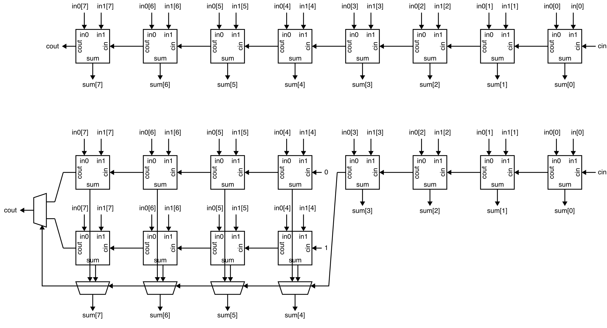
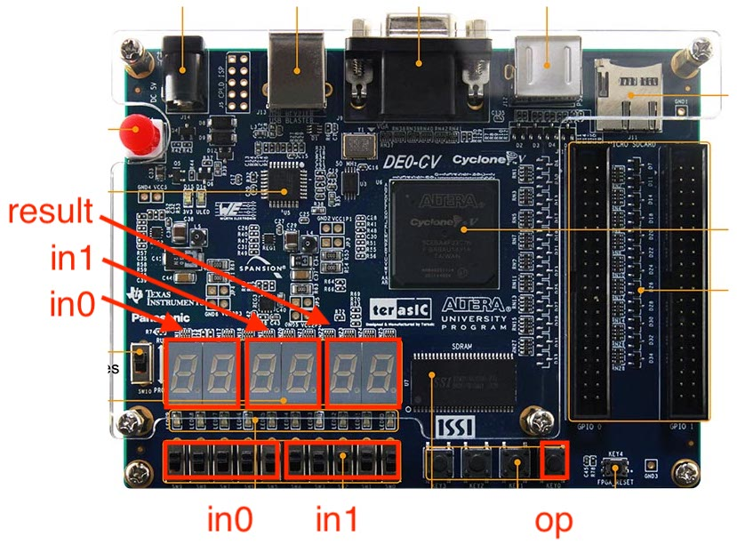
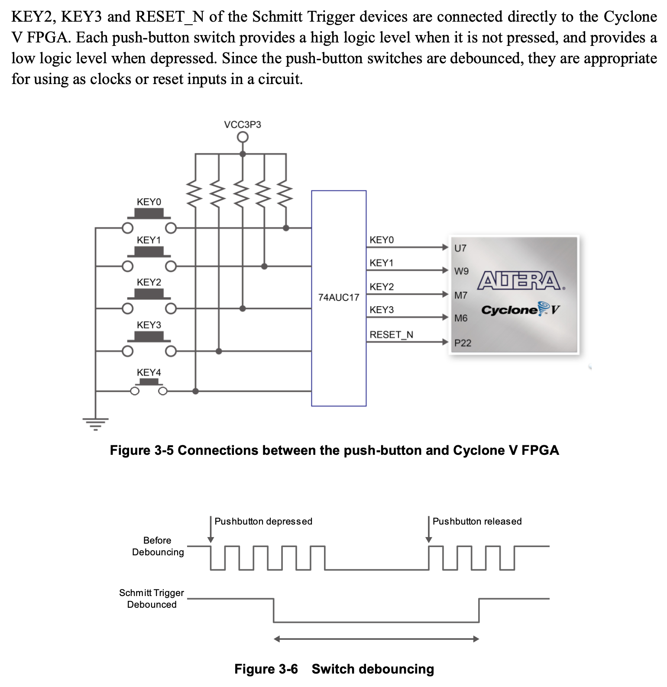

Lab 2: Two-Function Calculator (FPGA and Report)
==========================================================================

Lab 2 is meant to give you experience designing, implementing, testing,
and prototyping more complicated combinational logic using the Verilog
hardware description language. In addition to leveraging the concepts
from lecture across two key abstraction layers: logic gates and Boolean
equations, this lab will also reinforce three key abstraction principles:
modularity, hierarchy, and regularity. This lab will give students
experience with several combinational building blocks including
multiplexors, adders, and multipliers.

You will continue to explore a two-function calculator that takes as
input two binary values and then calculates either the sum or the product
of these two values. The input values and the result will be displayed on
seven-segment displays using your Verilog hardware design from Lab 1.
Your implementation should mostly use combinational logic gates and/or
Boolean equations, but you will also start to explore very simple
register-transfer-level modeling. You will also gain experience comparing
implementations using gate-level and Boolean equations vs implementations
using register-transfer-level modeling. You should have already worked on
using simulation to test your design, so in this lab session we will
explore integrating, synthesizing, analyzing, and configuring your design
for an FPGA prototype. Lab 2 must be done with your lab partner.

This handout assumes that you have read and understand the course
tutorials, attended the discussion sections, and successfully completed
Lab 1. Here are the steps to get started:

 - Step 1. Find your lab partner
 - Step 2. Find a free workstation
 - Step 3. Ask the TAs for a lab check-off sheet (each student needs
    their own check-off sheet)

Throughout this handout you will see two kinds tasks: lab check-off tasks
and lab report tasks.

For each _lab report task_ you must take some notes, save a screenshot,
and/or record some data for your lab report. Students can start working
on their lab report during their lab session, but will likely need to
continue working on their lab report after the lab session. The lab
report is due three days after your lab session at 11:59pm.

For each _lab check-off task_ you must raise your hand and have a TA come
to check-off your work. The TA will ask you the questions included as
part of the lab check-off task and the assess your understanding using
the following rubric: mastery; accomplished; emerging; beginning. If the
TA and students together feel the students have not mastered the lab
check-off task, the students are encouraged to take a few minutes and try
again.

!!! success "Lab Check-Off Task 1: Setup FPGA Board"

    Request an FPGA board from the TAs. The TAs will record the board
    number on your check-off sheet. Use the power cord to plug the FPGA
    board into an outlet, and use the USB cable to plug the FPGA board
    into the workstation.

1. Simulation of a Two-Function Calculator
--------------------------------------------------------------------------

Before starting to work on an FPGA prototype, you must make sure you have
a working Verilog hardware design that has been _thoroughly_ tested in
simulation. One student should start VS Code on the workstation, log into
the `ecelinux` servers, source the setup script, and make sure their
individual remote repository is up to date.

```bash
% source setup-ece2300.sh
% cd ${HOME}/ece2300/groupXX
% git pull
% tree
```

Where `XX` is your group number. Now run all of the tests from a clean
build to ensure your design is fully functional.

```bash
% cd ${HOME}/ece2300/groupXX
% trash build
% cd build
% ../configure
% make check
```

Also make sure the two-function calculator interactive simulator is
working.

```bash
% cd ${HOME}/ece2300/groupXX/build
% make calculator-sim
% ./calculator-sim +in0-switches=00100 +in1-switches=00011 +button=0
% ./calculator-sim +in0-switches=00100 +in1-switches=00011 +button=1
```

We now need to get the files for your design from `ecelinux` onto the
workstation. This requires multiple steps.

 - Step 1. Click _Microsoft Edge_ on the desktop to open a web-browser on
   the workstation to log into GitHub and then find your repository

 - Step 2. Start PowerShell by clicking the _Start_ menu then searching
   for _Windows PowerShell_

 - Step 3. Clone your repo onto the workstation by using this command in
   PowerShell (where `netid` is your Cornell NetID, **notice we are using
   https!**):

```
% git clone https://github.com/cornell-ece2300/groupXX
```

 - Step 4. In the _Connect to GitHub_ pop-up, click _Sign in with your
   browser_

 - Step 5. You may be asked for your GitHub username again and you may be
   asked to authorize the Git Credential Manager; click _authorize
   git-ecosystem_

 - Step 6. Verify that you have successfully cloned your repo by changing
   into your repo and using `tree` on the workstation:

```
% cd groupXX
% tree
```

!!! success "Lab Check-Off Task 2: Verify Test and Interactive Simulators"

    Show a TA that your hardware designs are passing all of your tests.
    The TA will give you two decimal numbers. You should first determine
    their unsigned binary representation, then determine what the correct
    unsigned binary output would be if we added these two numbers
    together, and finally determine what the correct unsigned output
    should be if we multiplied these two numbers together. **You must
    determine these unsigned binary values before running the
    two-function interactive simulator!** Once you know these values,
    then use the two-function interactive simulator to verify your work.
    The TA will ask follow-up questions about the following scenarios:

      - (1) addition when `in0` is 31 and `in1` is 1
      - (2) multiplication when `in0` is 16 and `in1` is 3
      - (3) multiplication when `in0` is 16 and `in1` is 7

    Be ready to explain _why_ the calculator is producing the
    corresponding output for each scenario.

2. Setup Quartus Project
--------------------------------------------------------------------------

Click _Quartus (Quartus Prime 19.1)_ on the desktop to start Quartus, and
click _Run the Quartus Prime software_. You might need to try starting
Quartus twice. Setup a new Quartus project using the _New Project
Wizard_:

 - Directory, Name, Top-Level Entity
    + Working directory: `C:\Users\netid\lab2`
    + Name of this project: `lab2`
    + Name of top-level design entity: `lab2`
    + Click _Next_
 - Directory does not exist. Do you want to create it?
    + Click yes
 - Project Type
    + Choose _Empty Project_
    + Click _Next_
 - Add Files
    + Click triple dots to right of _File name_
    + Click on _This PC_, then navigate to your cloned repo by choosing
       _Windows (C:) >  Users > netid > netid_ where _netid_ is your
       Cornell NetID
    + Shift-click on every Verilog hardware design file (do not include
       any test files)
    + Click _Open_
    + Click _Next_
 - Family, Device, and Board Settings
    + Click _Board_ tab
    + Family: _Cyclone V_
    + Select _DE0-CV Development Board_
    + Make sure _Create top-level design file_ is checked
    + Click _Next_
 - EDA Tool Settings
    + Click _Next_
 - Summary
    + Click _Finish_

Since we are now using RTL modeling, there is one new step from Lab 1.
You must choose _Assignments > Settings_ from the menu. Then select the
category _Compiler Settings > Verilog HDL Input_ and under _Verilog
version_ click _SystemVerilog_. Then click _Apply_ and _OK_.

3. Synthesize and Analyze Adders
--------------------------------------------------------------------------

We will start by synthesizing and analyzing three different adder designs
in isolation. When we say _in isolation_ we mean that our goal is not to
actually prototype these adder designs on the FPGA (e.g., demo the adders
with switches and seven segment displays), but our goal is instead to
perform a rigorous comparative analysis across multiple adder designs.
Once we better understand the adder design space we can then select the
appropriate adder for use in the final FPGA prototype.

Before starting, we want to predict the critical path for the
ripple-carry and carry-select adders. Ask the TAs for a hard copy of the
two block diagrams shown below. You do not need to redraw these yourself.



!!! note "Lab Report Task 1: Predicted Adder Critical Paths"

    Clearly draw your predicted critical path on each block diagram. Save
    these diagrams since you will be continuing to annotate them
    throughout the lab.

!!! success "Lab Check-Off Task 3: Discuss Predicted Adder Critical Paths"

    Show a TA your block diagrams with the critical paths. Explain to the
    TA which design should have a shorter critical path and why. How much
    shorter will the critical path be?

### 3.1. Synthesize and Analyze Ripple-Carry Adder

We will be using a slightly different approach to synthesize and analyze
the adders in isolation compared to our process in Lab 1. When pushing a
hardware design through the flow in isolation, we want to let the FPGA
tools automatically assign the top-level ports to the FPGA pins. This
will enable the FPGA to optimize this assignment improving the overall
critical path and enabling a more rigorous analysis.

To synthesize and analyze the ripple-carry adder in isolation first find
the _Project Navigator_ pane and click on _Hierarchy_ to display the
drop-down list. Choose _Files_ and select the `AdderRippleCarry_8b_GL.v`
file. Right click on the file and choose _Select as Top-Level Entity_.
Then click on _Files_ to display the drop-down list again. Choose
_Hierarchy_ and confirm that `AdderRippleCarry_8b_GL` is shown as the
only entity.

As in Lab 1, we need to create a _timing constraint_ file. As mentioned
in Lab 1, the FPGA tools do not synthesize the design to just run as fast
as possible. The way the FPGA tools work, is that the designer provides a
_timing constraint_ on the critical path delay, and the tools work as
hard as they can (but no harder!) to meet this critical path delay
constraint. When finished, the design will either "meet timing" (i.e.,
the actual critical path delay is less than the constraint) or "not meet
timing" (i.e., the actual critical path delay is greater than the
constraint).

Here are the steps to create a timing constraint file:

 - Choose _File > New_ from the menu
 - Click _Synopsys Design Constraints File_
 - Click _OK_
 - Enter the constraints shown below
 - Click _File > Save_ from the menu
 - Name the file _timing.sdc_
 - Save the file in the _lab2_ directory

We will use the following initial constraints:

```
set_max_delay -from [all_inputs] -to [all_outputs] 20
set_min_delay -from [all_inputs] -to [all_outputs] 0
```

These constraints tell the FPGA tools that our critical path delay
constraint is 20ns and that the FPGA tools should analyze all paths from
every input port to every output port.

Now use the following steps to synthesize your design and then look at
the RTL viewer, technology map viewer, and chip planner.

 - Choose _Processing > Start Compilation_ from the menu
 - Wait 2-3 minutes for synthesis to complete
 - RTL Viewer
    + Choose _Tools > Netlist Viewer > RTL Viewer_ from the menu
    + Drill down in the hierarchy to see the netlist for the 8-bit
       ripply-carry adder, the 4-bit ripple-carry adder, and the full
       adder
    + Does the RTL viewer match your expectations? Where would the
         critical path go on this diagram?
    + Choose _File > Close_ from menu to close the RTL viewer
 - Technology Map Viewer
    + Choose _Tools > Netlist Viewer > Technology Map Viewer (Post-Fitting)_
    + Drill down in the hierarchy to see the implementation of the 8-bit
       ripply-carry adder, the 4-bit ripple-carry adder, and the full
       adder
    + Does the RTL viewer match your expectations? Where would the
         critical path go on this diagram?
    + Choose _File > Close_ from the menu to close the technology map viewer
 - Chip Planner
    + Choose _Tools > Chip Planner_ from the menu
    + Identify where the logic used to implement your design is located in the FPGA
    + Choose _File > Close_ from the menu to close the chip planner

The next step is to analyze the area of your design.

 - Choose _Processing -> Compilation Report_ from the menu
 - Under _Table of Contents_ choose _Fitter > Resource Section > Resource
   Usage Summary_
 - Look through the report to determine the number of combinational ALUTs
   (configurable look-up tables) are used for your design

The final step is to analyze the timing (i.e., the critical path delay)
of your design. We will analyze timing for the _Slow 1100mV 85C Model_
which is the default choice in the Timing Analyzer.

 - Choose _Tools > Timing Analyzer_ from the menu
 - Double-click _Update Timing Netlist_
 - Choose _Reports > Custom Reports > Report Timing_ from the menu
 - Report Timing
    + From: _[all_inputs]_
    + To: _[all_outputs]_
    + Report number of paths: _1_
    + Click _Report Timing_
 - Identify the propagation delay of the displayed path
 - Look at the actual critical path (i.e., _Data Arrival Path_) which
    shows the longest path from one of the inputs through your
    design to one of the outputs
 - Choose _File > Close_ from the menu to close the timing analyzer

Your design will almost certainly meet timing with a critical path delay
constraint of 20ns. As in Lab 1, we are interested in the limit on the
critical path delay (i.e., what is the true minimum critical path delay)
so we can compare our unoptimized and optimized designs. To find the
limit, we need to iteratively reduce the critical path timing constraint
until we no longer meet timing. We can consider the shortest critical
path delay while still meeting timing as the "true minimum critical path
delay").

You can iteratively reduce the critical path delay, by changing _20_ in
the timing constraint file to something smaller. So the iterative process
will look like this:

 - Edit the timing constraints file to reduce the critical path delay constraint
 - Choose _Processing > Start Compilation_ from the menu
 - Wait 2-3 minutes for synthesis to complete
 - Analyze the area of your design
 - Analyze the timing of your design

You will be working to fill in this table:

 - <https://docs.google.com/spreadsheets/d/1tlkaQYOx7t8CJpzAL5IsU2EbmdBQsGVKJyi_uQSu1BQ/edit?gid=0#gid=0>

Make a copy of this table, and enter in the data for your ripple-carry
adder with a 20ns critical path delay constraint. You can find the number
of 7-input ALUts, 6-input ALUts, etc in the area report. You can save
time by not generating a brand new timing report. You can instead simply
use the following steps.

 - Choose _Processing -> Compilation Report_ from the menu
 - Under _Table of Contents_ choose _Timing Analyzer > Slow 1100mV 85C
     Model > Setup Summary_
 - The critical path delay is just the constraint minus the slack

Then iteratively reduce the timing constraint until your design no longer
meets timing. If the data delay is 14ns with a timing constraint of 20ns,
we recommend you reduce the timing constraint to 14ns and try again. You
want to find the a timing constraint where the design meets timing, but
if we reduce the timing constraint by 1ns the design would no longer meet
timing. The data delay for the final experiment where the design meets
timing is the "true minimum critical path delay". You only need to enter
as many rows as necessary to figure out the truth minimum critical path
delay.

Once you have found the minimum timing constraint which still meets
timing, use the Timing Analyzer to find the corresponding critical path.
We want to save the timing report to a file so we can include it in our
report. So when using the Timing Analyzer to create the timing report
complete the following two steps:

  + Check _File name_
  + Enter file name as `AdderRippleCarry_8b_GL-critical-path.txt`

Find and open this timing report text file. It should be in the `lab2`
subdirectory. Make sure there is only a single critical path in the
timing report text file.

!!! note "Lab Report Task 2: Data Table and Critical Path Report for Ripple-Carry Adder"

    Save your completed data table with your analysis of the ripple-carry
    adder and include it in your report. Save the critical path timing
    report text file and include it in your report. You only want to save
    the _Data Arrival Path_ from the timing report text file. Do NOT
    include anything else from the timing report text file. You must
    format the critical path with a fixed-width font and size the font
    such that it fits on a single page. **If you do not follow this
    requirements then we will ignore your critical path in the lab
    report.**

!!! note "Lab Report Task 3: Actual Critical Path for Ripple-Carry Adder"

    Draw the _actual_ critical path on the block diagram for the
    ripple-carry adder using the timing report. Label each full adder
    along the critical path with its corresponding delay using the timing
    report. Label the delay to get from the FPGA input pin to the adder
    and the delay to get from the adder to the FPGA output pin.

!!! success "Lab Check-Off Task 4: Discuss Area and Delay Analysis for Ripple-Carry Adder"

    Show a TA your completed data table with your analysis for the
    ripple-carry adder. Show a TA the actual critical path on the block
    diagram for the ripple-carry adder. Clearly show how the delays in
    the timing report correspond to the delays through the full adders in
    the block diagram.

### 3.2. Synthesize and Analyze Carry-Select Adder

Use the same process to synthesize and analyze the carry-select adder in
isolation. Remember to change that hardware module to be the top-level
entity. So find the _Project Navigator_ pane and click on _Hierarchy_ to
display the drop-down list. Choose _Files_ and select the
`AdderCarrySelect_8b_GL.v file. Right click on the file and choose
_Select as Top-Level Entity_. Then click on _Files_ to display the
drop-down list again. Choose _Hierarchy_ and confirm that
`AdderCarrySelect_8b_GL` is shown as the only entity. Remember to reset
the timing constraint back to 20ns.

Go through the same process of looking at the RTL Viewer, Technology Map
Viewer, and the Chip Planner. Use the same process to iteratively reduce
the critical path delay, by changing 20 in the timing constraint file to
something smaller. The iterative process will look like this:

 - Edit the timing constraints file to reduce the critical path delay constraint
 - Choose Processing > Start Compilation from the menu
 - Wait 2-3 minutes for synthesis to complete
 - Analyze the area of your design
 - Analyze the timing of your design

You will be continuing to to fill in this table:

 - <https://docs.google.com/spreadsheets/d/1tlkaQYOx7t8CJpzAL5IsU2EbmdBQsGVKJyi_uQSu1BQ/edit?gid=0#gid=0>

Once you have found the minimum timing constraint which still meets
timing, use the Timing Analyzer to find the corresponding critical path.
We want to save the timing report to a file so we can include it in our
report. So when using the Timing Analyzer to create the timing report
complete the following two steps:

  + Check _File name_
  + Enter file name as `AdderRippleCarry_8b_GL-critical-path.txt`

Find and open this timing report text file. It should be in the `lab2`
subdirectory. Make sure there is only a single critical path in the
timing report text file.

!!! note "Lab Report Task 4: Data Table and Critical Path Report for Carry-Select Adder"

    Save your completed data table with your analysis of the carry-select
    adder and include it in your report. Save the critical path timing
    report text file and include it in your report. You only want to save
    the _Data Arrival Path_ from the timing report text file. Do NOT
    include anything else from the timing report text file. You must
    format the critical path with a fixed-width font and size the font
    such that it fits on a single page. **If you do not follow this
    requirements then we will ignore your critical path in the lab
    report.**

!!! note "Lab Report Task 5: Actual Critical Path for Carry-Select Adder"

    Draw the _actual_ critical path on the block diagram for the
    carry-select adder using the timing report. Label each full adder and
    1-bit multiplexor along the critical path with its corresponding
    delay using the timing report. Label the delay to get from the FPGA
    input pin to the adder and the delay to get from the adder to the
    FPGA output pin.

!!! success "Lab Check-Off Task 5: Discuss Area and Delay Analysis for Both Adders"

    Show a TA your completed data table with your analysis for the
    carry-select adder. Show a TA the actual critical path on the block
    diagram for the carry-select adder. Clearly show how the delays in
    the timing report correspond to the delays through the full adders
    and 1-bit multiplexors in the block diagram. Use your experimental
    data to quantitatively explain to the TA the trade-offs between these
    two adders. Which adder is smallest? By what percentage is the area
    decreased? Which adder is the fastest? By what percentage is the
    critical path decreased?

### 3.2. Synthesize and Analyze RTL Adder

Use the same process to synthesize and analyze the carry-select adder in
isolation. Remember to change that hardware module to be the top-level
entity. So find the _Project Navigator_ pane and click on _Hierarchy_ to
display the drop-down list. Choose _Files_ and select the `Adder_8b_RTL.v
file. Right click on the file and choose _Select as Top-Level Entity_.
Then click on _Files_ to display the drop-down list again. Choose
_Hierarchy_ and confirm that `Adder_8b_RTL` is shown as the only entity.
Remember to reset the timing constraint back to 20ns.

Go through the same process of looking at the RTL Viewer, Technology Map
Viewer, and the Chip Planner. Look closely at the RTL viewer. What kind
of adder do the FPGA tools seem to be using?

Use the same process to iteratively reduce the critical path delay, by
changing 20 in the timing constraint file to something smaller. The
iterative process will look like this:

 - Edit the timing constraints file to reduce the critical path delay constraint
 - Choose Processing > Start Compilation from the menu
 - Wait 2-3 minutes for synthesis to complete
 - Analyze the area of your design
 - Analyze the timing of your design

You will be continuing to to fill in this table:

 - <https://docs.google.com/spreadsheets/d/1tlkaQYOx7t8CJpzAL5IsU2EbmdBQsGVKJyi_uQSu1BQ/edit?gid=0#gid=0>

Once you have found the minimum timing constraint which still meets
timing for the carry-select adder, use the Timing Analyzer to find the
corresponding critical path. Remember to output the timing report to a
text file when using the Timing Analyzer. Find and open this timing
report text file. It should be in the `lab2` subdirectory. Make sure
there is only a single critical path in the timing report text file. Look
very closely at this critical path and compare it to the critical path
for the ripple-carry and carry-select adders.

We are going to do something a little different to help us understand the
critical path. Right click on the _Data Arrival Path_ area and then
choose _Locate Path > Locate in Technology Map Viewer_. This is now
showing a diagram illustrating where the critical path goes through
various logic gates on the FPGA. What kind of adder do the FPGA tools
seem to be using?

!!! note "Lab Report Task 6: RTL Viewer and Critical Path Diagram for RTL Adder"

    Save a screenshot of the RTL viewer for `Adder_8b_RTL` and a
    screenshot of the critical path located in the technology map viewer
    for your lab report. Press the _Fn + Print Screen_ key to save a
    screenshot to the clipboard, then paste the screenshot into a Google
    Doc and crop appropriately for your lab report.

!!! note "Lab Report Task 7: Data Table and Critical Path Report for RTL Adder"

    Save your completed data table with your analysis of the RTL adder
    and include it in your report. Save the critical path timing report
    text file and include it in your report. You only want to save the
    _Data Arrival Path_ from the timing report text file. Do NOT include
    anything else from the timing report text file. You must format the
    critical path with a fixed-width font and size the font such that it
    fits on a single page. **If you do not follow this requirements then
    we will ignore your critical path in the lab report.**

!!! success "Lab Check-Off Task 6: Discuss Area and Delay Analysis for All Adders"

    Show a TA your completed data table with your analysis for the RTL
    adder. Explain to the TA what kind of adder you think the FPGA tools
    are using to implement the RTL adder. Use your experimental data to
    quantitatively explain to the TA the trade-offs between all three
    adders. Which adder is the smallest? Which adder is the fastest? What
    conclusions can we draw in terms of how much effort we should spend
    trying to implement building blocks using a gate-level implementation
    and/or Boolean equations in our Verilog hardware designs?

4. Synthesize and Analyze Multipliers
--------------------------------------------------------------------------

We want to do a similar comparison between our gate-level and RTL
multipliers. To save you time, we have gone ahead and done the iterative
sweep to find a reasonable timing constraint for both multipliers. Go
ahead and determine the area and critical path delay for both multipliers
using these constraints:

 - `Multiplier_2x8b_GL`: 16ns
 - `Multiplier_2x8b_RTL`: 13ns

If one of your designs does not meet timing with these constraints
increase the constraint by 1ns and try again.

!!! note "Lab Report Task 8: Data Table and Critical Path Report for Multipliers"

    Save your completed data table with your analysis of both
    multipliers. Save the critical path timing report text files for both
    multipliers and include them in your report. You only want to save the
    _Data Arrival Path_ from the timing report text file. Do NOT include
    anything else from the timing report text file. You must format the
    critical path with a fixed-width font and size the font such that it
    fits on a single page. **If you do not follow this requirements then
    we will ignore your critical path in the lab report.**

!!! success "Lab Check-Off Task 7: Discuss Area and Delay Analysis for Multipliers"

    Show a TA your completed data table with your analysis for both
    multipliers. Use your experimental data to quantitatively explain to
    the TA the trade-offs between all these two multipliers. Which adder
    is smallest? By what percentage is the area decreased? Which adder is
    the fastest? By what percentage is the critical path decreased? What
    conclusions can we draw in terms of how much effort we should spend
    trying to implement building blocks using a gate-level implementation
    and/or Boolean equations in our Verilog hardware designs?

5. Integrate, Synthesize, and Configure Two-Function Calculator FPGA Prototype
--------------------------------------------------------------------------

We now have a fully verified Verilog hardware design, and we have
finished a rigorous comparative analysis of the area and timing of both
the adders and multipliers. The last step is to integrate, synthesize,
and configure the FPGA with our design and demonstrate the final FPGA
prototype!

### Integrate

We need to change the top-level entity to be `DE0_CV_golden_top.v`. Find
the _Project Navigator_ pane and click on _Hierarchy_ to display the
drop-down list. Choose _Files_ and select the `DE0_CV_golden_top.v` file.
Right click on the file and choose _Select as Top-Level Entity_. Then
click on _Files_ to display the drop-down list again. Choose _Hierarchy_
and confirm that `DE0_CV_golden_top` is shown as the only entity.

The _New Project Wizard_ creates a top-level Verilog module for us which
has ports for all of the switches, LEDs, seven-segment displays, and pins
on the FPGA development board. We need to instantiate
`CalculatorDisplay_GL` in this top-level Verilog module and connect the
ports. Students are responsible for figuring out the appropriate
top-level port connections to meet the following specification.

 - The left five switches are for `in0`
 - The right five switches are for `in1`
 - The two seven-segment displays on the left are for `in0`
 - The two seven-segment displays in the middle are for `in1`
 - The two seven-segment displays on the right are for the result
 - The right-most push button is for `op`
 - By default calculator should perform addition, pressing the button
   should perform multiplication



Look carefully at the labels on the board to figure out how the switches,
buttons, and seven-segment displays correspond to ports in the top-level
Verilog module. Use the following steps when you are ready to integrate
the calculator.

 - Double-click on _DE0_CV_golden_top_
 - Instantiate _CalculatorDisplay_GL_ in the top-level module
 - Connect the ports
 - Choose _File > Save_ from the menu

### Synthesize

You will need to update the timing constraint file as follows:

```
set_max_delay -from [get_ports {SW* KEY*}] -to [get_ports HEX*] 22
set_min_delay -from [get_ports {SW* KEY*}] -to [get_ports HEX*] 0
```

Then choose  _Processing > Start Compilation_ from the menu to synthesize
your design. Open the Chip Planner to see where the calculator is located
on the FPGA:

 - Choose _Tools > Chip Planner_ from the menu
 - Identify where the logic used to implement your design is located in the FPGA
 - Choose _File > Close_ from the menu to close the chip planner

Feel free to also take a look at the area and critical path for the
complete calculator.

!!! note "Lab Report Task 9: Calculator Chip Planner"

    Save a screenshot of the chip planner for `CalculatorDisplay_GL`
    Press the _Fn + Print Screen_ key to save a screenshot to the
    clipboard, then paste the screenshot into a Google Doc and crop
    appropriately for your lab report. **You must highlight where your
    calculator is located on the FPGA.**

### Configure

Now we are finally ready to configure the FPGA for our calculator demo!

 - Choose _Tools > Programmer_ from the menu
 - Click _Hardware Setup_
 - Currently selected hardware: _USB-Blaster [USB-0]_
 - Click _Close_
 - Click _Start_

Test out your calculator. Note that the specification requires that your
calculator performs addition by default and only performs multiplication
when the button is pressed. Consider this excerpt from the data-sheet for
our FPGA boards.



Given this new information you may need to add a logic gate to the
top-level Verilog file to ensure your calculator correctly implements the
specification.

!!! success "Lab Check-Off Task 8: Final Two-Function Calculator Demo"

    Show a TA your final two-function calculator demo. The TA will ask
    you to enter two binary numbers using the switches. **You must
    determine the correct decimal values first, tell the TA what the
    correct decimal value should be for both addition and multiplication,
    and only then set the switches to confirm correct operation.** Your
    calculator must display the digits in the correct locations and
    perform addition by default and multiplication when the button is
    pressed.

!!! success "Lab Check-Off Task 9: Turn In FPGA Board"

    When you are finished with your demo, pack up your FPGA development
    board. Neatly put the board, power cable, and USB cable back in the
    box. Return the box to a TA who will then record the board number on
    your check-off sheet, initial the final check-off, and then collect
    your check-off sheet.

6. Lab Report Submission
--------------------------------------------------------------------------

Students should work with their partner to prepare a short lab report
that conveys what they have learned in this lab assignment. The lab
report should start with no more than two pages of text. Students should
include all figures, tables, and diagrams after these two pages in an
appendix. The appendix can be as many pages as necessary. Do not
interleave the text, figures, tables, and diagrams. There should be two
pages of text and then the appendix with all of the text, figures,
tables, and diagrams.

There are no restrictions on font size, margins, or line spacing, but
please make sure your report is readable. We recommend using 10pt Times
or 10pt Palintino with 0.75in to 1in margins. Please make sure you
include a title, your names, and your NetIDs at the top of the first
page. Do not include a title page.

The lab report must include the following numbered sections. Please
number your sections and use these specific titles. Please follow the
guidelines on the number of paragraphs, the content of each paragraph,
and which figures/tables to include. Some paragraphs might just be 2-3
sentences.

#### Section 1. Introduction (one paragraph)

 - Include 2-3 sentences explaining what the lab involves
 - Include one sentence explaining the purpose of this lab (why are
    students doing this lab?)
 - Include one sentence explicitly connecting the lab to one or more
    lecture topics; be specific on which lecture topics this lab
    reinforces with experiential learning

#### Section 2: Testing Strategy (one paragraph)

 - Include one sentence about the importance of a comprehensive testing
     strategy
 - Include 1-2 sentences about what is exhaustive testing and which
     modules used exhaustive testing
 - Include 2-3 sentences about what is directed testing and which
     modules used directed testing; mention specific kinds of directed
     test cases you included
 - Include 2-3 sentences about what is random testing and which modules
     used random testing; mention specific kinds of random test cases you
     included

#### Section 3: Comparative Analysis (three paragraphs)

 - Paragraph 1: Adder Area Comparison
    + Include a sentence referencing the area data in the FPGA data
       table for all three adder designs
    + Include 1-2 sentences comparing the area of the ripple-carry adder
       to the carry-select adder; **you must explain _why_ the area of one
       adder is more or less than the other adder**
    + Include 1-2 sentences comparing the area of the RTL adder to the
       other two adders; **you must try your best to explain _why_ the area
       of the RTL adder is more or less than the other adders**

 - Paragraph 2: Adder Delay Comparison
    + Include a sentence referencing the delay data in the FPGA data
       table for all three adder designs
    + Include a sentence describing where the critical path goes in
       detail for the ripple-carry adder by referencing your timing
       report and your annotated block diagram
    + Include a sentence describing where the critical path goes in
       detail for the carry-select adder by referencing your timing
       report and your annotated block diagram
    + Include 1-2 sentences comparing the critical path delays for the
       ripple-carry adder and the carry-select adder; **you must explain
       _why_ the delay of one adder is more or less than the other
       adder**
    + Include 1-2 sentences comparing the delay of the RTL adder to the
       other two adders; **you must try your best to explain _why_ the
       delay of the RTL adder is more or less than the other adders**

 - Paragraph 3: Multiplier Comparison
    + Include a 1-2 sentences comparing the area of the gate-level
       multiplier to the RTL multiplier
    + Include a 1-2 sentences comparing the delay of the gate-level
       multiplier to the RTL multiplier
    + It might be hard to deeply understand why the area and/or delay of
       one multiplier is more or less than the other, so it is fine to
       just summarize your results

#### Section 4: Conclusion (one paragraph)

 - Include 2-3 sentences that summarizes all of the data and analysis
    in this lab assignment
 - Include a sentence that draws a high-level conclusion; how will
    what you have learned impact your design work throughout the rest
    of the semester?

#### Appendix

 - FPGA Data Table
 - Block diagram for ripple-carry adder with highlighted critical path
     and annotated delays
 - Block diagram for carry-select adder with highlighted critical path
     and annotated delays
 - RTL Viewer for RTL adder
 - Critical Path Diagram Located in Technology Map Viewer for RTL Adder
 - Chip planner for calculator with logic highlighted
 - Critical path report for ripple-carry adder **(1 page max, fixed width font!)**
 - Critical path report for carry-select adder **(1 page max, fixed width font!)**
 - Critical path report for RTL adder **(1 page max, fixed width font!)**
 - Critical path report for array multiplier **(1 page max, fixed width font!)**
 - Critical path report for RTL multiplier **(1 page max, fixed width font!)**

