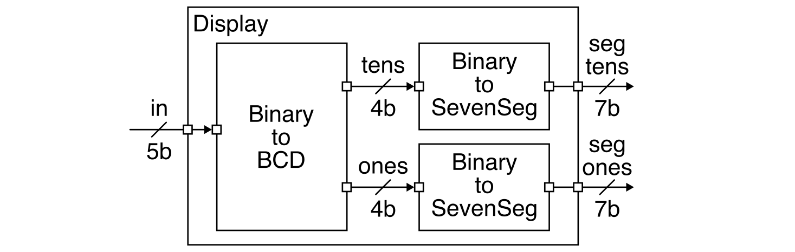
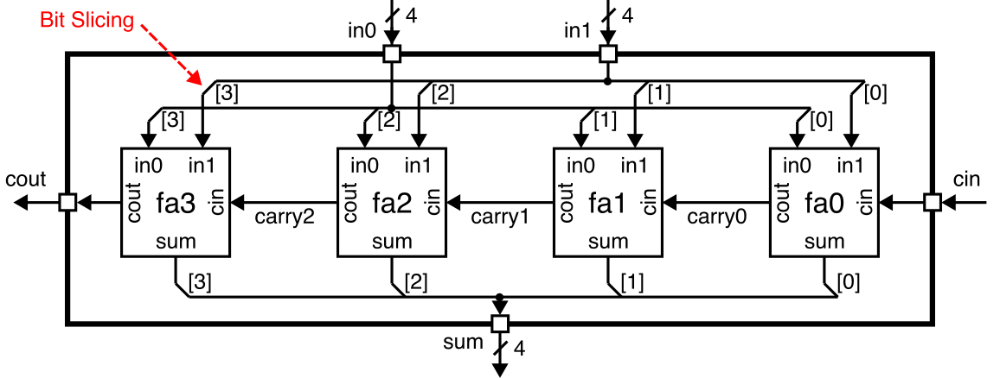
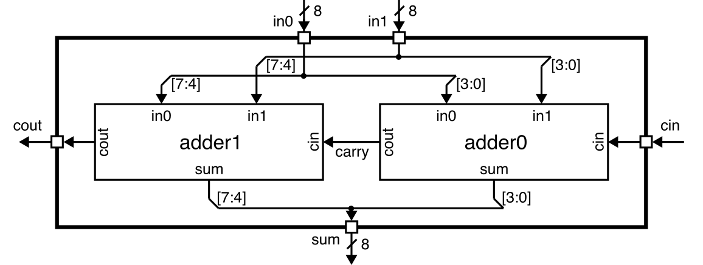
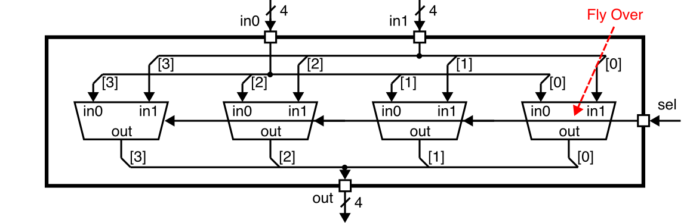
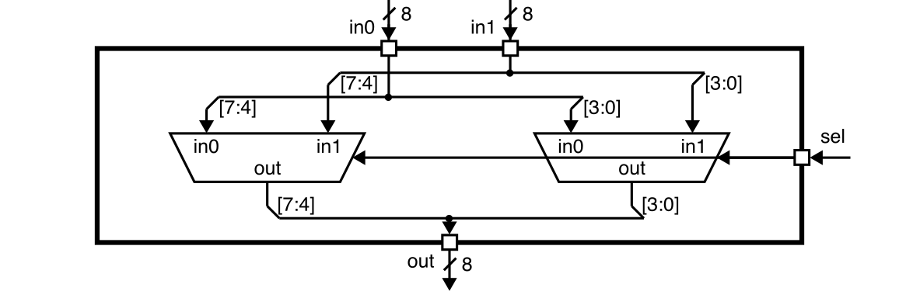

Lab 1.2: Calculator Simulation
==========================================================================

Lab 2 will give you experience designing, implementing, testing, and
prototyping more complicated combinational logic using the Verilog
hardware description language. In addition to leveraging the concepts
from lecture across two key abstraction layers: logic gates and boolean
equations, this lab will also reinforce three key abstraction principles:
modularity, hierarchy, and regularity. This lab will give students
experience with several combinational building blocks including
multiplexors, adders, and multipliers.

You will be implementing a simple calculator that takes as input two
binary values and then calculates either the sum or the product of these
two values. The input values and the result will be displayed on
seven-segment displays using your Verilog hardware design from Lab 1.
Parts of the calculator will be used in future labs. Your implementation
will mostly use combinational logic gates and/or Boolean equations, but
you will also start to explore very simple register-transfer-level
modeling. You will also gain experience comparing implementations using
gate-level and Boolean equations vs implementations using
register-transfer-level modeling. Lab 2.1 focuses on using simulation to
test your design, while Lab 2.2 will explore integrating, synthesizing,
analyzing, and configuring your design for an FPGA prototype. **Lab 2
must be done with a partner.** You can confirm your assigned partner on
Canvas (Click on _People_, then _Groups_, then search for your name to
find your lab group)

This handout assumes that you have read and understand the course
tutorials and that you have attended the discussion sections. To get
started, use VS Code to log into an `ecelinux` server, source the setup
script, and clone your individual remote repository from GitHub:

```bash
 % source setup-ece2300.sh
 % mkdir -p ${HOME}/ece2300
 % cd ${HOME}/ece2300
 % git clone git@github.com:cornell-ece2300/groupXX
 % cd ${HOME}/ece2300/groupXX
 % tree
```

where `XX` should be replaced with your group number. You can both pull
and push to your remote repository. If you have already cloned your
remote repository, then use git pull to ensure you have any recent
updates before working on your lab assignment.

```bash
 % cd ${HOME}/ece2300/groupXX
 % git pull
 % tree
```

Go ahead and create a build directory and run configure to generate a
Makefile.

```
% cd ${HOME}/ece2300/groupXX
% mkdir -p build
% cd build
% ../configure
```

Your repo the following files which are part of the automated build
system:

 - `Makefile.in`: Makefile for the build system
 - `configure`: Configure script for the build system
 - `configure.ac`: Used to generate the configure script
 - `scripts`: Scripts used by the build system

The `hw` subdirectory includes the following Verilog hardware design files.

 - `BinaryToSevenSeg_GL.v`: Binary-to-seven-segment converter
 - `BinaryToBinCodedDec_GL.v`: Binary-to-BCD converter
 - `Display_GL.v`: Five-bit numeric display
 - `FullAdder_GL.v`: Full adder
 - `AdderRippleCarry_4b_GL.v`: 4-bit ripple-carry adder
 - `AdderRippleCarry_8b_GL.v`: 8-bit ripple-carry adder
 - `Mux2_1b_GL.v`: 1-bit 2-to-1 multiplexor
 - `Mux2_4b_GL.v`: 4-bit 2-to-1 multiplexor
 - `Mux2_8b_GL.v`: 8-bit 2-to-1 multiplexor
 - `AdderCarrySelect_8b_GL.v`: 8-bit carry-select adder
 - `Adder_8b_RTL.v`: 8-bit register-transfer-level adder
 - `Multiplier_1x8b_GL.v`: 1-bit by 8-bit multplier
 - `Multiplier_2x8b_GL.v`: 2-bit by 8-bit multplier
 - `Multiplier_2x8b_RTL.v`: 2-bit by 8-bit register-transfer-level multiplier
 - `Calculator_GL.v`: Calculator supporting addition and multiplication
 - `CalculatorDisplay_GL.v`: Calculator with seven-segment displays

The `test` subdirectory includes the following test libraries and test
benches.

 - `ece2300-test.v`: ECE 2300 unit testing framework
 - `BinaryToSevenSeg_GL-test.v`: Tests for binary-to-seven-segment converter
 - `BinaryToBinCodedDec_GL-test.v`: Tests for binary-to-BCD converter
 - `Display_GL-test.v`: Tests for five-bit numeric display
 - `FullAdder_GL-test.v`: Tests for full adder
 - `AdderRippleCarry_4b_GL-test.v`: Tests for 4-bit ripple-carry adder
 - `AdderRippleCarry_8b_GL-test.v`: Tests for 8-bit ripple-carry adder
 - `Mux2_1b_GL-test.v`: Tests for 1-bit 2-to-1 multiplexor
 - `Mux2_4b_GL-test.v`: Tests for 4-bit 2-to-1 multiplexor
 - `Mux2_8b_GL-test.v`: Tests for 8-bit 2-to-1 multiplexor
 - `AdderCarrySelect_8b_GL-test.v`: Tests for 8-bit carry-select adder
 - `Adder_8b_RTL-test.v`: Tests for 8-bit register-transfer-level adder
 - `Multiplier_1x8b_GL-test.v`: Tests for 1-bit by 8-bit multplier
 - `Multiplier_2x8b_GL-test.v`: Tests for 2-bit by 8-bit multplier
 - `Multiplier_2x8b_RTL-test.v`: Tests for 2-bit by 8-bit register-transfer-level multiplier
 - `Calculator_GL-test.v`: Tests for calculator supporting addition and multiplication
 - `CalculatorDisplay_GL-test.v`: Tests for calculator with seven-segment displays

Finally, the `sim` directory includes the following interactive
simulator.

 - `calculator-sim.v`: Interactive simulator for calculator with
   seven-segment displays

The `_GL` suffix indicates which hardware designs should be implemented
using the logic gate or boolean equation layers of abstraction. For these
designs, students are only allowed to use these Verilog constructs:

 - `wire`, `assign`
 - `not`, `and`, `nand`, `or`, `nor`, `xor`, `xnor`
 - `~`, `&`, `|`, `^`
 - literals (e.g., `1'b0`, `1'b1`)
 - module instantiation

The `_RTL` suffix indicates which hardware designs should be implemented
using register-transfer-level (RTL) modeling. For RTL designs, students
can additional use the following Verilog constructs.

 - `+` `*`

Using unallowed Verilog constructs will result in significant penalties
for code functionality and code quality. If you have any questions on
what Verilog constructs can and cannot be used, please ask an instructor.
There are no restrictions on Verilog constructs in test benches.

The lab assignment is divided into two parts each with several steps.
Complete each step before moving on to the next step.

 - Part A **(Submit on GitHub by Thu, Sep 26 @ 11:59pm)**
    + Step 1. Copy your lab 1 design and testing code into lab 2
    + Step 2. Implement and test `FullAdder_GL`
    + Step 3. Implement and test `AdderRippleCarry_4b_GL`
    + Step 4. Implement and test `AdderRippleCarry_8b_GL`
    + Step 5. Implement and test `Mux2_1b_GL`
    + Step 6. Implement and test `Mux2_4b_GL`
    + Step 7. Implement and test `Mux2_8b_GL`
    + Step 8. Implement and test `AdderCarrySelect_8b_GL`
    + Step 9. Implement and test `Adder_8b_RTL`

 - Part B **(Submit on GitHub by Thu, Oct 3 @ 11:59pm)**
    + Step 10. Implement and test `Multiplier_1x8b_GL`
    + Step 11. Implement and test `Multiplier_2x8b_GL`
    + Step 12. Implement and test `Multiplier_2x8b_RTL`
    + Step 13. Implement and test `Calculator_GL`
    + Step 14. Implement and test `CalculatorDisplay_GL`

Students will almost certainly need to spend significant time outside of
their lab session to complete this lab. Students with a lab session early
in the week can use their lab session to get started with the help of the
course staff and then finish on their own before the deadline. Students
with a lab session late in the week can get started on their own and use
their lab session to finish their lab with the help of the course staff.
**Even though Part B does not need to be submitted on GitHub until
Thursday, October 3rd, students still must have Part B completed before
their lab session during the FPGA week in order to complete the FPGA lab
check-off tasks.**

**It is critical for students to work together to complete the lab
assignment.** It is unlikely one student can complete the entire lab on
their own. A very productive approach is to have one student work on the
design of a few hardware modules while the other student works on the
test benches for those same hardware modules. Then work together to test
and debug these modules. Then switch roles and move on the next few
modules.

Even thought this may seem like many steps, several hardware modules are
reused from Lab 1. Some hardware modules can be implemented in just a few
lines of Verilog (e.g., `FullAdder_GL`, `Mux2_1b_GL`, `Adder_8b_RTL`,
`Multiplier_2x8b_RTL`). It should also be possible to reuse your test
cases unchagned to verify hardware modules that have the same interface
(e.g., the same test cases can be used for `AdderRippleCarry_8b_GL`,
`AdderCarrySelect_8b_GL`, and `Adder_8b_RTL`; similarly, the same test
cases can be used for `Multiplier_2x8b_GL` and `Multiplier_2x8b_RTL`).
**Be strategic; work through one step at a time; start early!**

1. Interface and Implementation Specification
--------------------------------------------------------------------------

You will be implementing and composing a variety of combinational
building blocks including muxes, adders, and multipliers; ultimately you
will be composing combinational building blocks to implement a simple
calculator that takes as input two binary values and then calculates
either the sum or the product of these two values. This section describe
the required _interface_ (i.e., the ports for the module and the module's
functional behavior) before describing the required _implementation_
(i.e., what goes inside the module) for each combinational building
block.

### 1.1. Five-Bit Numeric Display

Recall the five-bit numeric display you implemented in Lab 1 which takes
as input a five-bit binary value and outputs two seven-bit values, each
of which can be used to control a seven-segment display.



You should reuse your code from Lab 1. You can choose either the
unoptimized or optimized implementation from either partner. Copy this
code into `BinaryToSevenSeg_GL.v`, `BinaryToBinCodedDec_GL.v`,
`Display_GL.v` in your Lab 2 repo.

### 1.2. Full Adder

A full adder adds three one-bit input values to produce a single two-bit
output.


Review the lecture notes to derive the truth table for a full adder and
implement this truth table in `FullAdder_GL.v`. Use either an explicit
gate-level network or Boolean equations. Even though we learned from Lab
1 that the FPGA tools will thoroughly optimize your logic, we sill
recommend using simplified logic for the `sum` and `cout` signals to
enable the reader to easily see that this module does indeed implement a
full adder.

### 1.3. Four-Bit Ripple-Carry Adder

A four-bit adder performs four-bit binary addition (i.e., adds two
four-bit input values to determine a four-bit sum output). A four-bit
ripple-carry adder chains together four full-adders to enable adding two
four-bit values producing a four-bit sum.



Review the lecture notes to understand how a four-bit ripple-carry adder
implements binary addition. This specific ripple-carry adder includes a
dedicated carry input port (`cin`) since we are going to want to chain
multiple instances of the ripple carry adder together to create even
larger adders.

To implement the ripple-carry adder, we need to take a four-bit input
port and use _bit slicing_ to connect each bit of the input port to a
different full adder module. We also need to take four one-bit outputs
from the four full adders and use _bit slicing_ to connect them to each
bit of the four-bit output port. In the above block-level diagram, we
indicate bit slicing with a small diagonal line and which bit is being
sliced in brackets.

Implement a four-bit ripple-carry adder in `AdderRippleCarry_4b_GL.v` by
instantiating four `FullAdder_GL` modules and correctly connecting all of
the ports. You will need three internal wires to implement the carry
chain.

### 1.4. Eight-Bit Ripple-Carry Adder

We can implement an eight-bit ripply-carry adder by simply chaining
together two four-bit ripple carry adders.



We again need to use bit slicing to connect four-bit slices of the input
and output ports to the four-bit ripple carry adders.

Implement an eight-bit ripple-carry adder in `AdderRippleCarry_8b_GL.v`
by instantiating `AdderRippleCarry_4b_GL` modules and correctly
connecting all of the ports. You will need an internal wire to implement
the carry chain.

### 1.5. One-Bit Two-to-One Multiplexor

A one-bit two-to-one multiplexor has two input ports and a select input
port which chooses which input port should be assigned to the output
port.


Review the lecture notes to derive the truth table for a one-bit
two-to-one multiplexor and implement this truth table in `Mux2_1b_GL.v`.
Use either an explicit gate-level network or Boolean equations.

### 1.6. Four-Bit Two-to-One Multiplexor

A four-bit two-to-one multiplexor has two four-bit input ports and a
selec tinput which chooses which input port should be assigned to the
four-bit output port.



We can implement a four-bit two-to-one multiplexor by using four one-bit
two-to-one multiplexors in parallel. The top-level select input is
connected to every child mux's select input. In the diagram above, we are
using "fly over" connections where the select signal "flys over" each
mux; the arrow heads indicate where the fly over connects to each mux's
select input. We use bit slicing to connect each bit of the four-bit
input and output ports to the appropropriate one-bit input and output
ports of the child muxes.

Implement a four-bit two-to-one multiplexor in `Mux2_4b_GL.v` by
instantiating four `Mux2_1b_GL` modules and correctly connecting all of
the ports.

### 1.7. Eight-Bit Two-to-One Multiplexor

We can implement an eight-bit two-to-one multiplexor by simply
instantiating two four-bit two-to-one multiplexors.



We again need to use bit slicing to connect four-bit slices of the input
and output ports to the four-bit muxes.

Implement an eight-bit two-to-one multiplexor in `Mux2_8b_GL.v` by
instantiating `Mux2_4b_GL` modules and correctly connecting all of the
ports.

### 1.8. Eight-Bit Carry-Select Adder

An eight-bit carry-select adder has the same interface as an eight-bit
ripple-carry adder but a very different implementation. An eight-bit
carry-select adder breaks the addition operation into two parts: a
four-bit lower ripple-carry adder is used to calculate the lower four
bits of the sum output. Two four-bit upper ripple-carry adders are used
to redundantly calculate the sum of the upper four bits; one assumes the
carry out from the lower adder is zero and the other assumes the carry
out from the lower adder is one. In this way all three four-bit
ripple-carry adders can operate in parallel. Once we know the carry
output from the lower adder we can use a four-bit two-to-one mux to
quickly choose the correct sum for the upper four bits.

Review the lectures notes on carry-select adders and implement an
eight-bit carry-select adder in `AdderCarrySelect_8b_GL` by instantiating
three `AdderRippleCarry_4b_GL` modules and one `Mux2_4b_GL` module and
then correctly connecting all of the ports. You will likely need some
internal wires.

### 1.9. Eight-Bit Register-Transfer-Level Adder

All of work in the lab assignments so far has involved using gate-level
networks and/or Boolean equations. We will gradually start to experiment
with using _register-transfer-level (RTL) modeling_ throughout the rest
of the lab assignments. RTL modeling involves working at a higher-level
of abstraction. **This can drastically increase designer productivity but
only if the designer always keeps in mind the hardware we are actually
modeling!** It is possible to use Verilog RTL which does not model any
kind of real hardware.

When using Boolean equations, we are only allowed to use a very limited
number of Verilog operators (`~`, `&`, `|`, `^`). The simplest form of
RTL modeling enables using more sophisticated operators. For example,
instead of implementing an eight-bit ripple-carry adder or an eight-bit
carry-select adder, we can use RTL modeling through the `+` operator to
implement an eight-bit adder in a single line of Verilog.

For example, here is an eight-bit RTL adder without a carry input or
carry output:

```verilog
module Adder_8b_RTL
(
  input  logic [7:0] in0,
  input  logic [7:0] in1,
  output logic [7:0] sum
);

  assign sum = in0 + in1;

endmodule
```

Notice how we use `logic` instead of `wire` in RTL modeling; the `logic`
datatype is meant for modeling at high levels of abstraction. Clearly
this is much more productive than implementing a ripple-carry or
carry-select adder using a gate-level network or Boolean equations.
However, we have also given up control over the exact adder
implementation. When using RTL modeling, we usually give the FPGA tools
more freedom to choose the detailed implementation of some combinational
building blocks like adders.

In this lab assignment, we want our adders to have carry input and carry
output ports. We can use the following RTL to achieve implement this kind
of adder.

```verilog
module Adder_8b_RTL
(
  input  logic [7:0] in0,
  input  logic [7:0] in1,
  input  logic       cin,
  output logic       cout,
  output logic [7:0] sum
);

  assign {cout,sum} = in0 + in1 + {7'b0,cin};

endmodule
```

We must zero extend `cin` since Verilator will not allow us to add
signals of different bitwidths. We assign the output to a concetentation
of two signals so we can retrieve the carry output.

Implement an eight-bit RTL adder in `Adder_8b_RTL`.

### 1.10. One-bit by Eight-Bit Multiplier

A one-bit by eight-bit multiplier multiplies an eight-bit input value by
a one-bit input value to determine an eight-bit product output.


Review the lecture notes for more on multipliers and then implement this
simple multiplier in `Multiplier_1x8b_GL`. Use either an explicit
gate-level network or Boolean equations.

### 1.11. Two-bit by Eight-Bit Multiplier

A two-bit by eight-bit multiplier multiplies an eight-bit input value by
a two-bit input value to determine an eight-bit product output.

We use two one-bit by eight-bit multipliers to create the two partial
products and then we can use an eight-bit adder to sum these two partial
products to get the final result. If the output overflows then the
implementation should truncate by using the lower eight bits of the
product.

Review the lecture nodes for more on multipliers and then implement this
multiplier in `Multiplier_2x8b_GL` by instantiating two
`Multiplier_1x8b_GL` modules and one `RipleCarrySelect_8b_GL` and
correctly connecting all of the ports. You will likely need some internal
wires. Note that you may also have some unused signals (i.e., the carry
output from the adder and the most significant bit of the sum). You can
use the following Verilog snippet to avoid unused signal errors for a
wire named `foo`.

```verilog
wire unused_foo;
assign unused_foo = foo;
```

Feel free to use such snippets with an associated comment if you are
confident that the signal really should be unused.

### 1.12. Two-bit by Eight-Bit Register-Transfer-Level Multiplier

Similar to our eight-bit RTL adder, we can also implement a two-bit by
eight-bit RTL multplier. Instead of implementing the multiplier by
instantiating various hardware modules, we can use RTL modeling through
the `*` operator to implement an eight-bit multiplier in a single line of
Verilog. Implement such a two-bit by eight-bit RTL multiplier in
`Multiplier_8b_RTL`.

### 1.13. Calculator

We can now put our adder and multiplier together using a eight-bit
two-to-one mux to create a calculator.

We include an `op` input to select which operation we want to perform. If
`op` is zero then we perform addition; if `op` is one then we perform
multiplication. Note that you will need to connect the least-significant
two bits of input `in1` to the multiplier's input `in1`.

Implement the calculator in `Calculator_GL.v` but instantiating an
`AdderCarrySelect_8b_GL` module, an `Multiplier_2x8b_GL` module, and a
`Mux2_8b_GL` module and then correctly connecting all of the ports. You
will likely need some internal wires. You may also need to use an extra
Verilog snippet to avoid unused signal errors.

### 1.14. Calculator with Seven-Segment Displays

We are finally now ready to implement the complete calculator with the
seven-segnment displays.

The inputs are only five bits, so you will need to zero extend these
values when connect them to the inputs of the calculator. Both inputs and
the output of the calculator should be attached to an instance of the
five-bit numeric display module you developed in the previous lab.
Implement the complete calculator in `CalculatorDisplay_GL.v` by
instantiating a `Calculator_GL` module and three `Display_GL` modules.

2. Testing Strategy
--------------------------------------------------------------------------

You are responsible for developing an effective testing strategy to
ensure all implementations are correct. Writing tests is one of the most
important and challenging aspects of designing hardware. Hardware
engineers often spend far more time implementing tests than they do
implementing the actual hardware design.

### 2.1. Basic Testing

We will be using the same lightweight testing framework from Lab 1. For
each hardware module, we provide a test bench for you to use along with
one basic test case. Unlike in Lab 1, we will now be using an automated
build system to simplify linting, compiling, and running tests. You can
run the basic tests for all hardware modules using the generated
`Makefile`.

```bash
% cd ${HOME}/ece2300/groupXX/build
% make check
```

You can also build and run a single test simulator.

```bash
% cd ${HOME}/ece2300/groupXX/build
% make BinaryToSevenSeg_GL-test
% ./BinaryToSevenSeg_GL-test
```

You can specify which specific test case to run on the command line and
also dump waveforms that can be viewed using Surfer.

```bash
% cd ${HOME}/ece2300/groupXX/build
% make BinaryToSevenSeg_GL-test
% ./BinaryToSevenSeg_GL-test +test-case=1
% ./BinaryToSevenSeg_GL-test +test-case=1 +dump-vcd=waves.vcd
```

### 2.2. Exhaustive Testing

The following test benches are for hardwware modules with a limited
number of inputs, and thus you can (and should) use exhaustive testing:

 - `BinaryToSevenSeg_GL-test.v`
 - `BinaryToBinCodedDec_GL-test.v`
 - `Display_GL-test.v`
 - `FullAdder_GL-test.v`
 - `Mux2_1b_GL-test.v`

To get started, you should copy your exhaustive test cases from Lab 1
into `BinaryToSevenSeg_GL-test.v`, `BinaryToBinCodedDec_GL-test.v`, and
`Display_GL-test.v`. Verify that all of your basic and exhaustive tests
for these modules are passing.

### 2.3. Directed Testing

The remaining hardware modules all have many more inputs and thus would
required hundreds or even thousands of checks to implement exhaustive
testing. So for the remaining hardware modules you can use directed
testing to check for specific corner cases. You should implement a few
directed test cases for each hardware module where exhaustive testing is
not applicable. Each directed test case should focus on testing a very
specific kind of functionality and they should contain 2-10 checks. Be
sure to add your tests cases to the list in the `initial` block and to
check the output of the test simulator to confirm that your directed test
cases are running and testing what you expect them to. Consider
purposefully inserting a bug in your designs to see if your directed test
cases will catch the bug.

### 2.4. Random Testing

Directed testing is useful for testing the known unknowns, but what about
the unknown unknowns? How should we test for corner cases we have not
even thought of yet? Random testing can help increase our testing
coverage and increase our confident that our hardware design is
functionally correct. You should implement one random test case for each
hardware module where exhaustive testing is not applicable. Random test
cases should include a for loop with approximately 50 iterations. Each
iteration should: (1) generate random input values; (2) use Verilog test
code to programmatically determine the correct output values; and (3) use
the `check` task to ensure the design-under-test produces the correct
outputs give the corresponding random inputs.

### 2.3. Simulator

We have provided you a simple calculator simulator which will emulate
what you will prototype during the Lab 2 FPGA week. After finishing your
implementation for the complete calculator, you can build and run the
calculator simulator like this:

```
% cd ${HOME}/ece2300/groupXX/build
% make calculator-sim
% ./calculator-sim +in0-switches=00100 +in1-switches=00011 +button=0
% ./calculator-sim +in0-switches=00100 +in1-switches=00011 +button=1
```

The switches are connected to the inputs of the calculator, andt he
button is connected to the `op` input of the calculator. The calculator
simulator will show what the six seven segment displays would look like
on the FPGA prototype.

3. Lab Code Submission
--------------------------------------------------------------------------

Your code quality score will be based on the way you format the text in
your source files, proper use of comments, deletion of instructor
comments, and uploading the correct files to GitHub (only source files
should be uploaded, no generated build files). **Note that students must
remove unnecessary comments that are provided by instructors in the code
distributed to students. Students must not commit executable binaries or
any other unnecessary files.**

To submit your code you simply upload it to GitHub. Your design code will
be assessed both in terms of functionality and code quality. Your
functionality score will be determined by running your code against a
series of tests developed by the instructors to test its correctness.
Your test bench code will also be assessed both in terms of verification
quality and code quality. Here is how we will be testing your code
submission for Lab 2 Part A:

```bash
% mkdir -p ${HOME}/ece2300/submissions
% cd ${HOME}/ece2300/submissions
% git clone git@github.com:cornell-ece2300/groupXX

% cd ${HOME}/ece2300/submissions/groupXX/lab2-calc
% mkdir -p build
% cd build
% ../configure
% make check-partA
```

Here is how we will be testing your code submission for Lab 2 Part B:

```bash
% mkdir -p ${HOME}/ece2300/submissions
% cd ${HOME}/ece2300/submissions
% git clone git@github.com:cornell-ece2300/groupXX

% cd ${HOME}/ece2300/submissions/groupXX/lab2-calc
% mkdir -p build
% cd build
% ../configure
% make check
```

