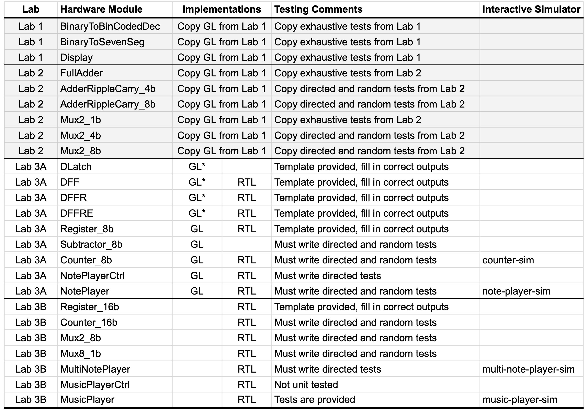
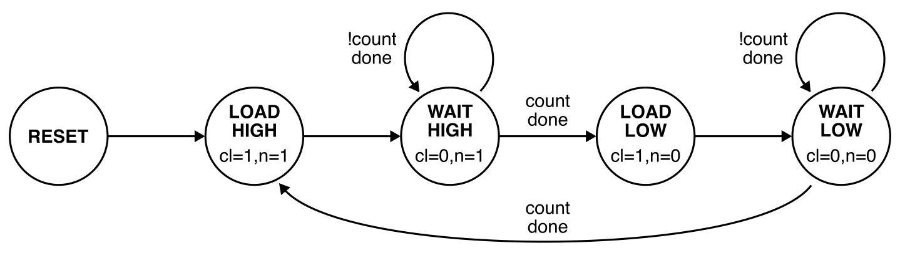
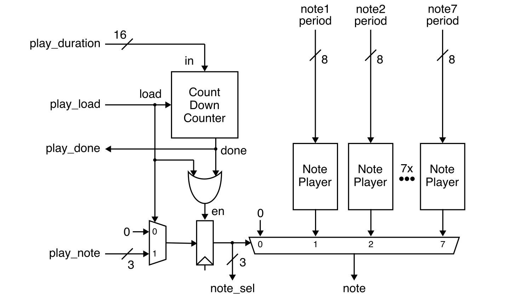
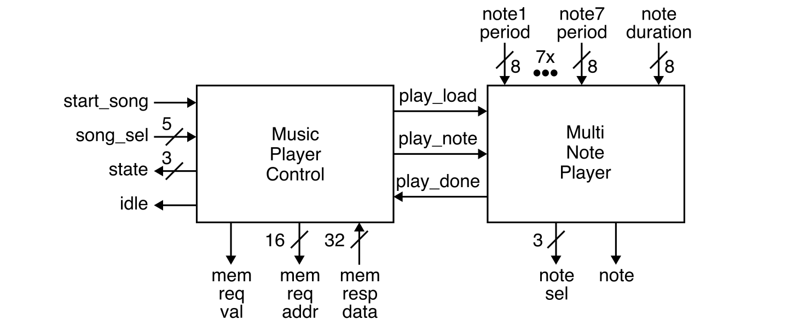
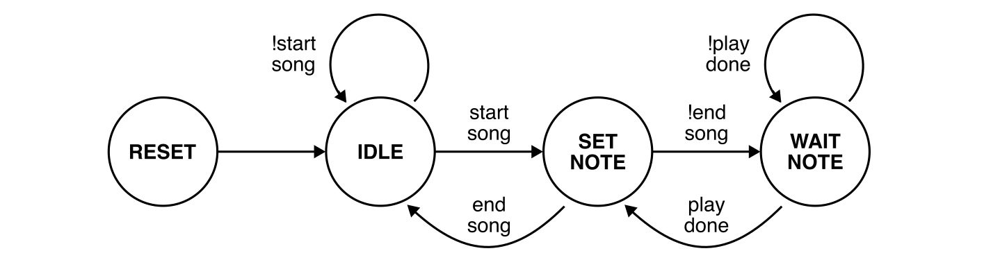
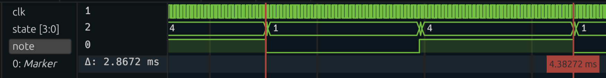
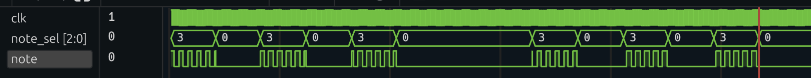

Lab 3 (Parts A & B): Music Player Implementation and Verification
==========================================================================

Lab 3 will give you experience designing, implementing, testing, and
prototyping combinational _and_ sequential logic using the Verilog
hardware description language. The lab reinforces several lecture topics
including sequential logic gates, finite-state machines (FSMs), and
sequential building blocks. More specifically, the lab will give students
experience with: latches, flip-flops, and registers; Moore and Mealy
FSMs; and counters. The lab will continue to provide opportunities to
leverage the three key abstraction principles: modularity, hierarchy, and
regularity. The lab will also enable students to better understand the
connection between simulation and prototyping.

You will be implementing a music player that takes as input a song
selection (via the switches) and a start song signal (via a push button).
The music player will then play the chosen song by generating a square
wave at appropriate note frequencies suitable for use with a
piezoelectric buzzer. An idle signal is displayed using an LED so that
user knows when the player is ready to play a new song. The music player
will make use of the adders and muxes from Lab 2. The song selection and
the current note are both displayed using seven-segment displays from Lab
1.

This lab also serves as a transition from lower-level gate-level (GL)
modeling to higher-level register-transfer-level (RTL) modeling. Some of
parts of your design will use explicit GL modeling or Boolean
equations, while other parts of your design will use RTL modeling.
Students will have a chance to appreciate how RTL modeling can improve
productivity but with less control over the final hardware
implementation.

The lab includes four parts:

 - Part A: Note Player Implementation and Verification
 - Part B: Music Player Implementation and Verification
 - Part C: Music Player FPGA Analysis and Prototyping
 - Part D: Music Player Report

Parts A and B are submitted by simply pushing the appropriate code to
GitHub. Part A is due on Thursday, October 17 at 11:59pm. Part B is due
on Thursday, October 24 at 11:59pm. **Even though Part B does not need to
be submitted on GitHub until Thursday, October 24, students still must
have Part B completed before their lab session during the FPGA week in
order to complete Part C!** Students can use the time after their lab
session to continue improving their code and verification quality. Part D
is due three days after the student's assigned lab session. All parts
must be done with your assigned lab partner. You can confirm your
assigned partner on Canvas (Click on _People_, then _Groups_, then search
for your name to find your lab group).

This handout assumes that you have read and understand the course
tutorials and that you have attended the discussion sections. To get
started, use VS Code to log into an `ecelinux` server, source the setup
script, and clone your individual remote repository from GitHub:

```bash
 % source setup-ece2300.sh
 % mkdir -p ${HOME}/ece2300
 % cd ${HOME}/ece2300
 % git clone git@github.com:cornell-ece2300/groupXX
 % cd ${HOME}/ece2300/groupXX
 % tree
```

where `XX` should be replaced with your group number. You can both pull
and push to your remote repository. If you have already cloned your
remote repository, then use `git pull` to ensure you have any recent
updates before working on your lab assignment.

```bash
 % cd ${HOME}/ece2300/groupXX
 % git pull
 % tree
```

Go ahead and create a build directory in the `lab3-music` directory for
this lab, and run configure to generate a Makefile.

```
% cd ${HOME}/ece2300/groupXX/lab3-music
% mkdir -p build
% cd build
% ../configure
```

Your repo contains the following files which are part of the automated
build system:

 - `Makefile.in`: Makefile for the build system
 - `configure`: Configure script for the build system
 - `configure.ac`: Used to generate the configure script
 - `scripts`: Scripts used by the build system

The following table shows all of the hardware modules you will be working
with in Lab 3.



Before starting, you should copy over all of the listed hardware modules
and the associated test benches for the seven-segment display from Lab 1
and the eight-bit ripple-carry adder and multiplexors from Lab 2. Make
sure all of these hardware modules pass all of your test cases.

Lab 3 requires implementing and verifying 23 hardware modules. While
this might seem like a daunting task, many of these hardware modules
require less than five lines of Verilog code. For many of the test
benches we provide students with a template so they need only enter the
expected outputs. Test cases are reused across the GL and RTL versions of
the same hardware module. **Start from the D latch and systematically
work your way down the table. Implement the GL and RTL versions at the
same time. Never move on to the next row in the table until you have
thoroughly tested the previous row.**

Remember that GL implementations must be implemented using either explicit
gate-level modeling or Boolean equations. For these designs, students are
only allowed to use these Verilog constructs:

 - `wire`, `assign`
 - `not`, `and`, `nand`, `or`, `nor`, `xor`, `xnor`
 - `~`, `&`, `|`, `^`
 - `1'b0`, `1'b1`, `1'd0`, `1'd1`, and other literals
 - `{}` (concatenation operator)
 - `{N{}}` (repeat operator)
 - module instantiation

Hardware modules marked in the table as GL* must _only_ use explicit
gate-level modeling (i.e., you cannot use `~`, `&`, `|`, `^`).

RTL implementations can use all of the GL constructs in addition to the
following Verilog constructs.

 - `logic`
 - `+`, `-`
 - `>>`, `<<`, `>>>`
 - `==`, `!=`, `<`, `>`, `<=`, `>=`
 - `&&`, `||`, `!`
 - `&`, `~&`, `|`, `~|`, `^`, `^~` (reduction operators)
 - `?:` (ternary operator)
 - `always_comb`, `always_ff @(posedge clk)`
 - `if`, `endif`
 - `case`, `endcase`

Note that some hardware modules have more specific restrictions; see the
source comments for more details. Using unallowed Verilog constructs will
result in significant penalties for code functionality and code quality.
If you have any questions on what Verilog constructs can and cannot be
used, please ask an instructor. There are no restrictions on Verilog
constructs in test benches.

**It is critical for students to work together to complete the lab
assignment.** It is unlikely one student can complete the entire lab on
their own. A very productive approach is to have one student work on the
design of a few hardware modules while the other student works on the
test benches for those same hardware modules. Then work together to test
and debug these modules. Then switch roles and move on the next few
modules.

1. Interface and Implementation Specification
--------------------------------------------------------------------------

You will be implementing and composing a variety of combinational and
sequential hardware modules including adders, muxes, latches, flip-flops,
registers, subtractors, and counters; ultimately you will be composing
these hardware modules to implement a music player. This section describe
the required _interface_ (i.e., the ports for the module and the module's
functional behavior) before describing the required _implementation_
(i.e., what goes inside the module) for each hardware module.

### 1.1. Latches and Flip-Flops

You will need to implement a GL latch and three GL/RTL flip-flops:

 - `DLatch`: D latch (level high, transparent when clock is one)
 - `DFF`: D flip-flop (positive edge triggered)
 - `DFFR`: D flip-flop with reset signal
 - `DFFRE`: D flip-flop with reset and enable signals

You should consult the lecture notes for the GL implementation of these
latches and flip-flops. You just need to directly map the implementation
from the lecture notes using explicit gate-level modeling. **Do not use
Boolean equations when implementing these latches and flip-flops!**

Recall from the discussion sections that we will need to make use of an
`always_ff` block for RTL modeling of sequential logic. Here is an
example of how to implement a D flip-flop using an `always_ff` block:

```verilog
  always_ff @( posedge clk ) begin
    q <= d;
  end
```

This `always_ff` block will execute on the positive edge (`posedge`) of
the clock signal (`clk`). We are using a special non-blocking assignment
(`<=`) which is meant to be used in `always_ff` blocks. The semantics of
a non-block assignment are: (1) right before the rising edge, the
right-hand side of every non-blocking assignment in the entire design is
evaluated and the result is saved; (2) right after the rising edge, the
saved values are assigned to the signal on the left-hand side. This
enables us to model flip-flops.

Note that this the _only_ form of an `always_ff` block you are allowed to
use in this course. You are not allowed to use `negedge` and you are not
allowed to trigger an `always_ff` with any other signals (e.g., in this
course, you are not allowed to include reset (`rst`) in the sensitivity
list for an `always_ff`).

You can use other RTL operations within an `always_ff` block. For
example, you can use an if/else conditional operation within an
`always_ff` block to model a D flip-flop with a (synchronous) reset
signal:

```verilog
  always_ff @( posedge clk ) begin
    if ( rst )
      q <= 0;
    else
      q <= d;
  end
```

Note that in this course we will only allow using an `always_ff` block in
very specific modules. Namely within the implementation of single-bit
flip-flops (i.e., `DFF_RTL`, `DFFR_RTL`, `DFFRE_RTL`) and within the
implementation of the multi-bit registers (e.g., `Register_8b_RTL`,
`Register_16b_RTL`). Students are not allowed to use an `always_ff`
anywhere else in their hardware designs. If a hardware design needs
sequential logic, then the design should instantiate one of these
single-bit flip-flops or multi-bit registers. This restriction is
critical to enabling new Verilog designers to know exactly what hardware
is being implemented. Arbitrarily using `always_ff` blocks can quickly
lead to incredibly complicated hardware models with no hope of
understanding what hardware we are actually implementing.

Once you have finished implementing all of the latches and flip-flops,
take a minute to appreciate the relationship between the GL and RTL
implementations. The RTL implementations are just a different way of
modeling the hardware within the GL implementation. The FPGA tools will
synthesize the RTL implementation into hardware very similar to what is
in the GL implementation.

### 1.2. Multi-Bit Registers

As discussed in lecture, we can create a GL multi-bit register by simply
instantiating a number of GL flip-flops in parallel. The data input (`d`)
and data output (`q`) of each flip-flop should be connected to their
corresponding bit of the register's multi-bit input and output ports. The
clock, reset, and enable signals should be connected to each flip-flop.
We need an GL eight-bit register for use in the GL count-down counter.

For RTL multi-bit registers there is no need to instantiate a number of
RTL flip-flops. We can instead model a multi-bit register using a single
`always_ff` block. A single non-blocking assignment can be used to assign
the multi-bit input to the multi-bit output on the rising edge of the
clock. We need RTL eight-bit and 16-bit registers for use in various more
complex RTL hardware modules.

### 1.3. Eight-Bit Subtractor

We need a GL eight-bit subtractor to implement the count-down counter.
Our subtractor will represent negative numbers using the two's complement
number system, which means we can efficiently implement a two's
complement subtractor using the same eight-bit ripple-carry adder you
developed in Lab 2. Our subtractor does not need a carry input nor a carry
output.

### 1.4. Count-Down Counters

The count-down counter has the following interface:


The reset input (`rst`) should reset the internal counter to zero. When
the load input (`load`) is high, then the counter should load the value
on the input (`in`) into the internal counter. The counter should
decrement by one every cycle until it reaches zero at which point the
done output (`done`) should be set to one. The input (`in`) must be
positive. Since we are using a two's complement number representation the
maximum allowed value for the input is 127.

Here is a trace of the expected output when counting down from three.

```
cyc  rst load in        in     count    count done
  0: 0   0    00000000 (  0) > 00000000 (  0) 1
  1: 0   1    00000011 (  3) > 00000000 (  0) 1
  2: 0   0    00000000 (  0) > 00000011 (  3) 0
  3: 0   0    00000000 (  0) > 00000010 (  2) 0
  4: 0   0    00000000 (  0) > 00000001 (  1) 0
  5: 0   0    00000000 (  0) > 00000000 (  0) 1
```

Pay careful attention to the exact cycle the output count is set to
three and the exact cycle the done signal is set to one. Your counter
must produce the exact same cycle-level behavior.

You are responsible for designing your own GL eight-bit counter that meets this
specification. Your GL implementation _must_ make use of the GL muxes, GL
registers, and GL subtractor. Do _not_ put any logic on the reset signal.
The reset signal should be directly attached to the reset input port of
the register without any logic. Do _not_ put any logic on the clock. The
clock signal should be directly attached to the clock input port of the
register without any logic. Start by drawing a block-level diagram. You
will need to show this diagram in lab for Part C and include this diagram
in the report for Part D.

You are also responsible for designing your own RTL eight-bit and 16-bit
counters that meet this specification. Your RTL counters _must_
explicitly instantiate an RTL register for the sequential logic, and then
use a single `always_comb` block for your combinational logic. You cannot
directly use an `always_ff` block in your RTL counter. You _must_
explicitly instantiate an RTL register. Do _not_ put any logic on the
reset signal. The reset signal should be directly attached to the reset
input port of the register without any logic. Do _not_ put any logic on
the clock. The counters are examples of _flat_ RTL modules, since they do
not instantiate any hardware modules other than the a register.

### 1.5. Note Player

The note player generates a square wave at a given frequency forever. It
includes a control unit and a count-down counter.


The clock and reset signals are not shown in the above block diagram. The
period is provided as an input port and is assumed to never change after
reset. The control unit should be implemented using the following
five-state Moore FSM.



The outputs are specified in each state: cl stands for `count_load` and n
stands for `note`. The FSM must use the following state encoding:

```
 State      Encoding
---------------------
 RESET      4'b0000
 LOAD_HIGH  4'b1000
 WAIT_HIGH  4'b0100
 LOAD_LOW   4'b0010
 WAIT_LOW   4'b0001
```

In the LOAD_HIGH state, the FSM should load the period into the
count-down counter, set the note output to be high, and move into the
WAIT_HIGH. In the WAIT_HIGH state, the FSM should continue to set the note
output to be high. Once the counter is done, the FSM should move into the
LOAD_LOW state. In the LOAD_LOW state, the FSM should load the period
into the count-down counter, set the note output to be high, and move
into the WAIT_LOW. In the WAIT_LOW state, the FSM should continue to set
the note output to be low. Once the counter is again done, the FSM should
move back to the LOAD_HIGH state to repeat the sequence.

Here is a trace of the expected output when the period is five.

```
cyc  rst period     state state      note
------------------------------------------
  0: 0   00000101 > 0000 (RESET    ) 0
  1: 0   00000101 > 1000 (LOAD_HIGH) 1
  2: 0   00000101 > 0100 (WAIT_HIGH) 1
  3: 0   00000101 > 0100 (WAIT_HIGH) 1
  4: 0   00000101 > 0100 (WAIT_HIGH) 1
  5: 0   00000101 > 0100 (WAIT_HIGH) 1
  6: 0   00000101 > 0100 (WAIT_HIGH) 1
  7: 0   00000101 > 0100 (WAIT_HIGH) 1
  8: 0   00000101 > 0010 (LOAD_LOW ) 0
  9: 0   00000101 > 0001 (WAIT_LOW ) 0
 10: 0   00000101 > 0001 (WAIT_LOW ) 0
 11: 0   00000101 > 0001 (WAIT_LOW ) 0
 12: 0   00000101 > 0001 (WAIT_LOW ) 0
 13: 0   00000101 > 0001 (WAIT_LOW ) 0
 14: 0   00000101 > 0001 (WAIT_LOW ) 0
 15: 0   00000101 > 1000 (LOAD_HIGH) 1
```

Pay careful attention to the exact cycle of each state transition and the
exact cycles the note is high and low. When you load the count-down
counter with the value five it will be zero on the sixth cycle. Your note
player must produce the exact same cycle-level behavior.

The GL version of the note player control unit should instantiate
four `DFFRE_GL` modules to store the four-bit FSM state. The next state
combinational logic and output combinational logic should be implemented
using Boolean equations. The GL version of the note player just composes
the GL note player control unit with the GL count-down counter.

The RTL version of the note player control unit should instantiate four
`DFFRE_RTL` modules to store the four-bit FSM state. The next state
combinational logic should be implemented using a single, dedicated
`always_comb` block. The output combinational logic should be implemented
using a separate `always_comb` block. The control unit is an example of a
_flat_ RTL module, since it does not instantiate any hardware modules
other than the flip-flops. The RTL version of the note player just
composes the RTL note player control unit with the RTL count-down
counter.

### 1.6. Multi-Note Player

The multi-note player can produce one of seven notes or a rest for a
specified duration by composing a counter, mux, register, and seven note
players.



The clock and reset signals are not shown in the above block diagram. The
periods are provided as an input ports and are assumed to never change
after reset. We will only be implementing an RTL version of the
multi-note player, and so we will use the RTL version of each of these
hardware modules. This is an example of _structural_ RTL, since it does
not directly include any `always_comb` blocks and instead just
instantiates other RTL modules.

To play a note using the multi-note player, the `play_note` input is set
to the desired note (i.e., which of the seven note period inputs to use),
the `play_duration` input is set to the desired duration, and the
`play_load` input is set high for one cycle. The desired note is produced
on the `note` output and when the duration is done the `play_done` output
is set high. The `note_sel` output is provided for debugging.

Note that when the note select (`note_sel`) is zero, then the multi-note
player should produce a rest (i.e., the note should stay low). You will
need to implement a RTL eight-bit 2-to-1 multiplexor and a RTL one-bit
8-to-1 multiplexor. Once these are implemented and tested you can compose
them with your RTL eight-bit count-down counter and your RTL note
players.

### 1.7. Music Player

The music player plays a song stored in memory. It includes a control
unit and a multi-note player.



The clock and reset signals are not shown in the above block diagram. The
periods are provided as an input ports and are assumed to never change
after reset. We will only be implementing an RTL version of the music
player. The music player control unit will include a Mealy FSM which
should be implemented using _flat_ RTL.

Songs are stored in memory as a sequence of notes. The memory is arranged
as 64K 4-byte words. The memory interface has a memory request valid
port (`memreq_val`) and a memory address port (`memreq_addr`). The memory
address is a _byte_ address. To read a value from memory, we need to set
the memory address to the desired byte address and set the memory request
valid signal high. The data will be returned _combinationally_ (i.e., on
that same cycle) on the `memresp_data` port.

Our music payer can play songs with up to seven notes and a rest. Each
note is stored in one 4-byte word using the following encoding:

```
 NOTE      Encoding
------------------------
 REST      32'h00000000
 NOTE_G    32'h00000001
 NOTE_A    32'h00000002
 NOTE_B    32'h00000003
 NOTE_C    32'h00000004
 NOTE_D    32'h00000005
 NOTE_E    32'h00000006
 NOTE_F    32'h00000007
 SONG_END  32'hffffffff
```

Each song can have a maximum of 128 notes. The value FFFF_FFFF (i.e., all
ones) is used to indicate the end of a song. The music player can play up
to 16 songs; so the music player will only use 16*128*4B = 8KB of
storage. The song _memory map_ (i.e., how the songs are arranged in
memory) looks like this:

```
 address song note
-------------------
 0x0000  0    0    start of song 0
 0x0004  0    1
 0x0008  0    2
 ...
 0x01fc  0    127
 0x0200  1    0    start of song 1
 0x0204  1    1
 0x0204  1    1
 ...
 0x03fc  1    127
 0x0400  2    0    start of song 2
 ...
```

The control unit will need its own memory address counter to keep track
of the memory address of the note we are currently playing. This counter
is initialized using the song select input (`song_sel`). From the above
memory map, we can see that the starting memory address for a song is
just:

```
  { 5'b0, song_sel, 9'b0 }
```

The counter will then need to increment this memory by four (because we
are using memory byte addresses and each note is four bytes) so the music
player can read the next note.

The control unit should be implemented using the following four-state
Mealy FSM.



The FSM must use the following state encoding:

```
 State      Encoding
---------------------
 RESET      2'b00
 IDLE       2'b01
 SET_NOTE   2'b10
 WAIT_NOTE  2'b11
```

In the IDLE state, the music player should initialize the memory address
counter to the desired song using the song select input (`song_sel`),
wait until start song is high, and then move into the SET_NOTE state. In
the SET_NOTE state, the FSM should read the next note from memory by
using the address from the memory address counter and setting the memory
request valid signal high. Since the memory is combinational, the
SET_NOTE state should also handle the memory response. If the note read
from memory is SONG_END, then the FSM should return to the IDLE state.
Otherwise, the FSM should set the control signals for the multi-note
player appropriately, increment the memory address counter, and move into
the WAIT_NOTE state. In the WAIT_NOTE state, the FSM should wait until
the multi-note player is done before moving back into the SET_NOTE state
to read the next note from memory.

2. Testing Strategy
--------------------------------------------------------------------------

You are responsible for developing an effective testing strategy to
ensure all implementations are correct. Writing tests is one of the most
important and challenging aspects of designing hardware. Hardware
engineers often spend far more time implementing tests than they do
implementing the actual hardware design.

### 2.1. Basic Testing

We will be using the same lightweight testing framework from the previous
labs. For each hardware module, we provide a test bench for you to use
along with one basic test case. We will be using the same automated build
system from Lab 2 to simplify linting, compiling, and running tests. You
can run the basic tests for all hardware modules using the generated
`Makefile`.

```bash
% cd ${HOME}/ece2300/groupXX/lab3-music/build
% make check
```

You can also build and run a single test simulator.

```bash
% cd ${HOME}/ece2300/groupXX/lab3-music/build
% make DLatch_GL-test
% ./DLatch_GL-test
```

You can specify which specific test case to run on the command line and
also dump waveforms that can be viewed using Surfer.

```bash
% cd ${HOME}/ece2300/groupXX/lab3-music/build
% make DLatch_GL-test
% ./DLatch_GL-test +test-case=1
% ./DLatch_GL-test +test-case=1 +dump-vcd=waves.vcd
```

### 2.2. Exhaustive Testing

The following test benches are for hardware modules with a limited
number of inputs, and thus you can (and should) use exhaustive testing:

 - `DLatch_GL-test.v`
 - `DFF_GL-test.v`, `DFF_RTL-test.v`

We provide test case templates for these test benches so all you need to
do is fill in the expected output. You do not need to add any more test
cases. Notice that `DFF_GL` and `DFF_RTL` have the exact same interface
and thus will use the exact same test cases. We have refactored the test
cases for these hardware modules into `DFF-test-cases.v` and then
included these test cases in `DFF_GL-test.v` and `DFF_RTL-test.v`. This
way we only need to write the test cases once.

### 2.3. Directed Testing

The remaining hardware modules all have many more inputs and thus would
required hundreds or even thousands of checks to implement exhaustive
testing. So for the remaining hardware modules you can use directed
testing to check for specific corner cases.

We provide test case templates for the following test benches so all you
need to do is fill in the expected output. You do not need to add any
more test cases.

 - `DFFR_GL-test.v`, `DFFR_RTL-test.v`
 - `DFFRE_GL-test.v`, `DFFRE_RTL-test.v`
 - `Register_8b_GL-test.v`, `Register_8b_RTL-test.v`
 - `Register_16b_RTL-test.v`

For some of these these we have again refactored the test cases for these
hardware modules into a separate `-test-cases.v` file. You must write
your own directed test cases for the following test benches:

 - `Subtractor_8b_GL-test.v`
 - `Counter_8b_GL-test.v`, `Counter_8b_RTL-test.v`, `Counter_16b_RTL-test.v`
 - `Mux2_8b_RTL-test.v`, `Mux8_1b_RTL-test.v`
 - `NotePlayerCtrl_GL-test.v`, `NotePlayerCtrl_RTL-test.v`
 - `NotePlayer_GL-test.v`,`NotePlayer_RTL_RTL-test.v`
 - `MultiNotePlayer_RTL-test.v`

You do not need to unit test `MusicPlayerCtrl_RTL` and we provide you
tests for `MusicPlayer_RTL`.

Remember, each directed test case should focus on testing a very specific
kind of functionality and they should contain 2-10 checks. Be sure to add
your tests cases to the list in the `initial` block and to check the
output of the test simulator to confirm that your directed test cases are
running and testing what you expect them to. Consider purposefully
inserting a bug in your designs to see if your directed test cases will
catch the bug.

### 2.4. Random Testing

Directed testing is useful for testing the known unknowns, but what about
the unknown unknowns? How should we test for corner cases we have not
even thought of yet? Random testing can help increase our testing
coverage and increase our confident that our hardware design is
functionally correct. You should implement one random test case for each
of the following hardware modules:

 - `Subtractor_8b_GL-test.v`
 - `Counter_8b_GL-test.v`, `Counter_8b_RTL-test.v`, `Counter_16b_RTL-test.v`
 - `Mux2_8b_RTL-test.v`, `Mux8_1b_RTL-test.v`
 - `NotePlayer_GL-test.v`,`NotePlayer_RTL_RTL-test.v`

Random test cases should include a for loop. Each iteration should: (1)
generate random input values; (2) use Verilog test code to
programmatically determine the correct output values; and (3) use the
`check` task to ensure the design-under-test produces the correct outputs
give the corresponding random inputs.

### 2.3. Simulator

We have provided you four simulator which will emulate the FPGA prototype
you will be demoing in Part C of the lab. After finishing implementing
and thoroughly testing your RTL counter, you can build and run the
simulator for the counter like this:

```bash
% cd ${HOME}/ece2300/groupXX/lab3-music/build
% make counter-sim
% ./counter-sim +switches=00111
```

The switches are connected to the counter input. The counter simulator
will display the input and the output of the count-down counter by
showing what the six seven segment displays would look like on the FPGA
prototype. You can press enter to emulate the clock toggling.

After finishing implementing and thoroughly testing your RTL note
player, you can build and run the simulator for the note player like
this:

```bash
% make note-player-sim
% ./note-player-sim +switches=0100_0100
```

The switches will set the period of the note player. Here is a table
showing the mapping from inputs to notes.

```
                   period period    freq
switches  hex  dec (cycs)   (ms)    (Hz) note
0111_1011 0x7b 123    250   5.12  195.31 G3
0110_1101 0x6d 109    222   4.55  219.95 A3
0110_0001 0x61  97    198   4.06  246.61 B3
0101_1011 0x5b  91    186   3.81  262.52 C4
0101_0001 0x51  81    166   3.40  294.15 D4
0100_1000 0x48  72    148   3.03  329.92 E4
0100_0100 0x44  68    140   2.87  348.77 F4
```

The simulator will generate a VCD file that you can then open using
Surfer to look at the note output waveform. You can measure period
between rising edges of the note output to verify that the note player is
indeed generating the note at the proper frequency. For example, this is
what the output looks like when setting the switches to 0100_0100. The
period is 2.86ms which is 348Hz or the note F4. Try other notes!



After finishing implementing and thoroughly testing your RTL multi-note
player, you can build and run the simulator for the multi-note player
like this:

```bash
% make multi-note-player-sim
% ./multi-note-player-sim +switches=111
```

The switches now select which note to play according to the following
table.

```
             period period    freq
sw  hex  dec (cycs)   (ms)    (Hz) note
000                                rest
001 0x7b 123    250   5.12  195.31 G3
010 0x6d 109    222   4.55  219.95 A3
011 0x61  97    198   4.06  246.61 B3
100 0x5b  91    186   3.81  262.52 C4
101 0x51  81    166   3.40  294.15 D4
110 0x48  72    148   3.03  329.92 E4
111 0x44  68    140   2.87  348.77 F4
```

This simulator will also generate a VCD file that you can then open using
Surfer to look at the note output waveform. Try selecting different notes
and verifying that the period is as expected.

After finishing implementing and thoroughly testing your RTL music
player, you can build and run the simulator for the music player like
this:

```bash
% make music-player-sim
% ./music-player-sim +switches=001
```

The switches now select which song to play. Here is what the output looks
like for song 1. You will figure out which song this is in Part C of the
lab.



3. Lab Code Submission
--------------------------------------------------------------------------

Your code quality score will be based on the way you format the text in
your source files, proper use of comments, deletion of instructor
comments, and uploading the correct files to GitHub (only source files
should be uploaded, no generated build files). **Note that students must
remove unnecessary comments that are provided by instructors in the code
distributed to students. Students must not commit executable binaries or
any other unnecessary files.**

To submit your code you simply upload it to GitHub. Your design code will
be assessed both in terms of functionality and code quality. Your
functionality score will be determined by running your code against a
series of tests developed by the instructors to test its correctness.
Your test bench code will also be assessed both in terms of verification
quality and code quality. Here is how we will be testing your code
submission for Lab 3 (Part A):

```bash
% mkdir -p ${HOME}/ece2300/submissions
% cd ${HOME}/ece2300/submissions
% git clone git@github.com:cornell-ece2300/groupXX

% cd ${HOME}/ece2300/submissions/groupXX/lab3-music
% mkdir -p build
% cd build
% ../configure
% make check-partA
```

Here is how we will be testing your code submission for Lab 3 (Part B):

```bash
% mkdir -p ${HOME}/ece2300/submissions
% cd ${HOME}/ece2300/submissions
% git clone git@github.com:cornell-ece2300/groupXX

% cd ${HOME}/ece2300/submissions/groupXX/lab3-music
% mkdir -p build
% cd build
% ../configure
% make check-partB
```
