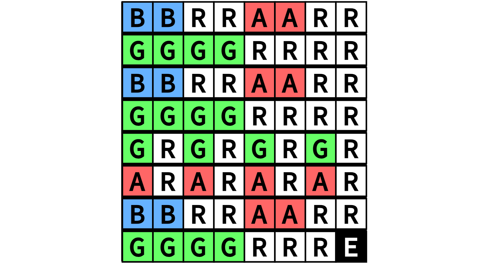

Lab 3 (Parts C & D) Optional Add-On: Custom Song
==========================================================================

!!! warning "Complete After Parts C and D"

    This section is an optional add-on to the main lab, and is meant for
    students who have already completed Parts C and D. If you have not
    already completed Parts C and D, **please go back and do so first**.

As part of Lab 3, students have the option to play a song of their
creation/choosing on the FPGA. Students will need to modify the provided
music memory to encode the notes they wish to play, then re-compile their
design for the FPGA.

1. Adding a Song to Memory
--------------------------------------------------------------------------

For this lab, the memory that stores music notes is implemented in
`lab3-music/hw/MusicMem_RTL.v`. Open this file and look inside the
`MusicMem_RTL` module. You should see a large statement that looks like:

```verilog
  always_comb begin
    case( memreq_addr )

      //----------------------------------------------------------------
      // Song 0
      //----------------------------------------------------------------

      16'h0000: memresp_data = NOTE_B;
      16'h0004: memresp_data = REST;
      16'h0008: memresp_data = NOTE_A;
      16'h000C: memresp_data = REST;
      16'h0010: memresp_data = NOTE_G;
      16'h0014: memresp_data = REST;
      16'h0018: memresp_data = NOTE_A;
      16'h001C: memresp_data = REST;

      ...

      16'h00FC: memresp_data = SONG_END;

      //----------------------------------------------------------------
      // Song 1
      //----------------------------------------------------------------

      16'h0200: memresp_data = NOTE_B;
      16'h0204: memresp_data = REST;

      ...

    endcase
    if ( !memreq_val )
        memresp_data = 32'b0;
  end
```

Here, we can see that our memory is implemented as a (rather large)
look-up table. The notes are defined as `NOTE_G` up to `NOTE_F`, with 
`REST` signifying to play no sound. When `MusicMem_RTL` gets a request,
it checks the address given by `memreq_addr`, and sets `memresp_data` to
be the corresponding note. You'll see that the memory range for each song
ends with `SONG_END`, to signify to our player that the song is finished.

As part of this memory, we've left a range (corresponding to Song #2) for
you as the student to implement a song of your choice, if you'd like. In
`MusicMem_RTL`, you can find the following section:

```verilog
      //----------------------------------------------------------------
      // Song 2
      //----------------------------------------------------------------
      // OPTIONAL: Replace note values to make a new song!

      16'h0400: memresp_data = SONG_END;
      16'h0404: memresp_data = SONG_END;
      16'h0408: memresp_data = SONG_END;
      16'h040C: memresp_data = SONG_END;
      16'h0410: memresp_data = SONG_END;
      16'h0414: memresp_data = SONG_END;
      16'h0418: memresp_data = SONG_END;
      16'h041C: memresp_data = SONG_END;

      ...
```

You can see that each note in the song is currently `SONG_END`. To write
a custom song, you should replace as many of these values as needed with
the notes for your song. Keep in mind that notes will lead directly into
each other; if you want a break between notes, you will have to include
a `REST` between them

!!! success "Implement a Song"

    Using the template above, implement a new song as Song #2 in the music
    memory. If you don't have a song in mind, you can use 
    "Hot Cross Buns", given below and starting "B", "B", "R", "R", ... 
    (with R representing `REST`, and E representing `SONG_END`):

    

2. Playing Your Custom Song
--------------------------------------------------------------------------

Once you've created your custom song, you can re-synthesize your overall
design (including `MusicMem_RTL.v`) and put your design on the FPGA, as
described in the main handout. From there, use the switches to select
Song #2. You should hopefully be able to hear your song being played by
your music player!
