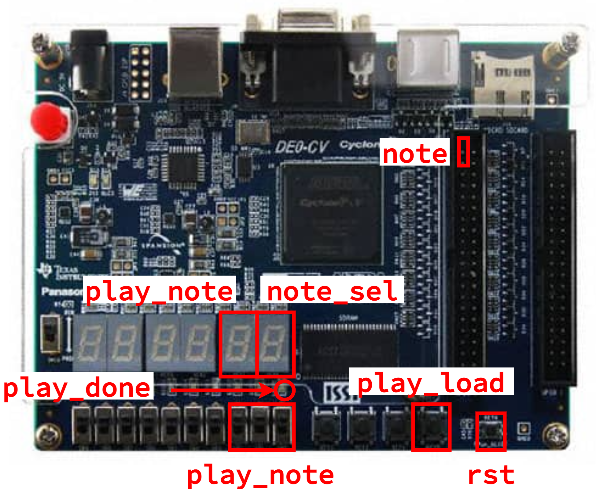
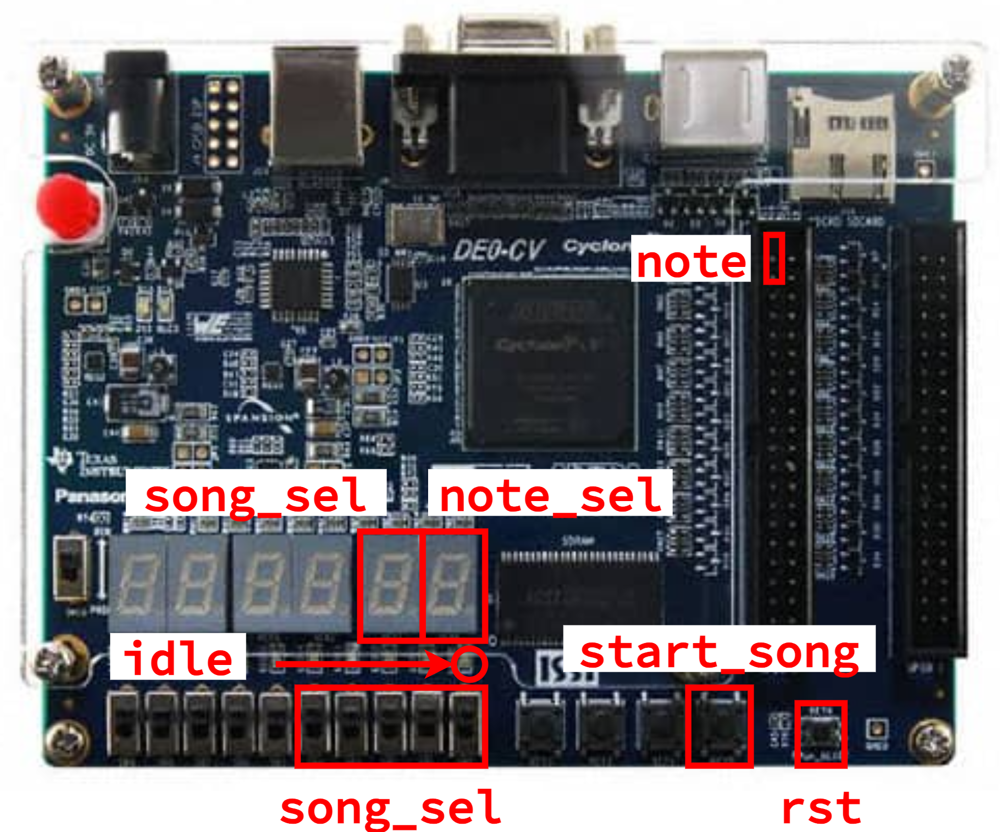

Lab 3 (Parts C & D): Music Player - FPGA Analysis/Prototype and Report
==========================================================================

Lab 3 is meant to give you experience designing, implementing, testing,
and prototyping combinational _and_ sequential logic using the Verilog
hardware description language. The lab reinforces several lecture topics
including sequential logic gates, finite-state machines (FSMs), and
sequential building blocks. More specifically, the lab will give students
experience with: latches, flip-flops, and registers; Moore and Mealy
FSMs; and counters. The lab will continue to provide opportunities to
leverage the three key abstraction principles: modularity, hierarchy, and
regularity. The lab will also enable students to better understand the
connection between simulation and prototyping.

With the introduction of sequential logic, our designs can now model more
complex and interesting designs; in particular, designs that can have
real-world applications. You should have already worked in simulation to
verify your music player and all of the submodules in Lab 3 Parts A and
B. In Lab 3 Part C, we will be using the FPGA to emulate these designs,
connecting them to real-world phenomena such as music. By the end of the
lab, you should be able to play a simple song using your design, and
understand the digital logic that allows it to happen.

This handout assumes that you have read and understand the course
tutorials, attended the discussion sections, and successfully completed
Labs 1-2. Here are the steps to get started:

 - Step 1. Find your lab partner
 - Step 2. Find a free workstation
 - Step 3. Ask the TAs for a lab check-off sheet (each student needs
    their own check-off sheet)

Throughout this handout you will see two kinds tasks: lab check-off tasks
and lab report tasks.

For each _lab report task_ you must take some notes, save a screenshot,
and/or record some data for your lab report. Students can start working
on their lab report during their lab session, but will likely need to
continue working on their lab report after the lab session. The lab
report is due three days after your lab session at 11:59pm.

For each _lab check-off task_ you must raise your hand and have a TA come
to check-off your work. The TA will ask you the questions included as
part of the lab check-off task and the assess your understanding using
the following rubric: mastery; accomplished; emerging; beginning. If the
TA and students together feel the students have not mastered the lab
check-off task, the students are encouraged to take a few minutes and try
again.

In contrast to previous labs, Lab 3 is much more application-oriented. We
will spend less time exploring the design space, and more time exploring
the applications of our design. Because of this, you will need some
additional hardware:

 - A __piezoelectric ("piezo") buzzer__. This is a tiny speaker that can
   play our notes
 - Four __jumper wires__:
    + Two __F-M jumper wires__. These have one "input" and one "output"
    + Two __F-F jumper wires__. These have two "inputs"
 - A __USB Drive__. Some of the lab report tasks will require you to
   capture waveforms from the oscilloscope. You should follow the
   instructions to save these on your USB Drive, and transfer them to
   your own laptop before leaving the lab.


**Real hardware can often be delicate and fragile.** As a general rule,
please do not "force" anything together, and take time and caution when
connecting different components. If you have any questions or need
assistance, please ask the TAs.

!!! success "Lab Check-Off Task 1: Setup FPGA Board and Hardware Supplies"

    Request an FPGA board and the hardware supplies from the TAs. The TAs
    will record the board number and the hardware supply kit number on
    your check-off sheet. Use the power cord to plug the FPGA board into
    an outlet, and use the USB cable to plug the FPGA board into the
    workstation. Do not use the other hardware supplies until instructed
    to do so.

1. Simulation of a Music Player
--------------------------------------------------------------------------

Before starting to work on an FPGA prototype, you must make sure you have
a working Verilog hardware design that has been _thoroughly_ tested in
simulation. One student should start VS Code on the workstation, log into
the `ecelinux` servers, source the setup script, and make sure their
individual remote repository is up to date.

```bash
% source setup-ece2300.sh
% cd ${HOME}/ece2300/groupXX
% git pull
% tree
```

Where `XX` is your group number. Now run all of the tests from a clean
build to ensure your design is fully functional.

```bash
% cd ${HOME}/ece2300/groupXX/lab3-music
% trash build
% mkdir build
% cd build
% ../configure
% make check
```

We now need to get the files for your design from `ecelinux` onto the
workstation. This requires multiple steps.

 - Step 1. Click _Microsoft Edge_ on the desktop to open a web-browser on
   the workstation to log into GitHub and then find your repository

 - Step 2. Start PowerShell by clicking the _Start_ menu then searching
   for _Windows PowerShell_

 - Step 3. Clone your repo onto the workstation by using this command in
   PowerShell (where `netid` is your Cornell NetID, **notice we are using
   https!**):

```
% git clone https://github.com/cornell-ece2300/groupXX
```

 - Step 4. In the _Connect to GitHub_ pop-up, click _Sign in with your
   browser_

 - Step 5. You may be asked for your GitHub username again and you may be
   asked to authorize the Git Credential Manager; click _authorize
   git-ecosystem_

 - Step 6. Verify that you have successfully cloned your repo by changing
   into your repo and using `tree` on the workstation:

```
% cd groupXX
% tree
```

!!! success "Lab Check-Off Task 2: Verify Tests"

    Show a TA that your hardware designs are passing all of your tests.
    The TA will ask one student to explain the purpose of the note player
    control FSM and to show the TA specific lines of code in the GL and
    RTL implementation that make this a Moore FSM. The TA will ask the
    other student to explain the purpose of the music player control FSM
    and to show the TA specific lines of code in the RTL implementation
    that make this a Mealy FSM.

2. Setup Quartus Project
--------------------------------------------------------------------------

Click _Quartus (Quartus Prime 19.1)_ on the desktop to start Quartus, and
click _Run the Quartus Prime software_. You might need to try starting
Quartus twice. Setup a new Quartus project using the _New Project
Wizard_:

 - Directory, Name, Top-Level Entity
    + Working directory: `C:\Users\netid\lab3`
    + Name of this project: `lab3`
    + Name of top-level design entity: `lab3`
    + Click _Next_
 - Directory does not exist. Do you want to create it?
    + Click yes
 - Project Type
    + Choose _Empty Project_
    + Click _Next_
 - Add Files
    + Click triple dots to right of _File name_
    + Click on _This PC_, then navigate to your cloned repo by choosing
       _Windows (C:) >  Users > netid > netid_ where _netid_ is your
       Cornell NetID
    + Shift-click on every Verilog hardware design file (do not include
       any test files)
    + Click _Open_
    + Click _Next_
 - Family, Device, and Board Settings
    + Click _Board_ tab
    + Family: _Cyclone V_
    + Select _DE0-CV Development Board_
    + Make sure _Create top-level design file_ is checked
    + Click _Next_
 - EDA Tool Settings
    + Click _Next_
 - Summary
    + Click _Finish_

Since we are now using RTL modeling, there is one new step, similar to
Lab 2. You must choose _Assignments > Settings_ from the menu. Then
select the category _Compiler Settings > Verilog HDL Input_ and under
_Verilog version_ click _SystemVerilog_. Then click _OK_.

3. Synthesize, Analyze, Integrate, and Configure Counters
--------------------------------------------------------------------------

We will start by synthesizing and analyzing the two different counter
implementations. Once we better understand the tradeoffs in these
implementations, we can make high-level conclusions about their tradeoffs.

!!! note "Lab Report Task 1: Gate-Level Counter Block Diagram"

    Make sure you have the block diagram for your gate-level counter
    which you prepared in Part A. If you did not draw a block diagram in
    Part A, the you _must_ draw a diagram now. Save this diagram since
    you will be annotating it later in the lab.

!!! success "Lab Check-Off Task 3: Discuss Gate-Level Counter Block Diagram"

    Show a TA your block diagram. Explain how loading a new value works.
    Explain how the done signal is implemented.

### 3.1. Synthesize and Analyze GL Counter

To synthesize and analyze the gate-level counter in isolation first find
the _Project Navigator_ pane and click on _Hierarchy_ to display the
drop-down list. Choose _Files_ and select the `Counter_8b_GL.v` file.
Right click on the file and choose _Select as Top-Level Entity_. Then
click on _Files_ to display the drop-down list again. Choose _Hierarchy_
and confirm that `Counter_8b_GL` is shown as the only entity.

As in Lab 2, we need to create a _timing constraint_ file. Unlike in Lab
2, we also now need to inform the tools that there is a _clock_ signal as
part of our design. Identifying the clock signal will make the tools work
to ensure that our design has no setup or hold time violations. Similar
to Lab 2, when finished, the design will either "meet timing" (i.e., the
actual critical path delay is less than the constraint and there are no
hold time violations) or "not meet timing" (i.e., the actual critical
path delay is greater than the constraint or there are hold time
violations).

Here are the steps to create a timing constraint file:

 - Choose _File > New_ from the menu
 - Click _Synopsys Design Constraints File_
 - Click _OK_
 - Enter the constraints shown below
 - Click _File > Save_ from the menu
 - Name the file _timing.sdc_
 - Save the file in the _lab3_ directory

We will use the following initial constraints:

```
set_max_delay -from [all_inputs] -to [all_outputs] 20
set_min_delay -from [all_inputs] -to [all_outputs] 0

create_clock -name clk -period 20 [get_ports {clk}]

set_output_delay -add_delay -clock clk -max 0 [all_outputs]
set_output_delay -add_delay -clock clk -min 0 [all_outputs]

set_input_delay  -add_delay -clock clk -max 0 [all_inputs]
set_input_delay  -add_delay -clock clk -min 0 [all_inputs]
```

These constraints tell the FPGA tools that:

 - Our critical path delay constraint is `20ns` from all inputs to all
   outputs as well
 - We have a clock signal named `clk`
    - There should be setup time violations with respect to
      `clk` when the period is `20ns`
    - There should be no hold time violations with respect to `clk`
 - The output ports have a setup time of 0 (max constraint) and a hold
   time of 0 (min constraint)
 - The input ports have clock-to-port propagation delay of 0 (max
   constraint) and a clock-to-port contamination delay of 0 (min
   constraint)

Now use the following steps to synthesize your design and then look at
the RTL viewer, technology map viewer, and chip planner.

 - Choose _Processing > Start Compilation_ from the menu
 - Wait 2-3 minutes for synthesis to complete
 - RTL Viewer
    + Choose _Tools > Netlist Viewer > RTL Viewer_ from the menu
    + Drill down in the hierarchy to see the netlist for the counter
    + Does the RTL viewer match your expectations?
    + Choose _File > Close_ from menu to close the RTL viewer
 - Technology Map Viewer
    + Choose _Tools > Netlist Viewer > Technology Map Viewer (Post-Fitting)_
    + Drill down into the subtractor all the way to see the
       implementation of the full adder
    + Does the technology viewer match your expectations?
    + Choose _File > Close_ from the menu to close the technology map
       viewer
 - Chip Planner
    + Choose _Tools > Chip Planner_ from the menu
    + Identify where the logic used to implement your design is located
       in the FPGA
    + Choose _File > Close_ from the menu to close the chip planner

The next step is to analyze the area of your design.

 - Choose _Processing -> Compilation Report_ from the menu
 - Under _Table of Contents_ choose _Fitter > Resource Section > Resource
   Usage Summary_
 - Look through the report to determine the number of combinational ALUTs
   (configurable look-up tables) that are used for your design
 - Look through the report to determine the number of dedicated logic
   registers that are used for your design

You will be working to fill in this data table:

 - <https://docs.google.com/spreadsheets/d/1b0Ep9hQOy_K2F6YslZt8ExoQcgabWJIXPrI3lRXn1mI/edit?gid=0#gid=0>

Make a copy of this table, and enter in the data for your ripple-carry
adder with a 20ns critical path delay constraint. You can find the number
of 7-input ALUts, 6-input ALUts, etc in the area report. You can find the
dedicated logic registers also in the area report.

The final step is to analyze the timing (i.e., the critical path delay)
of your design. We will analyze timing for the _Slow 1100mV 85C Model_
which is the default choice in the Timing Analyzer.

 - Choose _Tools > Timing Analyzer_ from the menu
 - Double-click _Update Timing Netlist_
 - Choose _Reports > Custom Reports > Report Timing_ from the menu
 - Report Timing
    + Clocks - From clock: _clk_
    + Clocks - To clock: _clk_
    + Targets - From: _[get_registers *]_
    + Targets - To: _[get_registers *]_
    + Report number of paths: _100_
    + Click _Report Timing_
 - Identify the propagation delay of the displayed path
 - Look at the actual critical path (i.e., _Data Arrival Path_) which
    shows the longest path from one of the inputs through your
    design to one of the outputs
 - Choose _File > Close_ from the menu to close the timing analyzer

Note that your GL counter will not meet timing. This is because the FPGA
tools do not understand that your gate-level flip-flop is actually a
register (check the number of dedicated logic registers in the area
report to confirm this). The FPGA tools are designed to recognize
specific RTL patterns and infer appropriate sequential logic, but they
are simply not designed to recognize specific GL patterns. Even so, we
can still analyze the critical path in our design.

We will use the following conventions when analyzing the critical path
based on FPGA timing reports. The FPGA timing report will have three
parts:

 - The clock part of the data arrival path: this is the delay from the
   clock pin to the flip-flop at the start of the path.

 - The data part of the data arrival path: this is the actual propagation
   path delay from one flip-flop to another flop-flop.

 - The clock part of the data required path: this is the delay from the
   clock pin to the flip-flop at the end of the path.

The following timing report illustrates these three parts:


The above image shows that you should count the delay from the start of
the path until the signal leaves the initial flip-flop or register module
as the clock-to-q delay, and you should count the delay from when the
signal enters the final flip-flop until the end of the path as the setup
time. If you select multiple cells in the _Incr_ column and hover your
mouse it will display a pop-up showing the sum of the delays along that
portion of the path.

Also notice that the propagation path delay and the slack do not add up
to the clock constraint. This is due to clock skew. Clock skew means the
clock reaches the initial and final flip-flops at a different times. You
can calculate the effective clock skew as follows:

$$t_{skew} = t_{pathdelay} + t_{slack} - t_{constraint}$$

The effective clock skew is different from what you will see in the
timing report because the tools are using a more complicated calculation.
For our purposes you should always use the effective clock skew as
calculated above. A negative effective clock skew means the clock reaches
the final flip-flop before it reaches the initial flip-flop. A positive
effective clock skew means the clock reaches the initial flip-flop before
it reaches the final flip-flop.

Enter the slack and critical path delay in the data table. The
spreadsheet will calculate effective clock skew for you.

!!! note "Lab Report Task 2: Collect Data for Gate-Level Counter"

    Save your completed data table with your analysis of the gate-level
    counter and include it in your report. 

     - When generating your timing report, select "File name" to save
       your timing report
     - You will only need to collect 1 path for this portion
    
    Draw the critical path on your
    block-level diagram. Annotate the clock-to-q delay, the propagation
    delay of each block along the critical path, and the setup time on
    your block level diagram. Save the critical path timing report text
    file and include it in your report. You only want to save the _Data
    Arrival Path_ from the timing report text file. Do NOT include
    anything else from the timing report text file. You must format the
    critical path with a fixed-width font and size the font such that it
    fits on a single page. You might need to delete some rows from the
    critical path to make it fit. Try to make sure that the remaining
    rows still clearly show where the critical path goes. **If you do not
    follow this requirements then we will ignore your critical path in
    the lab report.**

!!! success "Lab Check-Off Task 4: Discuss Gate-Level Counter Critical Path"

    Show a TA your data table and timing report. Explain why there are no
    dedicated logic registers. Show a TA the critical path on your block
    diagram and clearly show how the delays in the timing report
    correspond to the delays annotated on the block diagram.

### 3.2. Synthesize and Analyze RTL Counter

Use the same process to synthesize and analyze the RTL counter in
isolation. Remember to change that hardware module to be the top-level
entity. So find the _Project Navigator_ pane and click on _Hierarchy_ to
display the drop-down list. Choose _Files_ and select the
`Counter_8b_RTL.v` file. Right click on the file and choose _Select as
Top-Level Entity_. Then click on _Files_ to display the drop-down list
again. Choose _Hierarchy_ and confirm that `Counter_8b_RTL` is shown as
the only entity.

Go through the same process of looking at the RTL Viewer, Technology Map
Viewer, and the Chip Planner. Spend time looking at the Technology Map
Viewer and try to figure out how the blocks in the Technology Map Viewer
connect to your Verilog implementation. Go through the same process of
determining the area utilization. Do the number of dedicated logic
registers match your expectation? Go through the same process of
conducting a timing analysis. Enter the area, slack, and critical path
delay in the data table. The spreadsheet will calculate effective clock
skew for you.

Your RTL counter _should_ meet timing. This is because the FPGA tools
_do_ understand that your RTL flip-flop is actually a register (check the
number of dedicated logic registers in the area report to confirm this).
As mentioned above, the FPGA tools are designed to recognize specific RTL
patterns and infer appropriate sequential logic. You will likely observe
that the area is much less than the GL implementation and the critical
path is much shorter. This because for the GL counter the tools were not
able to actually do any timing optimization because they did not
understand how the timing constraints connected to the GL flip-flop,
while for the RTL counter the FPGA tools are able to do standard timing
optimization.

!!! note "Lab Report Task 3: Collect Data for RTL Counter"

    Save your completed data table with your analysis of the RTL counter
    and include it in your report. Save a screenshot of the technology
    mapper view for your RTL counter. Annotate this screen shot by
    circling what logic implements:

     - (1) The storage element that keeps track of the current count
     - (2) The logic that determines the subtracted count
     - (3) The logic that determines what should be the next stored count
     - (4) The logic that determines whether the counter is done

    Clearly label each circle with the corresponding Verilog code
    snippet. Save the critical path timing report text file and include
    it in your report. You only want to save the _Data Arrival Path_ from
    the timing report text file. Do NOT include anything else from the
    timing report text file. You must format the critical path with a
    fixed-width font and size the font such that it fits on a single
    page. **If you do not follow this requirements then we will ignore
    your critical path in the lab report.**

!!! success "Lab Check-Off Task 5: Discuss RTL Counter Technology Mapping"

    Show a TA your data table and timing report. Justify why the number
    of dedicated logic registers makes sense. Show a TA your technology
    map screen shot annotated with Verilog code snippets. Explain to the
    TA the connection between the Verilog code and the actual low-level
    logic gates. Are we convinced that RTL modeling does indeed turn into
    low-level logic gates?

### 3.3. Integrate RTL Counter

We are now ready to demonstrate a counter FPGA prototype using the RTL
implementation. We need to change the top-level entity to be
`DE0_CV_golden_top.v`. Find the _Project Navigator_ pane and click on
_Hierarchy_ to display the drop-down list. Choose _Files_ and select the
`DE0_CV_golden_top.v` file. Right click on the file and choose _Select as
Top-Level Entity_. Then click on _Files_ to display the drop-down list
again. Choose _Hierarchy_ and confirm that `DE0_CV_golden_top` is shown
as the only entity.

The _New Project Wizard_ creates a top-level Verilog module for us which
has ports for all of the switches, LEDs, seven-segment displays, and pins
on the FPGA development board. We want to implement a counter FPGA
prototype with the following specification:


 - `clk` should be connected to the first button
 - `rst` should be connected to the reset button on the board
 - `load` should be connected to the second button
 - `done` should be assigned to the first LED
 - Two seven-segment displays for the current input `in` to the counter
 - Two seven-segment displays for the current count

Note that FPGA's reset (`RESET_N`) and all of the buttons are
_active-low_. Unpressed buttons output a logic one and pressed buttons
output a logic zero. Here is a template you can use for your top-level
design.

```verilog
  Counter_8b_RTL counter
  (
    .clk      (),
    .rst      (),
    .load     (),
    .in       (),
    .count    (),
    .done     ()
  );

  Display_GL display0
  (
    .in       (),
    .seg_tens (),
    .seg_ones ()
  );

  Display_GL display1
  (
    .in       (),
    .seg_tens (),
    .seg_ones ()
  );
```

You just need to copy this code into the _DE0_CV_golden_top.v_ file and
connect the ports appropriately. You may need to declare additional
internal wires. Look carefully at the labels on the board to figure out
how the switches, buttons, and seven-segment displays correspond to ports
in the top-level Verilog module. We also need to update our timing
constraint file as follows:

```
set_max_delay -from [all_inputs] -to [all_outputs] 20
set_min_delay -from [all_inputs] -to [all_outputs] 0

create_clock -name clk -period 20 [get_ports {KEY[0]}]

set_output_delay -add_delay -clock clk -max 0 [all_outputs]
set_output_delay -add_delay -clock clk -min 0 [all_outputs]

set_input_delay  -add_delay -clock clk -max 0 [all_inputs]
set_input_delay  -add_delay -clock clk -min 0 [all_inputs]
```

### 3.4. Synthesize and Configure the RTL Counter

From here, choose  _Processing > Start Compilation_ from the menu to
synthesize your design. Once completed, we can configure the FPGA:

 - Choose _Tools > Programmer_ from the menu
 - Click _Hardware Setup_
 - Currently selected hardware: _USB-Blaster [USB-0]_
 - Click _Close_
 - Click _Start_

Additionally, on `ecelinux`, go ahead and build and run the counter
interactive simulator:

```bash
% cd ${HOME}/ece2300/groupXX/build
% make counter-sim
% ./counter-sim +switches=00111
```

Try out your counter simulator for a few values, and make sure that the
FPGA behaves identically.

!!! success "Lab Check-Off Task 6: Demonstrate the RTL Counter"

    First, show a TA the counter interactive simulator, demonstrating its
    functionality. The TA will give you a switch configuration. You
    should first predict what your counter will do, then demonstrate it
    in simulation. Then demonstrate that your counter on the FPGA
    produces identical results for the same stimulus. Additionally,
    demonstrate that your counter can take in new values at any time, and
    will stop counting down once it reaches 0.

4. Synthesize and Analyze Note Players
--------------------------------------------------------------------------

In this part, we will synthesize and analyze the gate-level and RTL note
players to continue to understand the connection between gate-level and
RTL modeling.

### 4.1. Synthesize and Analyze GL Note Player

Use the same process to synthesize and analyze the GL note player in
isolation that we used with the GL counter. Remember to change that
hardware module to be the top-level entity. So find the _Project
Navigator_ pane and click on _Hierarchy_ to display the drop-down list.
Choose _Files_ and select the `NotePlayer_GL.v` file. Right click on the
file and choose _Select as Top-Level Entity_. Then click on _Files_ to
display the drop-down list again. Choose _Hierarchy_ and confirm that
`NotePlayer_GL` is shown as the only entity.

You will need to use the following constraints.

```
set_max_delay -from [all_inputs] -to [all_outputs] 20
set_min_delay -from [all_inputs] -to [all_outputs] 0

create_clock -name clk -period 20 [get_ports {clk}]

set_output_delay -add_delay -clock clk -max 0 [all_outputs]
set_output_delay -add_delay -clock clk -min 0 [all_outputs]

set_input_delay  -add_delay -clock clk -max 0 [all_inputs]
set_input_delay  -add_delay -clock clk -min 0 [all_inputs]
```

Go through the same process of determining the area utilization. Do the
number of dedicated logic registers match your expectation? You can go to
_Table of Contents_ and choose _Fitter > Resource Section > Resource
Utilization by Entity_ to determine how many logic gates and registers
are used in every module in your design. Go through the same process of
conducting a timing analysis. As mentioned before, your GL design will
not meet timing, but we can still look at the critical path. Enter the
area, slack, and critical path delay in the data table. The spreadsheet
will calculate effective clock skew for you.

!!! note "Lab Report Task 4: Collect Data for GL Note Player"

    Save your completed data table with your analysis of the GL note
    player and include it in your report.

### 4.2. Synthesize and Analyze RTL Note Player

Use the same process to synthesize and analyze the RTL note player in
isolation that we used with the RTL counter. Remember to change that
hardware module to be the top-level entity. So find the _Project
Navigator_ pane and click on _Hierarchy_ to display the drop-down list.
Choose _Files_ and select the `NotePlayer_RTL.v` file. Right click on the
file and choose _Select as Top-Level Entity_. Then click on _Files_ to
display the drop-down list again. Choose _Hierarchy_ and confirm that
`NotePlayer_RTL` is shown as the only entity.

Go through the same process of determining the area utilization. Do the
number of dedicated logic registers match your expectation? You can go to
_Table of Contents_ and choose _Fitter > Resource Section > Resource
Utilization by Entity_ to determine how many logic gates and registers
are used in every module in your design. Go through the same process of
conducting a timing analysis. As mentioned before, your RTL design
_should_ meet timing. Enter the area, slack, and critical path delay in
the data table. The spreadsheet will calculate effective clock skew for
you.

!!! note "Lab Report Task 5: Collect Data for RTL Note Player"

    Save your completed data table with your analysis of the RTL note
    player and include it in your report.

!!! success "Lab Check-Off Task 7: Discuss GL vs RTL Note Players"

    Show a TA your data table and timing report. Justify why the number
    of dedicated logic registers makes sense. Are we convinced that RTL
    modeling does indeed turn into low-level logic gates?

5. Integrate, Synthesize, and Configure Multi-Note Player
--------------------------------------------------------------------------

Once we've analyzed our note player, we can move on to using our
multi-note player and actually begin to play notes!

### 5.1. Integrate

Similar to before, make sure that `DE0_CV_golden_top` is the top-level
entity. We want to implement a multi-note player FPGA prototype with the
following specification:



 - `clk` and `rst` are connected appropriately
 - `note1_period`, `note2_period`, etc are set as described below
 - `play_load` is connected to the first push button
 - `play_note` is connected to the right three switches
 - `play_duration` is set to `16'hBEBC` (resulting in a one second duration)
 - `play_done` is connected to the first LED
 - `note` is connected to the `GPIO_0[0]` pin
 - One seven-segment display for `play_note` (note specified on switches)
 - One seven-segment display for `note_sel` (currently playing note)

The note periods should be set according to the following table (see Part
A for more details):

```
                   period   freq
port         hex     (ms)   (Hz) note
note1_period 8'h7b   5.12 195.31 G3
note2_period 8'h6d   4.55 219.95 A3
note3_period 8'h61   4.06 246.61 B3
note4_period 8'h5b   3.81 262.52 C4
note5_period 8'h51   3.40 294.15 D4
note6_period 8'h48   3.03 329.92 E4
note7_period 8'h44   2.87 348.77 F4
```

Note that FPGA's reset (`RESET_N`) and all of the buttons are
_active-low_. Unpressed buttons output a logic one and pressed buttons
output a logic zero. Here is a template you can use for your top-level
design.

```verilog
  logic clk;

  ClockDiv_RTL#(9) clock_div
  (
    .clk_in  (CLOCK_50),
    .rst     (~RESET_N),
    .clk_out (clk)
  );

  MultiNotePlayer_RTL note_player
  (
    .clk           (clk),
    .rst           (),

    .note1_period  (8'h7b),
    .note2_period  (8'h6d),
    .note3_period  (8'h61),
    .note4_period  (8'h5b),
    .note5_period  (8'h51),
    .note6_period  (8'h48),
    .note7_period  (8'h44),

    .play_load     (),
    .play_note     (),
    .play_duration (),
    .play_done     (),
    .note_sel      (),
    .note          ()
  );

  Display_GL display0
  (
    .in       (),
    .seg_tens (/* not used */),
    .seg_ones ()
  );

  Display_GL display1
  (
    .in       (),
    .seg_tens (/* not used */),
    .seg_ones ()
  );
```

Notice we are using a clock divider. The on-board clock signal
(`CLOCK_50`) is a 50MHz clock. This is far too fast to have our notes be
audible. The `ClockDiv` module divides the clock (decreases the
frequency) by a parametrizable amount. To perform the necessary clock
division by a factor of $2^{10}$ for our desired clock frequency of
$\approx48828\text{Hz}$ we need to set the `ClockDiv` parameter to 9.

You just need to copy this code into the _DE0_CV_golden_top.v_ file and
connect the ports appropriately. You may need to declare additional
internal wires. Look carefully at the labels on the board to figure out
how the switches, buttons, and seven-segment displays correspond to ports
in the top-level Verilog module. We also need to update our timing
constraint file as follows:

```
set_max_delay -from [all_inputs] -to [all_outputs] 20
set_min_delay -from [all_inputs] -to [all_outputs] 0

create_clock -period 20 [get_ports {CLOCK_50}]
create_clock -name clk -period 20 [get_nets {ClockDiv_RTL:clock_div|count[9]}]

set_output_delay -add_delay -clock clk -max 0 [all_outputs]
set_output_delay -add_delay -clock clk -min 0 [all_outputs]

set_input_delay -add_delay -clock clk -max 0 [all_inputs]
set_input_delay -add_delay -clock clk -min 0 [all_inputs]
```

Note that we still specify `clk` to be `20ns`; this is over-constrained
based on our actual clock signal, but for our designs, it shouldn't make
a difference.

### 5.2. Synthesize and Configure

From here, choose _Processing > Start Compilation_ from the menu to
synthesize your design. Go through the same process of determining the
area utilization. Do the number of dedicated logic registers match your
expectation? You can go to _Table of Contents_ and choose _Fitter >
Resource Section > Resource Utilization by Entity_ to determine how many
logic gates and registers are used in every module in your design. Go
through the same process of conducting a timing analysis. Enter the area,
slack, and critical path delay in the data table. The spreadsheet will
calculate effective clock skew for you.

Now configure the FPGA:

 - Choose _Tools > Programmer_ from the menu
 - Click _Hardware Setup_
 - Currently selected hardware: _USB-Blaster [USB-0]_
 - Click _Close_
 - Click _Start_

Additionally, on `ecelinux`, go ahead and build and run the multi-note
player interactive simulator:

```bash
% cd ${HOME}/ece2300/groupXX/build
% make multi-note-player-sim
% ./multi-note-player-sim +switches=111
```

Open the resulting `multi-note-player-sim.vcd` in VSCode using Surfer.
You must display these signals in this order: `clk`, `play_note`,
`note_sel`, `note7_player.state`, and `note`. Select the note signal in
the waveform viewer. Right-click on a rising edge of `note` to place a
marker there, and use the arrow keys to navigate your cursor to the next
rising edge to measure the period of the note (one rising edge to the
next). Choose _Settings > Time Unit > ms_ to display the period in
milliseconds. Take a screen shot and record the period.

We will now determine the period for our FPGA prototype using an
oscilloscope. An oscilloscope is a kind of electronic test equipment that
graphically displays analog signals (i.e., voltage). We first need to
connect wires to the pin which produces the note and a reference ground.
Recall that the `note` port was connected to pin `GPIO_0[0]` on the FPGA
board. The excerpt from the manual below shows where the `GPIO_0[0]` pin
is located.


Connect the two __F-M Jumper Wires__:

 - Connect the input of one to the first GPIO of `GPIO_0` (look on the
   board for the label)
 - Connect the input of the other to ground

Now we need to connect these wires to the oscilloscope. Use the button on
the top of the oscilloscope (on the left) to turn it on and find the main
probe and the ground clip attached to Channel 1.


Now carefully follow these steps (ask a TA if you need help):

 - Connect the main probe of `CH 1` to `GPIO_0[0]`
 - Connect the ground clip of `CH 1` to ground
 - Click on _DEFAULT SETUP_ to first go to the default setup for the
   oscilloscope
 - Click the _CH 2 MENU_ button
    - Clicking this repeatedly will toggle whether Channel 2 is displayed
      We only need one channel; turn Channel 2 off, then click _MEASURE_
      to return to the main measurement window
 - Adjust the _VOLTS/DIV_ dial of `CH 1` to achieve a scale of 1.00V
   (referencing the bottom-left of the display)
 - Adjust the _POSITION_ dial of `CH 1` so that the static bar is about
   25% of the way from the bottom of the display
 - Adjust the _SEC/DIV_ dial to achieve a time division of 2.50ms
   (referencing the bottom-middle of the display)
 - Press _TRIG MENU_
    - Make sure that _Type_ is `EDGE`, _Source_ is `CH 1`, and _Slope_
      is `RISING` (adjusting any if needed). Once done, click _MEASURE_
      to go back to the main measurement window
 - Using the _LEVEL_ dial of the Trigger setup, adjust the trigger to
   be 1.00V (referencing the bottom-right of the display). This tells
   the oscilloscope at what value to capture a signal change.

You should initially see static. Try playing a note using your multi-note
FPGA prototype; you should see a waveform! Try different notes. Now,
let's capture this data from the oscilloscope:

 - Press _SINGLE SEQ_ to start a single capture
 - Play a note on the FPGA. You should see the captured waveform on the
   oscilloscope
 - Press _CURSOR_:
    - Change _Type_ to `TIME` by pressing the button next to it repeatedly
    - Using the buttons to the right of the display, click on _Cursor 1_.
      Using the large dial next the display, adjust the cursor to be on a
      positive edge of the note. Similarly, adjust Cursor 2 to be on a
      neighboring positive edge
    - Note the value of $\Delta t$ shown on the side - does it match your
      simulation?

!!! note "Lab Report Task 6: Collect Data for Multi-Note Player"

    Save your completed data table with your analysis of the multi-note
    player and include it in your report. Save a screenshot of your
    simulated waveform for a specific note which clearly shows the period
    of that note. Save a screenshot of your actual waveform from the
    oscilloscope for the same note which clearly shows the period of this
    same note. To obtain a screen capture from the oscilloscope use these
    steps:

     - Insert the USB Drive into the port on the front of the oscilloscope
     - Get the waveform you want to capture
        - This image should include both cursors, as well as the value of
          $\Delta t$
     - Press "PRINT" on the oscilloscope to save a screen capture to the
       USB Drive
        - A clock will appear on the side panel. This will take a minute
          to save; just be patient.

    This image will save in a new folder on the drive as a `.BMP` file
    (for which there are converters online to other image types). Once
    saved, you can connect the drive to either your own computer or the
    lab machine to get the image.

We are now ready to play notes using our multi-note FPGA prototype!

 - Swap the __F-M Jumper Wires__ for __F-F Jumper Wires__, connected
   similarly
 - Connect the other ends of the jumper wires to the piezo buzzer

Now, when you play a note, you should be able to hear the piezo buzzer
make a sound. Vary the switches, and verify that the resulting note
differs in frequency.

!!! success "Lab Check-Off Task 8: Demonstrate the Multi-Note Player"

    The TA will give you a configuration for the switches. First,
    simulate the configuration with your `multi-note-player-sim` and show
    the simulated waveform. You must find the state output for the note
    payer that corresponds to the note you are playing and explain how
    the states of the note payer FSM correspond to the generated note
    waveform. Next, connect the FPGA to the oscilloscope and show the
    waveform on the oscilloscope for the same note. Finally, connect the
    piezo buzzer to the FPGA, and demonstrate that you can play the
    desired note. You do not need to measure the period for the TA, but
    make sure you have that data for your lab report.

5. Integrate, Synthesize, and Configure Music Player
--------------------------------------------------------------------------

We are finally ready to play some tunes with our music player!

### 5.1. Integrate

Similar to before, make sure that `DE0_CV_golden_top` is the top-level
entity. We want to implement a music player FPGA prototype with the
following specification:



 - `clk` and `rst` are connected appropriately
 - `note1_period`, `note2_period`, etc are set as in multi-note player
 - `song_sel` is connected to the right five switches
 - `start_song` is connected to the first push button
 - `idle` is connected to the first LED
 - `note_duration` is set to `16'h2000` (resulting in a short but audible note)
 - `note` is connected to the `GPIO_0[0]` pin
 - Two seven-segment displays for `song_sel` (song specified on switches)
 - Two seven-segment displays for `note_sel` (currently playing note)

We provide you the appropriate top-level connections to implement this
specification below.

```verilog
  logic clk;

  ClockDiv_RTL#(9) clock_div
  (
    .clk_in  (CLOCK_50),
    .rst     (~RESET_N),
    .clk_out (clk)
  );

  logic  [2:0] note_sel;
  logic        memreq_val;
  logic [15:0] memreq_addr;
  logic [31:0] memresp_data;

  MusicPlayer_RTL player
  (
    .clk           (clk),
    .rst           (~RESET_N),
    .song_sel      (SW[4:0]),
    .start_song    (~KEY[0]),
    .state         (/* not used */),
    .idle          (LEDR[0]),

    .note_duration (16'h2000),
    .note1_period  (8'h7B),
    .note2_period  (8'h6D),
    .note3_period  (8'h61),
    .note4_period  (8'h5B),
    .note5_period  (8'h51),
    .note6_period  (8'h48),
    .note7_period  (8'h44),
    .note_sel      (note_sel),
    .note          (GPIO_0[0]),

    .memreq_val    (memreq_val),
    .memreq_addr   (memreq_addr),
    .memresp_data  (memresp_data)
  );

  MusicMem_RTL mem
  (
    .memreq_val    (memreq_val),
    .memreq_addr   (memreq_addr),
    .memresp_data  (memresp_data)
  );

  Display_GL display0
  (
    .in       (note_sel),
    .seg_tens (HEX1),
    .seg_ones (HEX0)
  );

  Display_GL display1
  (
    .in       (SW[4:0]),
    .seg_tens (HEX3),
    .seg_ones (HEX2)
  );

  // turn off remaining seven segment displays
  assign HEX4 = 7'b1111111;
  assign HEX5 = 7'b1111111;
```

You just need to copy this code into the _DE0_CV_golden_top.v_ file. Our
timing constraint file should be the same as in the multi-note player.

```
set_max_delay -from [all_inputs] -to [all_outputs] 20
set_min_delay -from [all_inputs] -to [all_outputs] 0

create_clock -period 20 [get_ports {CLOCK_50}]
create_clock -name clk -period 20 [get_nets {ClockDiv_RTL:clock_div|count[9]}]

set_output_delay -add_delay -clock clk -max 0 [all_outputs]
set_output_delay -add_delay -clock clk -min 0 [all_outputs]

set_input_delay -add_delay -clock clk -max 0 [all_inputs]
set_input_delay -add_delay -clock clk -min 0 [all_inputs]
```

### 5.2. Synthesize and Configure

From here, choose _Processing > Start Compilation_ from the menu to
synthesize your design. Go through the same process of determining the
area utilization. Do the number of dedicated logic registers match your
expectation? You can go to _Table of Contents_ and choose _Fitter >
Resource Section > Resource Utilization by Entity_ to determine how many
logic gates and registers are used in every module in your design. Go
through the same process of conducting a timing analysis. Enter the area,
slack, and critical path delay in the data table. The spreadsheet will
calculate effective clock skew for you.

Now configure the FPGA:

 - Choose _Tools > Programmer_ from the menu
 - Click _Hardware Setup_
 - Currently selected hardware: _USB-Blaster [USB-0]_
 - Click _Close_
 - Click _Start_

Additionally, on `ecelinux`, go ahead and build and run the music player
interactive simulator:

```bash
% cd ${HOME}/ece2300/groupXX/build
% make music-player-sim
% ./music-player-sim +switches=000
```

Open the resulting `multi-note-player-sim.vcd` in VSCode using Surfer.
You must display these signals in this order: `clk`, `song_sel`,
`note_sel`, and `note`. Zoom in so you can see the first three or four
notes. Take a screen shot.

Confirm that the piezo buzzer is wired correctly to the FPGA board.

 - Swap the __F-M Jumper Wires__ for __F-F Jumper Wires__, connected
   similarly
 - Connect the other ends of the jumper wires to the piezo buzzer

Now try playing song zero. Then try playing song one. What songs is your
music player playing?

!!! note "Lab Report Task 7: Collect Data for Multi-Note Player"

    Save your completed data table with your analysis of the music
    player and include it in your report. Save a screenshot of your
    simulated waveform for the the first song which clearly shows the
    first three or four notes.

!!! success "Lab Check-Off Task 9: Demonstrate the Music Player"

    The TA will ask you to use your music player to play song 0 and song
    1. To demonstrate mastery, you must clearly explain to the TA how the
    counter, note player FSM, and music player FSM all work together to
    play these songs. The TA will then ask you to play a hidden song and
    identify what song it is.

!!! success "Lab Check-Off Task 10: Turn In FPGA Board"

    When you are finished with your demo, pack up your FPGA development
    board. Neatly put the board, power cable, and USB cable back in the
    box. **Make sure to copy the oscilloscope screenshot from the USB
    drive to your laptop. Please delete any images that are on the USB
    drive.** Put the piezo buzzer, jumper wires, and the USB drive back
    in the zip lock. Return the box to a TA who will then record the
    board number on your check-off sheet, initial the final check-off,
    and then collect your check-off sheet.

6. Lab Report Submission
--------------------------------------------------------------------------

Students should work with their partner to prepare a short lab report
that conveys what they have learned in this lab assignment. The lab
report should start with no more than two pages of text. Students should
include all figures, tables, and diagrams after these two pages in an
appendix. The appendix can be as many pages as necessary. Do not
interleave the text, figures, tables, and diagrams. There should be two
pages of text and then the appendix with all of the text, figures,
tables, and diagrams.

There are no restrictions on font size, margins, or line spacing, but
please make sure your report is readable. We recommend using 10pt Times
or 10pt Palintino with 0.75in to 1in margins. Please make sure you
include a title, your names, and your NetIDs at the top of the first
page. Do not include a title page.

The lab report must include the following numbered sections. Please
number your sections and use these specific titles. Please follow the
guidelines on the number of paragraphs, the content of each paragraph,
and which figures/tables to include. Some paragraphs might just be 2-3
sentences.

#### Section 1. Introduction (one paragraph)

 - Include 2-3 sentences explaining what the lab involves
 - Include one sentence explaining the purpose of this lab (why are
    students doing this lab?)
 - Include one sentence explicitly connecting the lab to one or more
    lecture topics; be specific on which lecture topics this lab
    reinforces with experiential learning

#### Section 2. Gate-Level Counter Design (one paragraph)

 - Include a sentence referencing your block diagram
 - Include one sentence describing how you implemented your subtractor
 - Include 2-3 sentences that describe how your counter works including
    how it loads in new counter values and how to implements the done
    signal

#### Section 3. Gate-Level vs RTL Design (two paragraphs)

 - Paragraph 1: Analyzing the Gate-Level Counter
    + Include a sentence referencing the critical path of your GL counter
    + Discuss the delay of the various components along the critical path
      (you must mention clock-to-q and setup time)
    + Explain why the GL counter and GL note players do not meet timing
       and do not have any dedicated logic registers

 - Paragraph 2: Analyzing the RTL Counter
    + Include a sentence referencing your technology map screenshot
    + Discuss how the various Verilog constructs turn into specific
       low-level hardware in the FPGA
    + Discuss whether or not the number of dedicated logic registers in
       the GL counter and GL note player as expected
    + Be specific and count registers in your Verilog and argue why the
       number of dedicated logic registers is correct in both the counter
       and the note player

#### Section 4: Multi-Note and Music Player (one paragraph)

 - Briefly reference your simulated waveforms and your oscilloscope
   waveforms for your multi-note player
 - Explain what note you tried, the expected note period, the measured
   note period in simulation, and the measured note period using the
   oscilloscope

#### Section 5: Conclusion (one paragraph)

 - Include 2-3 sentences that summarizes all of the data and analysis
    in this lab assignment
 - Include a sentence that draws a high-level conclusion; how will
    what you have learned impact your design work throughout the rest
    of the semester?

#### Appendix

 - FPGA Data Table
 - Block diagram for GL counter with highlighted critical path and
     annotated delays
 - Technology map viewer for RTL counter annotated with Verilog code snippets
 - Critical path report for GL counter **(1 page max, fixed width font!)**
 - Critical path report for RTL counter **(1 page max, fixed width font!)**
 - Simulated waveform screenshot for multi-note player clearly showing
    note period
 - Oscilloscope waveform screenshot for multi-note player clearly showing
    note period
 - Simulated waveform screenshot for first song which clearly shows the
    first few notes

