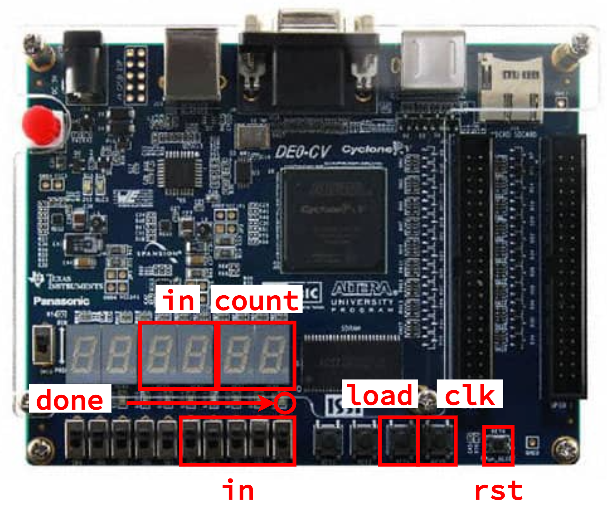

Lab 3 (Parts C & D): Music Player Implementation and Verification
==========================================================================

Lab 3 is meant to give you experience designing, implementing, testing,
and prototyping combinational _and_ sequential logic using the Verilog
hardware description language. The lab reinforces several lecture topics
including sequential logic gates, finite-state machines (FSMs), and
sequential building blocks. More specifically, the lab will give students
experience with: latches, flip-flops, and registers; Moore and Mealy
FSMs; and counters. The lab will continue to provide opportunities to
leverage the three key abstraction principles: modularity, hierarchy, and
regularity. The lab will also enable students to better understand the
connection between simulation and prototyping.

With the introduction of sequential logic, our designs can now model more
complex and interesting designs; in particular, designs that can have
real-world applications. You should have already worked in simulation to
verify your `MusicPlayer` and all of the submodules in Lab 3A. In Lab 3B,
we will be using the FPGA to emulate these designs, connecting them to
real-world phenomena such as music. By the end of the lab, you should be
able to play a simple song using your design, and understand the digital
logic that allows it to happen.

This handout assumes that you have read and understand the course
tutorials, attended the discussion sections, and successfully completed
Lab 2. Here are the steps to get started:

 - Step 1. Find your lab partner
 - Step 2. Find a free workstation
 - Step 3. Ask the TAs for a lab check-off sheet (each student needs
    their own check-off sheet)

Throughout this handout you will see two kinds tasks: lab check-off tasks
and lab report tasks.

For each _lab report task_ you must take some notes, save a screenshot,
and/or record some data for your lab report. Students can start working
on their lab report during their lab session, but will likely need to
continue working on their lab report after the lab session. The lab
report is due three days after your lab session at 11:59pm.

For each _lab check-off task_ you must raise your hand and have a TA come
to check-off your work. The TA will ask you the questions included as
part of the lab check-off task and the assess your understanding using
the following rubric: mastery; accomplished; emerging; beginning. If the
TA and students together feel the students have not mastered the lab
check-off task, the students are encouraged to take a few minutes and try
again.

In contrast to previous labs, Lab 3 is much more application-oriented. We
will spend less time exploring the design space, and more time exploring
the applications of our design. Because of this, you will need some
additional hardware:

 - A __piezoelectric ("piezo") buzzer__. This is a tiny speaker that can
   play our notes
 - Four __jumper wires__:
    - Two __F-M jumper wires__. These have one "input" and one "output"
    - Two __F-F jumper wires__. These have two "inputs"
 - A __USB Drive__. Some of the lab report tasks will require you to
   capture waveforms from the oscilloscope. You should follow the
   instructions to save these on your USB Drive, and transfer them to your
   computer before leaving the lab


!!! warning "Please be delicate!"

    Real hardware can often be delicate and fragile. As a general rule,
    please do not "force" anything together, and take time and caution
    when connecting different components. If you have any questions or
    need assistance, please ask the TAs

!!! success "Lab Check-Off Task 1: Setup FPGA Board and Hardware Supplies"

    Request an FPGA board and the hardware supplies from the TAs. The TAs
    will record the board number and the hardware supply kit number on
    your check-off sheet. Use the power cord to plug the FPGA board into
    an outlet, and use the USB cable to plug the FPGA board into the
    workstation. Do not use the other hardware supplies until instructed
    to do so

1. Simulation of a Music Player
--------------------------------------------------------------------------

Before starting to work on an FPGA prototype, you must make sure you have
a working Verilog hardware design that has been _thoroughly_ tested in
simulation. One student should start VS Code on the workstation, log into
the `ecelinux` servers, source the setup script, and make sure their
individual remote repository is up to date.

```bash
% source setup-ece2300.sh
% cd ${HOME}/ece2300/groupXX
% git pull
% tree
```

Where `XX` is your group number. Now run all of the tests from a clean
build to ensure your design is fully functional.

```bash
% cd ${HOME}/ece2300/groupXX/lab3-music
% trash build
% mkdir build
% cd build
% ../configure
% make check
```

!!! success "Lab Check-Off Task 2: Verify Tests"

    Show a TA that your hardware designs are passing all of your tests.
    The TA will ask _both_ students about the two FSMs involved in their
    design. Explain the different purposes of the two FSMs, and how the
    states and state transitions achieve that purpose.

2. Setup Quartus Project
--------------------------------------------------------------------------

Click _Quartus (Quartus Prime 19.1)_ on the desktop to start Quartus, and
click _Run the Quartus Prime software_. You might need to try starting
Quartus twice. Setup a new Quartus project using the _New Project
Wizard_:

 - Directory, Name, Top-Level Entity
    + Working directory: `C:\Users\netid\lab3`
    + Name of this project: `lab3`
    + Name of top-level design entity: `lab3`
    + Click _Next_
 - Directory does not exist. Do you want to create it?
    + Click yes
 - Project Type
    + Choose _Empty Project_
    + Click _Next_
 - Add Files
    + Click triple dots to right of _File name_
    + Click on _This PC_, then navigate to your cloned repo by choosing
       _Windows (C:) >  Users > netid > netid_ where _netid_ is your
       Cornell NetID
    + Shift-click on every Verilog hardware design file (do not include
       any test files)
    + Click _Open_
    + Click _Next_
 - Family, Device, and Board Settings
    + Click _Board_ tab
    + Family: _Cyclone V_
    + Select _DE0-CV Development Board_
    + Make sure _Create top-level design file_ is checked
    + Click _Next_
 - EDA Tool Settings
    + Click _Next_
 - Summary
    + Click _Finish_

Since we are now using RTL modeling, there is one new step, similar to Lab
2. You must choose _Assignments > Settings_ from the menu. Then select the
category _Compiler Settings > Verilog HDL Input_ and under _Verilog
version_ click _SystemVerilog_. Then click _Apply_ and _OK_.

3. Synthesize, Analyze, Integrate, and Configure Counters
--------------------------------------------------------------------------

We will start by synthesizing and analyzing the two different counter
implementations. Once we better understand the tradeoffs in these
implementations, we can make high-level conclusions about their tradeoffs.

!!! note "Lab Report Task 1: Predicted Counter Critical Path"

    Draw a diagram of your counter. This diagram should include
    all gates present in your counter module, as well as high-level
    representations of all submodules instantiated in your counter module
    (i.e. if you instantiate a subtractor, you can draw a representation
    of that subtractor and abstract away the internal gates).

    Clearly draw your predicted critical path on your block diagram. Save
    this diagrams since you will be continuing to annotate it
    throughout the lab.

### 3.1. Synthesize and Analyze Gate-Level Counter

To synthesize and analyze the gate-level counter in isolation first find
the _Project Navigator_ pane and click on _Hierarchy_ to display the
drop-down list. Choose _Files_ and select the `Counter_8b_GL.v`
file. Right click on the file and choose _Select as Top-Level Entity_.
Then click on _Files_ to display the drop-down list again. Choose
_Hierarchy_ and confirm that `Counter_8b_GL` is shown as the
only entity.

As in Lab 2, we need to create a _timing constraint_ file. Unlike in Lab
2, we also now need to inform the tools that there is a _clock_ signal as
part of our design. Identifying the clock signal will make the tools
work to ensure that our design has no setup or hold time violations.
Similar to Lab 2, when finished, the design will either "meet timing" 
(i.e., the actual critical path delay is less than the constraint) or "not
meet timing" (i.e., the actual critical path delay is greater than the
constraint).

Here are the steps to create a timing constraint file:

 - Choose _File > New_ from the menu
 - Click _Synopsys Design Constraints File_
 - Click _OK_
 - Enter the constraints shown below
 - Click _File > Save_ from the menu
 - Name the file _timing.sdc_
 - Save the file in the _lab3_ directory

We will use the following initial constraints:

```
set_max_delay -from [all_inputs] -to [all_outputs] 20
set_min_delay -from [all_inputs] -to [all_outputs] 0

create_clock -period 20 [get_ports {clk}]

set_output_delay -add_delay -clock clk -max 0 [all_outputs]
set_output_delay -add_delay -clock clk -min 0 [all_outputs]

set_input_delay -add_delay -clock clk -max 0 [all_inputs]
set_input_delay -add_delay -clock clk -min 0 [all_inputs]
```

These constraints tell the FPGA tools that:

 - Our critical path delay constraint is `20ns` from all inputs to all
   outputs as well
 - We have a clock signal named `clk`
    - Our design must not have any hold time violations with respect to `clk`
    - Our design must not have any setup time violations with respect to
      `clk` when the period is `20ns`
 - The outputs should have a delay of 0 when being factored into the
   timing of paths
 - The inputs should have a delay of 0 when being factored into the
   timing of paths

Now use the following steps to synthesize your design and then look at
the RTL viewer, technology map viewer, and chip planner.

 - Choose _Processing > Start Compilation_ from the menu
 - Wait 2-3 minutes for synthesis to complete
 - RTL Viewer
    + Choose _Tools > Netlist Viewer > RTL Viewer_ from the menu
    + Drill down in the hierarchy to see the netlist for the counter
    + Does the RTL viewer match your expectations? Where would the
         critical path go on this diagram?
    + Choose _File > Close_ from menu to close the RTL viewer
 - Technology Map Viewer
    + Choose _Tools > Netlist Viewer > Technology Map Viewer (Post-Fitting)_
    + Drill down in the hierarchy to see the implementation of the counter
    + Does the technology viewer match your expectations? Where would the
         critical path go on this diagram?
    + Choose _File > Close_ from the menu to close the technology map viewer
 - Chip Planner
    + Choose _Tools > Chip Planner_ from the menu
    + Identify where the logic used to implement your design is located in the FPGA
    + Choose _File > Close_ from the menu to close the chip planner

The next step is to analyze the area of your design.

 - Choose _Processing -> Compilation Report_ from the menu
 - Under _Table of Contents_ choose _Fitter > Resource Section > Resource
   Usage Summary_
 - Look through the report to determine the number of combinational ALUTs
   (configurable look-up tables) that are used for your design
 - Look through the report to determine the number of dedicated logic 
   registers that are used for your design

The final step is to analyze the timing (i.e., the critical path delay)
of your design. We will analyze timing for the _Slow 1100mV 85C Model_
which is the default choice in the Timing Analyzer.

 - Choose _Tools > Timing Analyzer_ from the menu
 - Double-click _Update Timing Netlist_
 - Choose _Reports > Custom Reports > Report Timing_ from the menu
 - Report Timing
    + From: _[get_registers *]_
    + To: _[get_registers *]_
    + Report number of paths: _100_
    + Click _Report Timing_
 - Identify the propagation delay of the displayed path
 - Look at the actual critical path (i.e., _Data Arrival Path_) which
    shows the longest path from one of the inputs through your
    design to one of the outputs
 - Choose _File > Close_ from the menu to close the timing analyzer

You may run into issues completing the timing report for `Counter_8b_GL`.
Think critically about why these reports might occur. Referencing your
area reports may additionally help.

!!! note "Lab Report Task 2: Mapping and Area for Gate-Level Counter"

    Save a screenshot of the technology mapper view for your gate-level
    counter. In this view, determine the location of

     - (1) The storage element that keeps track of the current count
     - (2) The logic that determines the subtracted count
     - (3) The logic that determines what should be the next stored count
     - (4) The logic that determines whether the counter is done

   In addition, save the values of the combinational ALUTs and dedicated
   logic registers used for your design.

!!! success "Lab Check-Off Task 3: Discuss Mapping and Timing of Gate-Level Counter"

    Show a TA your screenshot of the technology mapper view, and discuss
    your identification of the different portions of the design (listed
    above). Were these easy or difficult to identify?
    
    Additionally, show the TA your results after performing timing 
    analysis on your gate-level counter. Be ready to discuss why the tools
    might perform this way, leveraging your area results

### 3.2. Synthesize and Analyze RTL Counter

Use the same process to synthesize and analyze the RTL counter in
isolation. Remember to change that hardware module to be the top-level
entity. So find the _Project Navigator_ pane and click on _Hierarchy_ to
display the drop-down list. Choose _Files_ and select the
`Counter_8b_RTL.v file. Right click on the file and choose
_Select as Top-Level Entity_. Then click on _Files_ to display the
drop-down list again. Choose _Hierarchy_ and confirm that
`Counter_8b_RTL` is shown as the only entity.

Go through the same process of looking at the RTL Viewer, Technology Map
Viewer, and the Chip Planner. Go through the same process of determining
the area utilization, as well as conducting timing analysis.

!!! note "Lab Report Task 3: Mapping and Area for RTL Counter"

    Save a screenshot of the technology mapper view for your RTL
    counter. In this view, determine the location of

     - (1) The storage element that keeps track of the current count
     - (2) The logic that determines the subtracted count
     - (3) The logic that determines what should be the next stored count
     - (4) The logic that determines whether the counter is done

   For the lab report, you will be asked to provide a version of this
   screenshot annotated with the corresponding snippets of RTL code. Make
   sure that you note down the locations above, to be used when
   annotating.
   
   In addition, save the values of the combinational ALUTs and dedicated
   logic registers used for your design.

!!! note "Lab Report Task 4: Data Table and Critical Path Report for RTL Counter"

    Save your completed data table with your analysis of the RTL counter
    and include it in your report. Save the critical path timing
    report text file and include it in your report. You only want to save
    the _Data Arrival Path_ from the timing report text file. Do NOT
    include anything else from the timing report text file. You must
    format the critical path with a fixed-width font and size the font
    such that it fits on a single page. **If you do not follow this
    requirements then we will ignore your critical path in the lab
    report.**

!!! note "Lab Report Task 5: Actual Critical Path for RTL Counter"

    Draw the _actual_ critical path on the block diagram for the
    RTL counter using the timing report. Label each gate/block
    along the critical path with its corresponding delay using the timing
    report.

!!! success "Lab Check-Off Task 4: Discuss Mapping and Timing of RTL Counter"

    Show a TA your screenshot of the technology mapper view, and discuss
    your identification of the different portions of the design (listed
    above). Were these easy or difficult to identify relative to the
    gate-level version? What conclusions can we make about the
    clarity of how a design is implemented when it is gate-level vs. RTL?

    Show a TA your completed data table with your analysis for the
    RTL counter. Show a TA the actual critical path on the block
    diagram for the RTL counter. Clearly show how the delays in
    the timing report correspond to the delays through the 
    blocks/submodules in the block diagram.

### 3.3. Integrate, Synthesize, and Configure the RTL Counter

Now that we've performed analysis on our counters, we can demonstrate
them on the FPGA.

#### Integrate

We need to change the top-level entity to be `DE0_CV_golden_top.v`. Find
the _Project Navigator_ pane and click on _Hierarchy_ to display the
drop-down list. Choose _Files_ and select the `DE0_CV_golden_top.v` file.
Right click on the file and choose _Select as Top-Level Entity_. Then
click on _Files_ to display the drop-down list again. Choose _Hierarchy_
and confirm that `DE0_CV_golden_top` is shown as the only entity.

The _New Project Wizard_ creates a top-level Verilog module for us which
has ports for all of the switches, LEDs, seven-segment displays, and pins
on the FPGA development board. We need to instantiate
`Counter_8b_RTL` in this top-level Verilog module and connect the
ports.

Notably, the FPGA's reset signal (`RESET_N`) is _active-low_; it is
designed for modules that reset when the signal is 0 (unlike ours, which
reset when the signal is 1). Students should declare a signal named `rst`,
assign it to the inverse/NOT of `RESET_N`, and use `rst` for all designs
where appropriate. In addition, students should declare a separate
`clk` signal, for our timing file to recognize. All designs should use
`clk` and `rst` as their clock and reset signals, appropriately

Students are responsible for figuring out the appropriate top-level port
connections to meet the following specification:

 - `clk` should be connected to the first button
 - `load` should be connected to the second button
 - `done` should be assigned to the first LED

Both `clk` and `load` should be _active-high_, meaning that the signals
are 1 when the button is pressed. Recall from Lab 2 that this may require
some additional logic.

In addition to the above, students should re-use their `Display` module
from Lab 1 to achieve the following:

 - The two seven-segment displays in the middle should display the current
   input `in` to the counter
 - The two seven-segment displays on the right should display the current
   count



Look carefully at the labels on the board to figure out how the switches,
buttons, and seven-segment displays correspond to ports in the top-level
Verilog module. Use the following steps when you are ready to integrate
the calculator.

 - Double-click on _DE0_CV_golden_top_
 - Instantiate _Counter_8b_RTL_ in the top-level module
 - Connect the ports
 - Choose _File > Save_ from the menu

Then choose  _Processing > Start Compilation_ from the menu to synthesize
your design. Open the Chip Planner to see where the calculator is located
on the FPGA:

 - Choose _Tools > Chip Planner_ from the menu
 - Identify where the logic used to implement your design is located in the FPGA
 - Choose _File > Close_ from the menu to close the chip planner

#### Synthesize and Configure

From here, choose  _Processing > Start Compilation_ from the menu to 
synthesize your design. Once completed, we can configure the FPGA:

 - Choose _Tools > Programmer_ from the menu
 - Click _Hardware Setup_
 - Currently selected hardware: _USB-Blaster [USB-0]_
 - Click _Close_
 - Click _Start_

Additionally, on ECELinux, have your counter simulation open:

```bash
% cd ${HOME}/ece2300/groupXX/build
% make counter-sim
% ./counter-sim +switches=00111
```

Try out your counter simulator for a few values, and make sure that the
FPGA behaves identically.

!!! success "Lab Check-Off Task 5: Demonstrate the RTL Counter"

    First, show a TA your calculator simulator, demonstrating its
    functionality. The TA will give you a switch configuration. You
    should first predict what your counter will do, then demonstrate it
    in simulation.

    From there, demonstrate that your counter on the FPGA produces
    identical results for the same stimulus. Additionally, demonstrate
    that your counter can take in new values at any time, and will stop
    counting down once it reaches 0

4. Synthesize and Analyse Note Players
--------------------------------------------------------------------------

From here, we can transition to analyzing our gate-level and RTL note
players

<!-- Insert stuff about NotePlayers - skipping for now since it repeats above -->

<!-- Include this section on clock division: -->

The on-board clock signal (`CLOCK_50`) is a 50MHz clock. This is far too
fast to have our notes be audible. Because of this, students are
provided a `ClockDiv` module that divides the clock (decreases the
frequency) by a parametrizable amount. To perform the necessary clock
division by a factor of $2^{11}$ for our desired clock frequency of
$\approx48828\text{Hz}$, students should now assign the `clk` signal to
be an output of an instantiated clock divider, as shown below:

```verilog
ClockDiv_RTL #(10) clock_div
(
  .clk_in  (CLOCK_50),
  .rst     (rst),
  .clk_out (clk)
);
```

Similarly, we must update our timing constraint file to reflect the other
clock signal. Note that we still specify `clk` to be `20ns`; this is
over-constrained based on our actual clock signal, but for our designs,
it shouldn't make a difference.

```
set_max_delay -from [all_inputs] -to [all_outputs] 20
set_min_delay -from [all_inputs] -to [all_outputs] 0

create_clock -period 20 [get_ports {CLOCK_50}]
create_clock -period 20 [get_ports {clk}]

set_output_delay -add_delay -clock clk -max 0 [all_outputs]
set_output_delay -add_delay -clock clk -min 0 [all_outputs]

set_input_delay -add_delay -clock clk -max 0 [all_inputs]
set_input_delay -add_delay -clock clk -min 0 [all_inputs]
```


5. Integrate, Synthesize, and Configure Multi-Note Players
--------------------------------------------------------------------------

Once we've analyzed our `NotePlayer`, we can move on to using our
`MultiNotePlayer`, and actually begin to play notes!

### Integrate

Similar to before, make sure that `DE0_CV_golden_top` is the top-level
entity. Students are responsible for figuring out the appropriate top-level
port connections to meet the following specification:

 - `clk` and `rst` are connected appropriately
 - `play_load` is connected to the first push button (_active-high_)
 - `play_note` is connected to the right three switches
 - `duration` is set to `0xBEBC` (resulting in a one second duration)
 - `play_done` is connected to the first LED
 - `note` is connected to the first GPIO in `GPIO_0`
 - The note periods should be set according to the following table (see
   Part A for more details):

```
                    freq
port         hex    (Hz) note
note1_period 0x7b 195.31 G3
note1_period 0x6d 219.95 A3
note1_period 0x61 246.61 B3
note1_period 0x5b 262.52 C4
note1_period 0x51 294.15 D4
note1_period 0x48 329.92 E4
note1_period 0x44 348.77 F4
```

In addition to the above, students should re-use their `Display` module
from Lab 1 to achieve the following:

 - The rightmost seven-segment display should show the currently selected
   note (`note_sel`)
 - The next rightmost seven-segment display should show the current input
   note from the switches (`play_note`)


Look carefully at the labels on the board to figure out how the switches,
buttons, and seven-segment displays correspond to ports in the top-level
Verilog module. Use the following steps when you are ready to integrate
the calculator.

 - Double-click on _DE0_CV_golden_top_
 - Instantiate _Counter_8b_RTL_ in the top-level module
 - Connect the ports
 - Choose _File > Save_ from the menu

Then choose  _Processing > Start Compilation_ from the menu to synthesize
your design. Open the Chip Planner to see where the calculator is located
on the FPGA:

 - Choose _Tools > Chip Planner_ from the menu
 - Identify where the logic used to implement your design is located in the FPGA
 - Choose _File > Close_ from the menu to close the chip planner

#### Synthesize and Configure

From here, choose  _Processing > Start Compilation_ from the menu to 
synthesize your design. Once completed, we can configure the FPGA:

 - Choose _Tools > Programmer_ from the menu
 - Click _Hardware Setup_
 - Currently selected hardware: _USB-Blaster [USB-0]_
 - Click _Close_
 - Click _Start_

Additionally, on ECELinux, have your counter simulation open:

```bash
% cd ${HOME}/ece2300/groupXX/build
% make multi-note-player-sim
% ./multi-note-player-sim +switches=111
```

Open the resulting `multi-note-player-sim.vcd` in VSCode using Surfer.
Right-click on a rising edge of `note` to place a marker there, and
navigate your cursor to the next rising edge to measure the period
of the note (one rising edge to the next). Note down this period.

To sample the note, we need to know the connections. Reference the excerpt
from the manual below:


Connect the two __F-M Jumper Wires__:
 - Connect the input of one to the first GPIO of `GPIO_0` (look on the
   board for the label)
 - Connect the input of the other to ground

From there, we can connect these to the oscilloscope (ask a TA if you need
help):

 - Press the button on the top of the oscilloscope (on the right) to
   turn it on
 - Connect the main probe of `CH 1` to the first GPIO of `GPIO_0`
 - Connect the ground clip of `CH 1` to ground
 - Click on _DEFAULT SETUP_ to first go to the default setup for the
   oscilloscope
 - Click the _CH 2 MENU_ button
    - Clicking this repeatedly will toggle whether Channel 2 is displayed
      We only need one channel; turn Channel 2 off, then click _MEASURE_
      to return to the main measurement window
 - Adjust the _VOLTS/DIV_ dial of `CH 1` to achieve a scale of 1.00V
   (referencing the bottom-left of the display)
 - Adjust the _POSITION_ dial of `CH 1` so that the static bar is about
   25% of the way from the bottom of the display
 - Adjust the _SEC/DIV_ dial to achieve a time division of 2.50ms
   (referencing the bottom-middle of the display)
 - Press _TRIG MENU_
    - Make sure that _Type_ is `EDGE`, _Source_ is `CH 1`, and _Slope_
      is `RISING` (adjusting any if needed). Once done, click _MEASURE_
      to go back to the main measurement window
 - Using the _LEVEL_ dial of the Trigger setup, adjust the trigger to
   be 1.00V (referencing the bottom-right of the display). This tells
   the oscilloscope at what value to capture a signal change

You should initially see static. Try playing a note; you should see
some signal. Now, let's capture this data from the oscilloscope:

 - Press _SINGLE SEQ_ to start a single capture
 - Play a note on the FPGA. You should see the captured waveform on the
   oscilloscope
 - Press _CURSOR_:
    - Change _Type_ to `TIME` by pressing the button next to it repeatedly
    - Using the buttons to the left of the display, click on _Cursor 1_.
      Using the large dial next the display, adjust the cursor to be on a
      positive edge of the note. Similarly, adjust Cursor 2 to be on a
      neighboring positive edge
    - Note the value of $\Delta t$ shown on the side - does it match your
      simulation?

If you repeat the above process, you will notice that the first captured
cycle of the note can differ in length than the others. Make sure you can
understand why this might happen based on the underlying hardware

!!! note "Lab Report Task 6: Screenshot of MultiNotePlayer Waveform"

    Follow the instructions below on the oscilloscope to obtain a screen
    capture of the waveform

     - Insert the USB Drive into the port on the front of the oscilloscope
     - Get the waveform you want to capture
        - This image should include both cursors, as well as the value of
          $\Delta t$
     - Press "PRINT" on the oscilloscope to save a screen capture to the
       USB Drive
        - A clock will appear on the side; wait for it to disappear

    This image will save in a new folder on the drive as a `.BMP` file
    (for which there are converters online to other image types). Once
    saved, you can connect the drive to either your own computer or the
    lab machine to get the image.

From here, we can play notes from the FPGA!

 - Swap the __F-M Jumper Wires__ for __F-F Jumper Wires__, connected
   similarly
 - Connect the other ends of the jumper wires to the piezo buzzer

Now, when you play a note, you should be able to hear the piezo buzzer
make a sound. Vary the switches, and verify that the resulting note
differs in frequency.

!!! success "Lab Check-Off Task 6: Demonstrate the MultiNotePlayer"

    The TA will give you a configuration for the switches. First,
    simulate the configuration with your `multi-note-player-sim`,
    and demonstrate finding the period. The TA will ask follow-up 
    questions about how the note period would change in the following 
    scenarios:

     - (1) The underlying `NotePlayer` is instead loaded with the value 
           `0x88`
     - (2) We use the switch input `010` instead
     - (3) The clock frequency is increased by a factor of 2

    Be ready to explain _why_ the `MultiNotePlayer` is producing the
    corresponding output for each scenario.

    Next, connect the FPGA to the oscilloscope, and capture a waveform
    for the same switch configuration. Measure the period, and show that
    it's identical to the simulation. Explain to the TA why the period
    of the first pulse might differ from the others.

    Finally, connect the piezo buzzer to the FPGA, and demonstrate that
    you can play the desired note.
