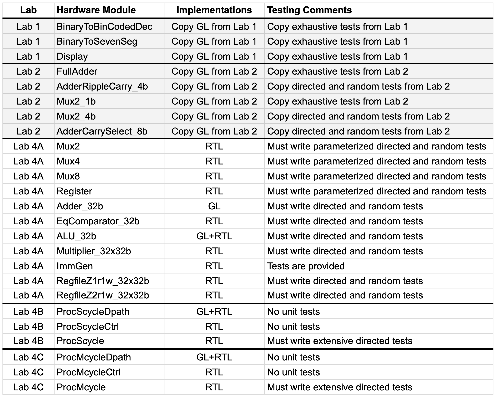
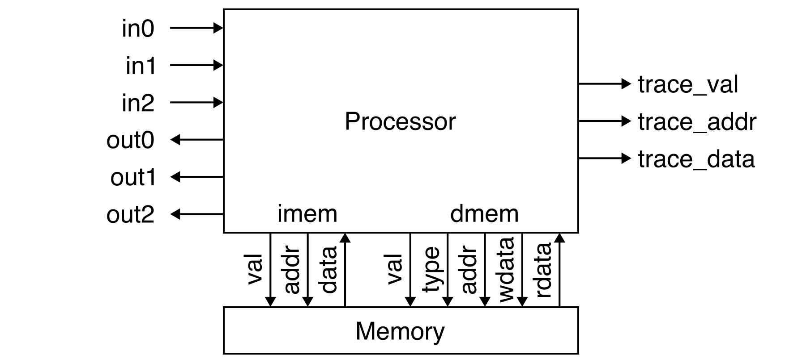
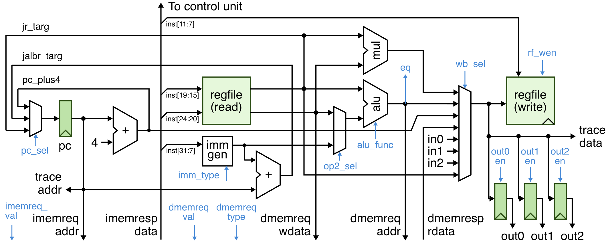
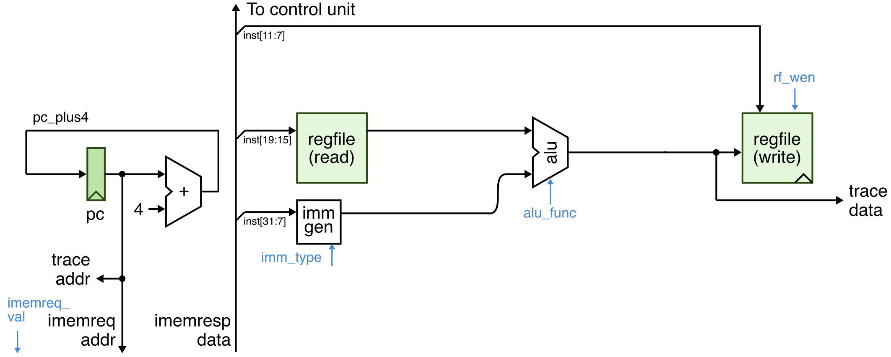

Lab 4 (Parts A & B): TinyRV1 Processor - Implementation and Verification
==========================================================================

Lab 4 will give you experience designing, implementing, testing, and
prototyping two simple processor microarchitectures which both implement
the TinyRV1 instruction set. The TinyRV1 instruction set manual is
located here:

 - <https://cornell-ece2300.github.io/ece2300-docs/ece2300-tinyrv1-isa>

The lab reinforces several lecture topics including instruction set
architectures, single-cycle processors, and multi-cycle processors. The
lab will continue to provide opportunities to leverage the three key
abstraction principles: modularity, hierarchy, and regularity.

The lab will include several parts, but currently only Parts A and a
portion of Part B released.

 - Part A: Processor Datapath Components
 - Part B: Single-Cycle and Multi-Cycle TinyRV1 Processors

Parts A and B are submitted by simply pushing the appropriate code to
GitHub. Part A is due on Thursday, November 7 at 11:59pm. Part B is due
on Thursday, November 14.

This handout assumes that you have read and understand the course
tutorials and that you have attended the discussion sections. To get
started, use VS Code to log into an `ecelinux` server, source the setup
script, and clone your individual remote repository from GitHub:

```bash
 % source setup-ece2300.sh
 % mkdir -p ${HOME}/ece2300
 % cd ${HOME}/ece2300
 % git clone git@github.com:cornell-ece2300/groupXX
 % cd ${HOME}/ece2300/groupXX
 % tree
```

where `XX` should be replaced with your group number. You can both pull
and push to your remote repository. If you have already cloned your
remote repository, then use `git pull` to ensure you have any recent
updates before working on your lab assignment.

```bash
 % cd ${HOME}/ece2300/groupXX
 % git pull
 % tree
```

Go ahead and create a build directory in the `lab4-proc` directory for
this lab, and run configure to generate a Makefile.

```
% cd ${HOME}/ece2300/groupXX/lab4-proc
% mkdir -p build
% cd build
% ../configure
```

Your repo contains the following files which are part of the automated
build system:

 - `Makefile.in`: Makefile for the build system
 - `configure`: Configure script for the build system
 - `configure.ac`: Used to generate the configure script
 - `scripts`: Scripts used by the build system

The following table shows all of the hardware modules for Part A.



Before starting, you should copy over all of the listed hardware modules
and the associated test benches for the seven-segment display from Lab 1
and the adders and multiplexors from Lab 2. Make sure all of these
hardware modules pass all of your test cases.

Remember that GL implementations must be implemented using either explicit
gate-level modeling or Boolean equations. For these designs, students are
only allowed to use these Verilog constructs:

 - `wire`, `assign`
 - `not`, `and`, `nand`, `or`, `nor`, `xor`, `xnor`
 - `~`, `&`, `|`, `^`
 - `1'b0`, `1'b1`, `1'd0`, `1'd1`, and other literals
 - `{}` (concatenation operator)
 - `{N{}}` (repeat operator)
 - module instantiation

Hardware modules marked in the table as GL* must _only_ use explicit
gate-level modeling (i.e., you cannot use `~`, `&`, `|`, `^`).

RTL implementations can use all of the GL constructs in addition to the
following Verilog constructs.

 - `logic`
 - `+`, `-`, `*`
 - `>>`, `<<`, `>>>`
 - `==`, `!=`, `<`, `>`, `<=`, `>=`
 - `&&`, `||`, `!`
 - `&`, `~&`, `|`, `~|`, `^`, `^~` (reduction operators)
 - `?:` (ternary operator)
 - `always_comb`, `always_ff @(posedge clk)`
 - `if`, `else if`, `endif`
 - `case`, `default`, `endcase`

Note that some hardware modules have more specific restrictions; see the
source comments for more details. Using unallowed Verilog constructs will
result in significant penalties for code functionality and code quality.
If you have any questions on what Verilog constructs can and cannot be
used, please ask an instructor. There are no restrictions on Verilog
constructs in test benches.

**It is critical for students to work together to complete the lab
assignment.** It is unlikely one student can complete the entire lab on
their own. A very productive approach is to have one student work on the
design of a few hardware modules while the other student works on the
test benches for those same hardware modules. Then work together to test
and debug these modules. Then switch roles and move on the next few
modules.

1. Interface and Implementation Specification
--------------------------------------------------------------------------

This section describe the required _interface_ (i.e., the ports for the
module and the module's functional behavior) before describing the
required _implementation_ (i.e., what goes inside the module) for each
hardware module.

### 1.1. Processor Datapath Components

You will need to implement multiplexors, registers, four arithmetic
units, immediate generation unit, and two register files.

**Parameterized Multiplexors and Registers**

Implement 2-to-1, 4-to-1, and 8-to-1 multiplexors using RTL modeling.
Each multiplexor should be parameterized by the bitwidth of the
corresponding input and output ports.

Implement a multi-bit register which supports reset and enable using RTL
modeling. The register should be parameterized by the bitwidth of the
corresponding input and output ports.

**Arithmetic Units**

Implement four arithmetic units.

 - Implement a 32-bit adder by instantiating four 8-bit carry select
   adders from Lab 2. The 32-bit adder will be the only module
   implemented at the gate-level in your final processor implementation.

 - Implement a 32-bit equality comparator using RTL modeling.

 - Compose the adder, the equality comparator, and a 2-to-1 multiplexor
   to create a simple ALU. The ALU takes as `op` input port which
   specifies whether the ALU should do an add (`op` is zero) or an
   equality comparison (`op` is one).

 - Implement a 32-bit by 32-bit multiplier using RTL modeling.

** Immediate Generation Unit**

Implement an immediate generation unit suitable for use in generating
immediates from TinyRV1 instructions. The immediate generation unit
uses the following encoding for the `imm_type` input:

 - `imm_type == 0`: I-type (ADDI)
 - `imm_type == 1`: S-type (SW)
 - `imm_type == 2`: J-type (JAL)
 - `imm_type == 3`: B-type (BNE)

See the TinyRV1 ISA manual for more details.

**Register Files**

Implement two different register files. Both register files have 32
32-bit registers. For both register files, reading register 0 should
_always_ return the value zero. For both register files, writing and
reading the same register results in reading the old value. The key
difference is one register file provides one read port and one write
port, while the other register file provides two read ports and one write
port.

### 1.2. TinyRV1 Processor Interface

Both the single-cycle and multi-cycle TinyRV1 processors have the exact
same interface:

```verilog
module Proc
(
  (* keep=1 *) input  logic        clk,
  (* keep=1 *) input  logic        rst,

  // Memory Interface

  (* keep=1 *) output logic        imemreq_val,
  (* keep=1 *) output logic [31:0] imemreq_addr,
  (* keep=1 *) input  logic [31:0] imemresp_data,

  (* keep=1 *) output logic        dmemreq_val,
  (* keep=1 *) output logic        dmemreq_type,
  (* keep=1 *) output logic [31:0] dmemreq_addr,
  (* keep=1 *) output logic [31:0] dmemreq_wdata,
  (* keep=1 *) input  logic [31:0] dmemresp_rdata,

  // I/O Interface

  (* keep=1 *) input  logic [31:0] in0,
  (* keep=1 *) input  logic [31:0] in1,
  (* keep=1 *) input  logic [31:0] in2,

  (* keep=1 *) output logic [31:0] out0,
  (* keep=1 *) output logic [31:0] out1,
  (* keep=1 *) output logic [31:0] out2,

  // Trace Interface

  (* keep=1 *) output logic        trace_val,
  (* keep=1 *) output logic [31:0] trace_addr,
  (* keep=1 *) output logic [31:0] trace_data
);
```



**Memory Interface**

The memory interface includes two parts. The _instruction memory
interface_ is used to read instructions similar to how we read notes in
Lab 3. To read an instruction set the `imemreq_val` output port high and
the `imemreq_addr` output port to the desired instruction address; the
instruction will be returned via the `imemresp_data` input port
combinationally (i.e., in the same cycle). The _data memory interface_
enables load and store instructions to read and write memory. It is
similar to the instruction memory interface except now we have an
additional `dmemreq_type` output port which specifies whether we want to
read memory (i.e., `dmemreq_type` is zero) or write memory (i.e.,
`dmemreq_type` is one). We also need the `dmemreq_wdata` output port for
the write data.

**I/O Interface**

The input/output (I/O) interface enables the processor to send and
receive data from the system. We will eventually be connecting the I/O
ports to the switches, push buttons, LEDs, and seven-segment displays. We
can read the input I/O ports using CSRR instructions and we can write the
output I/O ports using CSRW instructions. See the TinyRV1 ISA manual for
more information.

**Trace Interface**

The trace interface is used for verification and should produce a "trace"
of all instructions executed by the processor. Whenever the processor
executes an instruction it should set the `trace_val` output high and
also set the `trace_addr` output port to the address of the executed
instruction and the `trace_data` output port to be the data written to
the register file by that instruction. If the instruction does not write
the register file then the `trace_data` output is undefined.

### 1.2. TinyRV1 Single-Cycle Processor Implementation

The TinyRV1 single-cycle processor implementation will be decomposed into
a datapath and a control unit. The datapath must be implemented
structurally without any always blocks or non-trivial logic. The control
unit will be implemented using flat RTL via a single always block.

The following diagram illustrates the complete TinyRV1 single-cycle
processor datapath. Note that this diagram is slightly different from
lecture, since in lab we need to implement the CSRR/CSRW instructions,
the I/O interface, and the trace interface. Again, the datapath should be
implemented structurally by instantiating and connecting the processor
datapath components developed in Part A.



The blue arrows are control/status signals between the control unit and
the datapath. Control signals go from the control unit to the datapath
while status signals go from the datapath to the control unit. Here is a
list of all of the control signals you will need for your single-cycle
processor implementation (all signals are one bit unless otherwise
specified):

 - `c2d_pc_sel` (2 bits)
 - `c2d_imm_type` (2 bits)
 - `c2d_op2_sel`
 - `c2d_alu_func`
 - `c2d_wb_sel` (3 bits)
 - `c2d_rf_wen`
 - `c2d_imemreq_val`
 - `c2d_dmemreq_val`
 - `c2d_dmemreq_type`
 - `c2d_out0_en`
 - `c2d_out1_en`
 - `c2d_out2_en`

There is one status signal for the single-cycle processor implementation
which indicates the branch outcome:

 - `d2c_eq`

The control unit essentially needs to implement a control signal table
just like in lecture. We will use the following stylized approach to
implement this control signal table:

```verilog
  always_comb begin
    if ( rst )
      cs( '0, '0, '0, '0, '0, '0, '0, '0, '0 );
    else begin
      casez ( d2c_inst )
                          //    pc  imm    op2 alu  wb  rf  imem dmem dmem
                          //    sel type   sel func sel wen val  val  type
        `TINYRV1_INST_ADDI: cs( 'x, imm_i, 'x, add, 'x, 1,  1,   0,   'x   );

        default:            cs( 'x, 'x,    'x, 'x,  'x, 'x, 1,   'x,  'x   );
      endcase
    end
  end
```

There should be one row per instruction and one column for each control
signal. You should declare appropriate `localparams` (e.g., `imm_i`,
`add`) to make the control signal table more readable.

The single-cycle processor should be able to fetch a new instruction from
memory, decode this instruction, read the register file, perform
arithmetic, access memory, and write the result to the register file all
in a single cycle.

2. Testing Strategy
--------------------------------------------------------------------------

You will need to use a variety of different testing strategies to ensure
your TinyRV1 processors are full functional.

### 1.1. Testing the Processor Datapath Components

It is critical we take a test-driven approach. You must thoroughly verify
each processor datapath component using exhaustive, directed, and/or
random testing as appropriate. You can use a very similar approach as in
the previous labs. Do not under any circumstances start implementing your
processor until you are absolutely positive all of your processor
datapath components are fully functional.

### 1.2. Testing the Processors

Testing processors is more complex than testing individual hardware
blocks. We have provided you some testing infrastructure to simplify the
process, but students should still expect to dedicated significant time
to verifying their processors correctly implement the TinyRV1 ISA.

We have provided you a functional-level FL processor model (also called
an instruction set simulator) located in `test/ProcFL.v`. The FL
processor model executes the instruction semantics behaviorally using
high-level Verilog. It is not meant to model hardware. The FL processor
model can be used to make sure your tests are correct before you run
those tests on your single-cycle and multi-cycle processors.

The test cases for the processors are located in these test files:

 - `test/Proc-addi-test-cases.v`
 - `test/Proc-add-test-cases.v`
 - `test/Proc-mul-test-cases.v`
 - `test/Proc-lw-test-cases.v`
 - `test/Proc-sw-test-cases.v`
 - `test/Proc-jal-test-cases.v`
 - `test/Proc-jr-test-cases.v`
 - `test/Proc-bne-test-cases.v`
 - `test/Proc-csr-test-cases.v`

Each file should only test a single instruction. Processor test cases
look like this:

```verilog
task test_case_1_basic();
  t.test_case_begin( "test_case_1_basic" );

  // Write assembly program into memory

  asm( 'h000, "addi x1, x0, 2"   );
  asm( 'h004, "addi x2, x1, 2"   );

  // Check each executed instruction

  check_trace( 'h000, 'h0000_0002 ); // addi x1, x0, 2
  check_trace( 'h004, 'h0000_0004 ); // addi x2, x1, 2

endtask
```

Every processor test case includes two parts.

 - `asm` tasks are used to write instructions into the memory. The `asm`
   task takes two arguments: the address for the instruction and an
   assembly instruction represented as a string. The `asm` task will take
   care of converting the assembly instruction into a machine
   instruction. The `asm` tasks represent the _static_ instruction
   sequence (i.e., what instructions are stored in memory before the
   processor starts executing).

 - `check_trace` tasks are like the `check` tasks you have seen
   elsewhere, but `check_trace` tasks will wait for the `trace_val`
   signal to be high before checking to see if the `trace_addr` and
   `trace_data` outputs from the processor match the desired values. The
   `check_trace` tasks are used to check the _dynamic_ instruction
   sequence (i.e., what instructions the processor actually executes at
   runtime).

The above basic test case for the ADDI instruction uses the trace to make
sure the first ADDI instruction writes the value 2 to the register file
and the second ADDI instruction writes the value 4 to the register file.
When writing register X0, the trace data is undefined. We do not want to
enforce that the register write data is zero when writing X0 since this
would require special hardware to handle this case. Here is how you might
test reading and writing register X0.

```verilog
task test_case_2_regX0();
  t.test_case_begin( "test_case_2_regX0" );

  // Write assembly program into memory

  asm( 'h000, "addi x1, x0, 0"   );
  asm( 'h004, "addi x0, x1, 0"   );

  // Check each executed instruction

  check_trace( 'h000, 'h0000_0000 ); // addi x1, x0, 0
  check_trace( 'h004, 'x          ); // addi x0, x1, 0

endtask
```

Processor test cases for memory can include an additional part:

```verilog
task test_case_1_basic();
  t.test_case_begin( "test_case_1_basic" );

  // Write assembly program into memory

  asm( 'h000, "addi x1, x0, 0x100" );
  asm( 'h004, "lw   x2, 0(x1)"     );

  // Write data into memory

  data( 'h100, 32'hdead_beef );

  // Check each executed instruction

  check_trace( 'h000, 'h0000_0100 ); // addi x1, x0, 0x100
  check_trace( 'h004, 'hdead_beef ); // lw   x2, 0(x1)

endtask
```

In addition to the `asm` tasks and `check_trace` tasks, we can also use a
`data` task to write data into the memory. The above basic test case for
the LW instruction first uses an ADDI instruction to get the memory
address 0x100 into register x1. The test case then performs a LW
instruction to load the data from address 0x100 into register x2. The
`check_trace` tasks verify that the ADDI instruction correctly writes the
address to the register file, and that the LW instruction correctly loads
the value 0xdeadbeef from memory address 0x100.

The `check_trace` tasks become particularly important when testing
control flow instructions. The following test case is for the JAL
instruction:

```verilog
task test_case_1_basic();
  t.test_case_begin( "test_case_1_basic" );

  // Write assembly program into memory

  asm( 'h000, "addi x1, x0, 1" );
  asm( 'h004, "jal  x2, 0x00c" );
  asm( 'h008, "addi x1, x0, 2" );
  asm( 'h00c, "addi x1, x0, 3" );

  // Check each executed instruction

  check_trace( 'h000, 'h0000_0001 ); // addi x1, x0, 1
  check_trace( 'h004, 'h0000_0008 ); // jal  x2, 0x00c
  check_trace( 'h00c, 'h0000_0003 ); // addi x1, x0, 3

endtask
```

Here we can see the static instruction sequence includes four
instructions, but the dynamic instruction sequence only includes three
instructions because the JAL instruction jumps over the instruction at
address 0x008. Note that in the assembly format used for testing our
processors, the literal in a JAL and BNE instruction is the _absolute_
address of the target not the actual immediate. The assembler will take
care of creating the appropriate PC relative immediate.

You can run the test cases for the ADDI instruction on the FL processor
model like this:

```bash
% cd ${HOME}/ece2300/groupXX/lab4-proc/build
% make ProcFL-addi-test
% ./ProcFL-addi-test
```

You can run those same test cases for the ADDI instruction on the single-
and multi-cycle processors like this:

```bash
% cd ${HOME}/ece2300/groupXX/lab4-proc/build
% make ProcScycle-addi-test
% ./ProcScycle-addi-test
% make ProcMcycle-addi-test
% ./ProcMcycle-addi-test
```

Add will need to add more tests cases to the appropriate `-test-cases.v`
file, and also add corresponding calls to these test cases in the
`ProcFL-*-test.v`, `ProcScycle-*-test.v`, and `ProcMcycle-*-test.v`
files. **Remember to always make sure your tests pass on the FL processor
model before attempting to run those tests on your single- or multi-cycle
processor model!**

3. Getting Started
--------------------------------------------------------------------------

We cannot stress enough how important it is to take an incremental
approach on this lab. **Do not implement the entire datapath, then
implement the entire control unit, and then try to run your first test!**
You _must_ take an incremental approach. Start by implementing just what
you need in the datapath to execute an ADDI instruction, then add the
corresponding row to the control signal table in the control unit. Then
add many directed test cases to ensure your ADDI instruction is executing
correctly. Then move on to the next instruction. We recommend you
implement and test the instructions in this order:

 - ADDI
 - ADD
 - MUL
 - LW
 - SW
 - JAL
 - JR
 - BNE
 - CSRR/CSRW

To get you started we have provided you a functional datapath (see below)
and control unit capable of executing ADDI instructions. Your first task
should be to add many more directed tests for the ADDI instruction.
Remember to make sure these tests pass on the FL processor model! Once
your design is passing these tests and you are confident your design is
functional then you can move on and add just what you need in the
datapath to executed ADD instructions. Then add the corresponding row to
the control signal table in the control unit.



