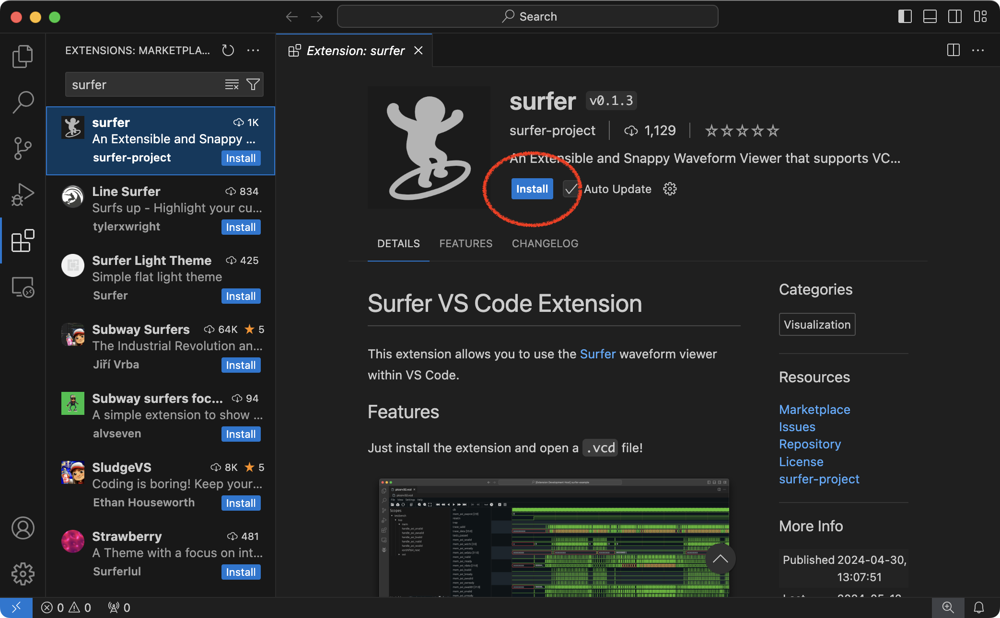
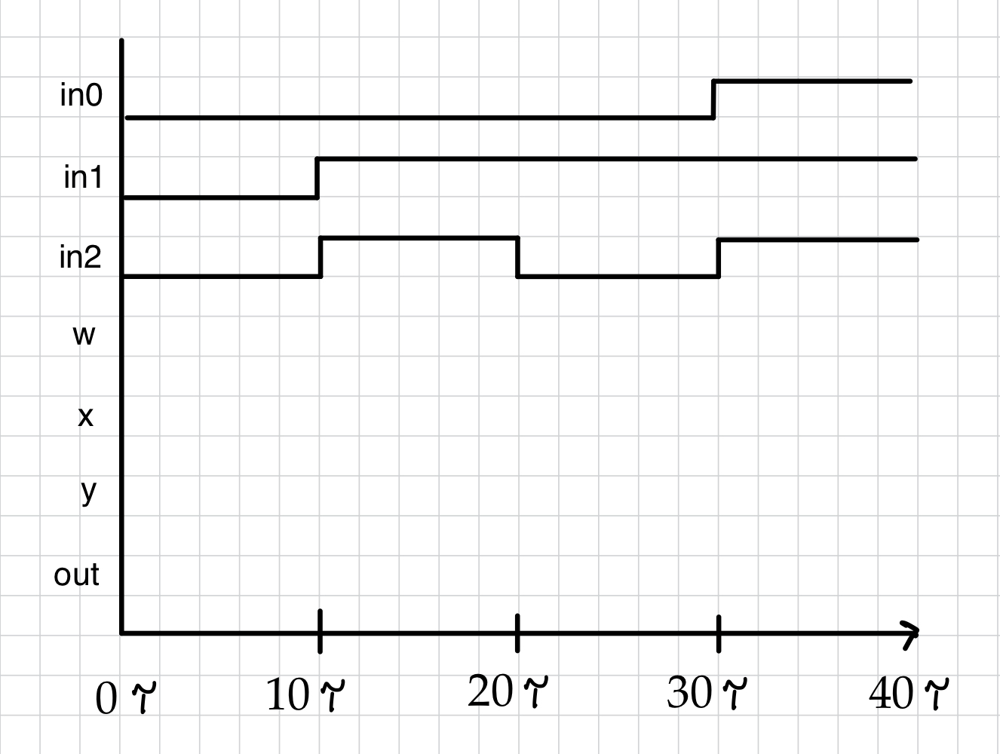
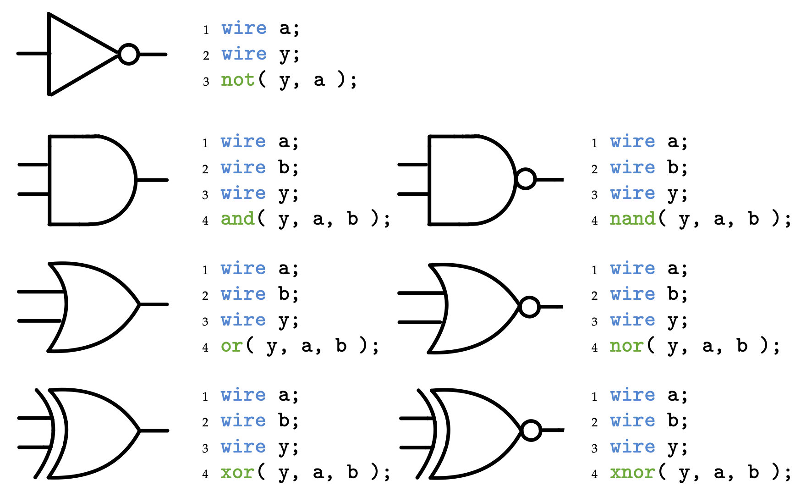

Section 2: Verilog Combinational Gate-Level Design
==========================================================================

In this discussion section you will develop your first Verilog hardware
design, simulate the design, and test its functionality.

1. Logging Into `ecelinux` with VS Code
--------------------------------------------------------------------------

Follow the same process as last discussion section. Find a free
workstation and log into the workstation using your NetID and standard
NetID password. Then complete the following steps (described in more
detail in the last discussion section):

 - Start VS Code
 - Install the Remote-SSH, Verilog, and Surfer extensions
 - Use _View > Command Palette_ to execute _Remote-SSH: Connect Current
    Window to Host..._
 - Enter `netid@ecelinux.ece.cornell.edu`
 - Install the Verilog and Surfer extensions on the server
 - Use _View > Explorer_ to open your home directory on `ecelinux`
 - Use _View > Terminal_ to open a terminal on `ecelinux`

Note that installing the Surfer extension is new from last time.



You need to install the Surfer extension on _both_ your local machine
_and_ the server. So you might need to disconnect from the server using
_File > Close Remote Connection_. Now fork the GitHub repo we will be
using in this discussion section. As mentioned last week, we won't
actually be forking repos for the lab assignments, but it is an easy way
for you to grab some example code for this discussion section and also to
see how GitHub actions work. Go to the example repo here:

 - <https://github.com/cornell-ece2300/ece2300-sec02>

Click on the "Fork" button. Wait a few seconds and then visit the new
copy of this repo in your own person GitHub workspace:

 - <https://github.com/githubid/ece2300-sec02>

where `githubid` is your username on the public version of GitHub. Enable
GitHub Actions on this repo. Click on the _Actions_ tab in your
repository on GitHub and click _I understand my workflows, go ahead and
enable them_. Now let's clone your new repo to the `ecelinux` machine.

```bash
% source setup-ece2300.sh
% mkdir -p ${HOME}/ece2300
% cd ${HOME}/ece2300
% git clone git@github.com:githubid/ece2300-sec02 sec02
% cd sec02
% tree
```

Where `githubid` is your username on the public version of GitHub. The
repo includes the following files:

 - `ece2300-stdlib.v` : ECE 2300 standard library
 - `PairTripleDetector.v` : Verilog for simple hardware module
 - `PairTripleDetector_adhoc.v` : adhoc test for hardware module
 - `PairTripleDetector_test.v` : test cases for hardware module

2. Background on a Pair/Triple Detector
--------------------------------------------------------------------------

We will be using a Pair/Triple detector as the target hardware in this
discussion section. A Pair/Triple detector has some number of input ports
and one output port. The output is one if either two or three of the
inputs are one, and is the output should be zero otherwise. Here is a
truth table for a three-bit pair/triple detector.

| in0 | in1 | in2 | out |
|-----|-----|-----|-----|
| 0   | 0   | 0   | 0   |
| 0   | 0   | 1   | 0   |
| 0   | 1   | 0   | 0   |
| 0   | 1   | 1   | 1   |
| 1   | 0   | 0   | 0   |
| 1   | 0   | 1   | 1   |
| 1   | 1   | 0   | 1   |
| 1   | 1   | 1   | 1   |

Verify that this truth table matches the specification above. Here is a
gate-level network that implements this truth table.


Here is an example of an incomplete simulation table for this gate-level
network.

| in0 | in1 | in2 | w   | x   | y   | out |
|-----|-----|-----|-----|-----|-----|-----|
| 0   | 0   | 0   |     |     |     |     |
| 0   | 1   | 1   |     |     |     |     |
| 0   | 1   | 0   |     |     |     |     |
| 1   | 1   | 1   |     |     |     |     |

Here is an example of an incomplete waveform which corresponds to the
above simulation table.



!!! question "Activity 1: Simulation Tables and Waveforms"

    Complete the above simulation table and waveform. Assume a zero delay
    model.


3. Implementing and Linting a Pair/Triple Detector in Verilog
--------------------------------------------------------------------------

In this part, we will first implement a pair/triple detector before
linting the detector to check for errors.

### 3.1. Implementing a Verilog Design

Before implementing the pair/triple detector, you might want to review
how to instantiate our primitive logic gates in Verilog.



We have provided you with the interface for the pair/triple detector in
`PairTripleDetector.v`. Open this file using VS Code.

```bash
% cd ${HOME}/ece2300/sec02
% code PairTripleDetector.v
```

!!! question "Activity 2: Implement a Pair/Triple Detector"

    Create a Verilog hardware design that implements a pair/triple
    detector by declaring wires, instantiating primitive logic gates, and
    connecting the wires and gates appropriately.

### 3.2. Linting a Verilog Design

Note that Verilog is a very relaxed language which allows all kinds of
sketch constructs many of which are only flagged with warnings. So we
will be using the open-source `verilator` tool to _lint_ our Verilog
hardware designs. Linting means to check the design for static errors. It
is critical be clear that `verilator` will only check for _static_ errors
(i.e., syntax errors) and does not actually test that your hardware
design has the desired _dynamic_ behavior. We will use testing in the
next part to verify your hardawre design has the desired dynamic
behavior. There is more information about `verilator` on its webpage:

 - <https://www.veripool.org/verilator>

Here is how to use `verilator` to lint our design.

```bash
% cd ${HOME}/ece2300/sec02
% verilator -Wall --lint-only PairTripleDetector.v
```

If `verilator` does not report any warnings or errors then you are ready
to compile a simulator; but let's purposefully make an error in our
Verilog hardware design. For example, modify your hardware design to
purposefully omit the semicolon at the end of the module interface.

```verilog
module PairTripleDetector
(
  input  wire in0,
  input  wire in1,
  input  wire in2,
  output wire out
)
```

Notice there is no semicolon after the closed parenthesis which is a bug.
Rerun `verilator` to lint your design. You should see an error like this:

```bash
% cd ${HOME}/ece2300/sec02
% verilator -Wall --lint-only PairTripleDetector.v
%Error: PairTripleDetector.v:13:3: syntax error, unexpected wire, expecting ';'
   13 |   wire w;
      |   ^~~~
%Error: PairTripleDetector.v:17:3: syntax error, unexpected or
   17 |   or ( w,   in0, in1 );
      |   ^~
%Error: Exiting due to 2 error(s)
```

`verilator` is much, much better at catching syntax bugs and providing
useful error messages. **So we will always lint our designs first with
`verilator`, and then (only once we are sure there are no static errors!)
we will move on to testing our hardware design's functionality.**

4. Ad-Hoc Testing a Pair/Triple Detector in Verilog
--------------------------------------------------------------------------

In this part, we will first implement a test bench for our pair/triple
detector before simulating the detector to test its functionality.

### 4.1. Implementing a Verilog Test Bench

Now that we have successfully linted our design, we want to test its
functionality (i.e., make sure it produces the correct output for various
inputs). We need to implement a Verilog _test bench_ which will set
inputs and check outputs. We can use Verilog to implement hardware
designs and to implement test benches. **It is critical we keep these two
very different uses of Verilog separate!** When using Verilog for
hardware design we are using Verilog to model hardware. We must be very
careful, restrict ourselves to a very limited subset of the Verilog
language, and ensure we always know what is the hardware we are modeling.
**It is easy to write Verilog which does not model any real hardware!**
When using Verilog for test benches, we can use any part of the Verilog
language we want; our goal is not to model hardware but to test hardware.

We have provided you a simple ad-hoc test bench in
`PairTripleDetector_adhoc.v`. Take a look at this file in VS Code.

```bash
% cd ${HOME}/ece2300/sec02
% code PairTripleDetector_adhoc.v
```

```verilog
module Top();

  logic dut_in0;
  logic dut_in1;
  logic dut_in2;
  logic dut_out;

  PairTripleDetector dut
  (
    .in0 (dut_in0),
    .in1 (dut_in1),
    .in2 (dut_in2),
    .out (dut_out)
  );

  initial begin
    $dumpfile("PairTripleDetector_test.vcd");
    $dumpvars;

    dut_in0 = 0;
    dut_in1 = 0;
    dut_in2 = 0;
    #10;
    $display( "%x %x %x > %x", dut_in0, dut_in1, dut_in2, dut_out );

    dut_in0 = 0;
    dut_in1 = 1;
    dut_in2 = 1;
    #10;
    $display( "%x %x %x > %x", dut_in0, dut_in1, dut_in2, dut_out );

    dut_in0 = 0;
    dut_in1 = 1;
    dut_in2 = 0;
    #10;
    $display( "%x %x %x > %x", dut_in0, dut_in1, dut_in2, dut_out );

    dut_in0 = 1;
    dut_in1 = 1;
    dut_in2 = 1;
    #10;
    $display( "%x %x %x > %x", dut_in0, dut_in1, dut_in2, dut_out );

  end

endmodule
```

We start by declaring four wires that will be connected to the
design-under-test. Note that we use `logic` not `wire` in test benches. A
`logic` is a more abstract kind of signal than a `wire` in Verilog. We
then instantiates the design-under-test (DUT) and hooks up the ports to
the `logic` signals we just declared.

An initial block is a special piece of code which starts running at the
beginning of a simulation. **You should NEVER use an initial block when
modeling hardware.** But it is perfectly fine to use an initial block in
your test benches. We call two system tasks (`$dumpfile`,`$dumpvars`) to
tell the simulator to output a VCD file which contains waveforms so we
can visualize what our hardware design is doing. Then we set input values
for all input ports. Then wait 10 units of time. Then we display all of
the input and output values. We do this four times with four different
sets of input values.

### 4.2. Ad-Hoc Testing a Verilog Design

Now that we have implemented and linted our Verilog hardware design and
implemented a test bench, we want to simulate our hardware design to
verify its functionality. We will be using the open-source `iverilog`
(Icarus Verilog) simulator. One weakness of `iverilog` is that its error
messages are not great; this is one of the primary reasons we always
want to lint our designs first using `verilator`. There is more
information about `iverilog` on its webpage:

 - <https://steveicarus.github.io/iverilog>

When using `iverilog` there are always two steps. First, we create a
simulator and then we need to explicitly run the simulator to test
hardware design. Let's start by using `iverilog` to create a simulator
based on our pair/triple hardware design and test bench.

```bash
% cd ${HOME}/ece2300/sec02
% iverilog -Wall -g2012 -o PairTripleDetector_adhoc \
    PairTripleDetector_adhoc.v PairTripleDetector.v
```

If there are no errors you should now have a simulator named
`PairTripleDetector_adhoc`. Go ahead and execute the simulator.

```bash
% cd ${HOME}/ece2300/sec02
% ./PairTripleDetector_adhoc
```

The ad-hoc test will print out a simulation table. Compare it to the
simulation table you created by hand earlier in this discussion section.
You can also view the corresponding waveforms using the Surfer extension.

```bash
% cd ${HOME}/ece2300/sec02
% code PairTripleDetector_adhoc.vcd
```

Find the _Scopes_ panel and click on the arrow next to _Top_. Click on
_dut_ and then click on the signals in the _Variables_ panel to see the
waveforms.

5. Systematic Testing for a Pair/Triple Detector in Verilog
--------------------------------------------------------------------------

So far we have been using "ad-hoc" testing. Our test bench will display
outputs on the terminal. If it is not what we expected, we can debug our
hardware design until it meets our expectations. Unfortunately, ad-hoc
testing is error prone and not easily reproducible. If you later make a
change to your implementation, you would have to take another look at the
output to ensure your implementation still works. If another designer
wants to understand your implementation and verify that it is working, he
or she would also need to take a look at the output and think hard about
what is the expected result. Ad-hoc testing is usually verbose, which
makes it error prone, and does not use any kind of standard test output.
While ad-hoc testing might be feasible for very simple implementations,
it is obviously not a scalable approach when developing the more
complicated implementations we will tackle in this course.

We will be using a more _systematic_ way to do automated unit testing
including standardized naming conventions, test benches, and test output.
We have provided you an example of such systematic testing in
`PairTripleDetector_test.v`. Take a look at this file in VS Code.

```bash
% cd ${HOME}/ece2300/sec02
% code PairTripleDetector_test.v
```

The systematic test bench still declares four wires that will be
connected to the DUT, and also still instantiates the DUT and hooks up
the ports. We then declare a `check` task. We will be using Verilog tasks
in our test bench. Tasks are a Verilog feature used for creating test
benches and should be avoided when modeling hardware. A task is similar
to a function in a software programming language and are critical for
creating clean test benches.

```verilog
  task check
  (
    input logic in0,
    input logic in1,
    input logic in2,
    input logic out
  );

    dut_in0 = in0;
    dut_in1 = in1;
    dut_in2 = in2;

    #8;

    if ( t.n != 0 )
      $display( "%3d: %x %x %x > %x", t.cycles,
                dut_in0, dut_in1, dut_in2, dut_out );

    `ECE2300_CHECK_EQ( dut_out, out );

    #2;

  endtask
```

The `check` task takes as values we want to use as input to test our
design, and the correct output values we want to check for. The task then
sets the input, waits for some amount of time, displays the input and
output values, and then checks that the output is as expected. We then
declare one or more test case tasks. Each test case task has a sequence
of checks. Here is the basic test case.

```verilog
  task test_case_1_basic();
    $display( "\ntest_case_1_basic" );
    t.reset_sequence();

    check( 0, 0, 0, 0 );
    check( 0, 1, 1, 1 );
    check( 0, 1, 0, 0 );
    check( 1, 1, 1, 1 );

  endtask
```

Finally, our test bench uses an initial block to decide which test cases
to run.

```verilog
  initial begin
    #1;

    if ((t.n <= 0) || (t.n == 1)) test_case_1_basic();
    if ((t.n <= 0) || (t.n == 2)) test_case_2_exhaustive();

    $display(t.pass_fail);
    $finish;
  end
```

We can compile and run our systematic testing just like our ad-hoc
testing.

```bash
% cd ${HOME}/ece2300/sec02
% iverilog -Wall -g2012 -o PairTripleDetector_test \
    PairTripleDetector_test.v PairTripleDetector.v
% ./PairTripleDetector_test
```

Remember, you can always use the up arrow key to retrieve a previously
entered command. You can then quickly edit it as opposed to having to
type a complete command from scratch.

The simple unit testing framework we provide you enables you to display
trace output (with `+test-case=-1`), specify a single test case to run (with
`+test-case=1` or `+test-case=2`), and generate a VCD file for viewing
waveforms (with `+dump-vcd=waveform.vcd`).

```bash
% cd ${HOME}/ece2300/sec02
% ./PairTripleDetector_test +test-case=-1
% ./PairTripleDetector_test +test-case=1
% ./PairTripleDetector_test +test-case=1 +dump-vcd=PairTripleDetector_test.vcd
```

Open up the waveforms in surfer.

!!! question "Activity 3: Exhaustive Testing"

    Finish the second test case which should use exhaustive testing.
    Exhaustive testing simply means we test all possible input values.
    You can refer to the truth table from earlier in the discussion
    section and simply have one check for every row in the truth table.
    When you have finished rerun the the test using `+test-case=2` to
    make sure your test bench is testing what you think it is.

6. Using GitHub Actions for Continuous Integration
--------------------------------------------------------------------------

We will be using GitHub Actions for continuous integration which means
that GitHub Actions will run all of your tests in the cloud every time
you push to GitHub. Go ahead and commit your work and push to GitHub.

```bash
% cd ${HOME}/ece2300/sec02
% git commit -a -m "finished implementation"
% git push
```

Then go to the _Actions_ tab of your repo.

 - <https://github.com/githubid/ece2300-sec02/actions>

You should be able to see a workflow run. Click on the name of the
workflow run, then click on _sim_, then if you click on _Run sim_tests_
you should be able to see the output of running the tests in the cloud
through GitHub Actions.

7. To-Do On Your Own
--------------------------------------------------------------------------

So far we have been using  explicit gate-level modeling which can be
quite tedious. We can also directly implement Boolean equations in
Verilog. Here is how our primitive gates can be implemented using Boolean
equations.

| Explicit Gate-Level Modeling  | Boolean Equations      |
|-------------------------------|------------------------|
| `not( y, a );`                | `assign y =  ~a;`      |
| `and( y, a, b );`             | `assign y =   a & b;`  |
| `nand( y, a, b );`            | `assign y = ~(a & b);` |
| `or( y, a, b );`              | `assign y =   a | b;`  |
| `nor( y, a, b );`             | `assign y = ~(a | b);` |
| `xor( y, a, b );`             | `assign y =   a ^ b;`  |
| `xnor( y, a, b );`            | `assign y = ~(a ^ b);` |

Here is the exact same gate-level network implementing the pair/triple
detector except now implemented using Boolean equations.

```verilog
module PairTripleDetector
(
  input  wire in0,
  input  wire in1,
  input  wire in2,
  output wire out
);

  wire w;
  wire x;
  wire y;

  assign w   = in0 | in1;
  assign x   = in0 & in1;
  assign y   = w   & in2;
  assign out = y   | x;

endmodule
```

You can also of course use substitution to easily express the output in a
single Boolean equation.

```verilog
module PairTripleDetector
(
  input  wire in0,
  input  wire in1,
  input  wire in2,
  output wire out
);

  assign out = ((in0|in1) & in2) | (in0 & in1);

endmodule
```

We can also directly transform the original truth table for a pair/triple
detector into a Verilog hardware design using Boolean equations. We
simply create eight wires, each of which will be true for a different
row in the truth table. Then we OR together all of the wires where the
output in the truth table is one to derive the final output.

```verilog
module PairTripleDetector
(
  input  wire in0,
  input  wire in1,
  input  wire in2,
  output wire out
);

  wire min0, min1, min2, min3;

  assign min0 = ~in0 & ~in1 & ~in2;
  assign min1 = ~in0 & ~in1 &  in2;
  assign min2 = ~in0 &  in1 & ~in2;
  assign min3 = ~in0 &  in1 &  in2;

  wire min4, min5, min6, min7;

  assign min4 =  in0 & ~in1 & ~in2;
  assign min5 =  in0 & ~in1 &  in2;
  assign min6 =  in0 &  in1 & ~in2;
  assign min7 =  in0 &  in1 &  in2;

  assign out = min3 | min5 | min6 | min7;

endmodule
```

We now have explored three new approaches to implementing a pair/triple
detector. All three are equivalent with our original implementation.
Modify your implementation in `PairTripleDetector.v` based on one of
these new approach and then rerun the ad-hoc and system tests to verify
your new implementation is correct.
