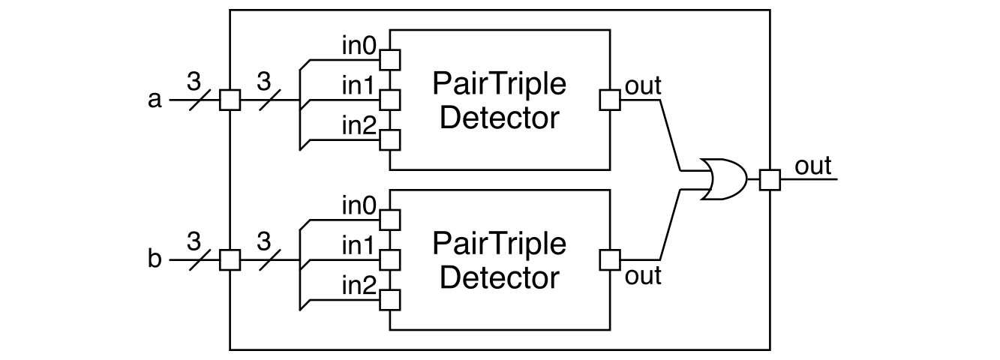

Section 3: Verilog Testing
==========================================================================

In this discussion section you will learn how to automate the process of
linting your designs, building test simulators for your designs, and
testing the functionality of your design with these test simulators.

1. Logging Into `ecelinux` with VS Code
--------------------------------------------------------------------------

Follow the same process as previous discussion sections. Find a free
workstation and log into the workstation using your NetID and standard
NetID password. Then complete the following steps (described in more
detail in the last discussion section):

 - Start VS Code
 - Install the Remote-SSH, Verilog, and Surfer extensions
 - Use _View > Command Palette_ to execute _Remote-SSH: Connect Current
    Window to Host..._
 - Enter `netid@ecelinux.ece.cornell.edu`
 - Install the Verilog and Surfer extensions on the server
 - Use _View > Explorer_ to open your home directory on `ecelinux`
 - Use _View > Terminal_ to open a terminal on `ecelinux`

There is no need to fork the repo for today's discussion section. Simple
clone the repo as follows.

```bash
% source setup-ece2300.sh
% mkdir -p ${HOME}/ece2300
% cd ${HOME}/ece2300
% git clone git@github.com:cornell-ece2300/ece2300-sec03-verilog-testing sec03
% cd sec03
% tree
```

The repo includes the following files:

 - `Makefile.in`: Makefile for the build system
 - `configure`: Configure script for the build system
 - `configure.ac`: Used to generate the configure script
 - `scripts`: Scripts used by the build system
 - `hw/PairTripleDetector_GL.v`: Verilog for pair/triple detector
 - `hw/PairTripleDetector2_GL.v`: Verilog for two pair/triple detectors
 - `test/ece2300-test.v`: ECE 2300 unit testing library
 - `test/PairTripleDetector_GL-test.v`: test cases for pair/triple detector
 - `test/PairTripleDetector2_GL-test.v`: test cases for two pair/triple detector
 - `sim/detector2-sim.v`: interactive simulator for hardware module

To make it easier to cut-and-paste commands from this handout onto the
command line, you can tell Bash to ignore the `%` character using the
following command:

```bash
% alias %=""
```

Now you can cut-and-paste a sequence of commands from this tutorial
document and Bash will not get confused by the `%` character which begins
each line.

2. A Simple Makefile
--------------------------------------------------------------------------

We will start by writing a very simple Makefile to automate our work from
the last discussion section. Let's copy some files into a temporary
directory to enable us to explore a simple makefile.

```bash
% cd ${HOME}/ece2300/sec03
% mkdir -p temp
% cp hw/PairTripleDetector_GL.v temp
% cp test/ece2300-test.v temp
% cp test/PairTripleDetector_GL-test.v temp
```

Now let's remind ourselves how to lint, build, and run a test simulator
for the pair/triple detector from the last discussion section.

```bash
% cd ${HOME}/ece2300/sec03/temp
% verilator -Wall --lint-only PairTripleDetector_GL.v
% iverilog -Wall -g2012 -o PairTripleDetector_GL-test PairTripleDetector_GL-test.v
% ./PairTripleDetector_GL-test
```

Let's now remove the test simulator so we are back to a clean directory.

```bash
% cd ${HOME}/ece2300/sec03/temp
% trash PairTripleDetector_GL-test
```

Manually performing these steps can be very tedious. We can use a new
tool called `make` which was specifically designed to help automate the
process of running a sequence of programs. The key to using `make` is
developing a `Makefile`. A `Makefile` is a plain text file which contains
a list of _rules_ which together specify how to execute commands to
accomplish some task. Each rule has the following syntax:

```
target : prerequisite0 prerequisite1 prerequisite2
<TAB>command
```

A rule specifies how to generate the target file using the list of
prerequisite files and the given Linux command. `make` is smart enough to
know it should rerun the command if any of the prerequisites change, and
it also knows that if one of the prerequisites does not exist then it
needs to look for some other rule to generate that prerequisite first. It
is very important to note that make requires commands in a rule to start
with a real TAB character. So you should not type the letters `<TAB>`,
but you should instead press the TAB key and verify that it has
inserted a real TAB character (i.e., if you move the left/right arrows
the cursor should jump back and forth across the TAB). This is the only
time in the course where you should use a real TAB character as opposed
to spaces.

Let's create a simple `Makefile` to automate the process of linting an
building a test simulator. Use VS Code to create a new file named
`Makefile`.

```bash
% cd ${HOME}/ece2300/sec03/temp
% code Makefile
```

Enter the following content into the `Makefile`:

```
PairTripleDetector_GL-test : PairTripleDetector_GL.v PairTripleDetector_GL-test.v 
<TAB>verilator -Wall --lint-only PairTripleDetector_GL.v
<TAB>iverilog -Wall -g2012 -o PairTripleDetector_GL-test PairTripleDetector_GL-test.v

clean:
<TAB>rm -rf PairTripleDetector_GL-test
```

We can use the newly created `Makefile` like this:

```bash
% cd ${HOME}/ece2300/sec03/temp
% make PairTripleDetector_GL-test
% ./PairTripleDetector_GL-test
```

`make` will by default use the `Makefile` in the current directory.
`make` takes a command line argument specifying what you want "make". In
this case, we want to make the `PairTripleDetector_GL-test` simulator.
`make` will look at all of the rules in the `Makefile` to find a rule
that specifies how to make the `PairTripleDetector_GL-test` simulator. It
will then check to make sure the prerequisites exist and that they are
up-to-date, and then it will run the command sequence specified in the
rule for `PairTripleDetector_GL-test`. In this case, those commands are
`verilator` and `iverilog`. `make` will output to the terminal every
command it runs, so you should see it output the command line which uses
`verilator` to lint the design and `iverilog` to build the
`PairTripleDetector_GL-test` simulator.

Try running `make` again:

```bash
% cd ${HOME}/ece2300/sec03/temp
% make PairTripleDetector_GL-test
% ./PairTripleDetector_GL-test
```

`make` detects that the prerequisite (i.e., `PairTripleDetector_GL.v` and
`PairTripleDetector_GL-test.v`) have not changed and so it does not
rebuild the test simulator. Now let's try making a change in the
`PairTripleDetector_GL.v` source file; change the final OR gate to a NOR
gate and rebuild and rerun the test simulator like this:

```bash
% cd ${HOME}/ece2300/sec03/temp
% make PairTripleDetector_GL-test
% ./PairTripleDetector_GL-test
```

`make` will automatically detect that the prerequesite has changed and
rebuild the test simulator appropriately. This ability to automatically
track dependencies and rerun just what is necessary is a key benefit of
using a tool like `make`. `Makefiles` can also include targets which are
not actually files. Our example `Makefile` includes a `clean` target
which will delete any generated simulators. Let's clean up our directory
like this:

```bash
% cd ${HOME}/ece2300/sec03/temp
% ls
% make clean
% ls
```

Let's go ahead and remove the temporary directory.

```bash
% trash ${HOME}/ece2300/sec03/temp
```

3. Automated Build System
--------------------------------------------------------------------------

So far we have been doing all of our work in one directory. We will need
a better way to organize our work as we start to develop larger and more
complicated hardware modules. In the remaining lab assignments, you will
be working with four subdirectories:

 - `hw` : subdirectory for Verilog hardware design files
 - `test` : subdirectory for Verilog test simulator files
 - `sim` : subdirectory for Verilog interactive simulator files
 - `build` : subdirectory for building/running all simulators

Take a look in the `hw`, `test`, and `sim` directories in your cloned
repo. You can see the `PairTripleDetector_GL.v` file is in the `hw`
subdirectory and the `PairTripleDetector_GL-test.v` file is in the `test`
subdirectory.

From now on, we will always be building all of our simulators in a
separate `build` directory. Keeping simulator executables, trace files,
and waveforms separate from the source code is critical to maintaining a
clean project. It enables us to easily do a "clean build". We can simply
trash the build directory and start from scratch. **You should never
commit and push your build directory to GitHub!**

We provide you a sophisticated `Makefile` you will be using in the
remaining lab assignments. The `Makefile` is generated through a
configuration step that checks to make sure your environment is setup
correctly. Let's go ahead and create a build directory, run configure,
and look at the provided `Makefile.`

```bash
% cd ${HOME}/ece2300/sec03
% mkdir -p build
% cd build
% ../configure
% code Makefile
```

You do not need to understand everything in the `Makefile`, but just
appreciate that it will be a powerful way to automate the process of
linting, building, and running our simulators.

### 2.1. Composing Two Pair/Triple Detectors

Let's implement a more complicated Verilog hardware module that composes
two instances of our pair/triple detector called `PairTripleDetector2`.
It has the following block diagram.



The `PairTripleDetector2` has two three-bit input ports and one one-bit
output port; it should output a one if either of the input ports contain
two or three ones and output a zero otherwise. Go ahead and use VS Code
to implement `PairTripleDetector2`.

```bash
% cd ${HOME}/ece2300/sec03/build
% code ../hw/PairTripleDetector2_GL.v
```

### 2.2. Testing Child Modules

What strategy should we use to test our new composition? The wrong thing
to do is to immediately start testing the composition. Instead, **we must
test and thoroughly verify every child module before doing any kind of
integration testing.** Let's use the provided `Makefile` to lint, build,
and run the test simulator for the child pair/triple detector.

```bash
% cd ${HOME}/ece2300/sec03/build
% make PairTripleDetector_GL-test
% ./PairTripleDetector_GL-test
```

You can build and run the test in a single line like this:

```bash
% cd ${HOME}/ece2300/sec03/build
% make PairTripleDetector_GL-test && ./PairTripleDetector_GL-test
```

The `&&` bash operator enables running multiple commands on the same
command line. Remember you can "zoom-in" to run a single test case with
the `+test-case` command line option.

```bash
% cd ${HOME}/ece2300/sec03/build
% ./PairTripleDetector_GL-test +test-case=1
% ./PairTripleDetector_GL-test +test-case=2
```

When you zoom-in the test framework will displace a trace of the inputs
and outputs for the design-under-test. You can output waveforms using the
`+dump-vcd` command line option and then open them using the Surfer
extension for VS Code.

```bash
% cd ${HOME}/ece2300/sec03/build
% ./PairTripleDetector_GL-test +test-case=2 +dump-vcd=waves.vcd
% code waves.vcd
```

### 2.3. Basic Testing

Now that we know the child modules are correct, we can do integration
testing of the composition. Run the basic tests that we provide for this
new composition.

```bash
% cd ${HOME}/ece2300/sec03/build
% make PairTripleDetector2_GL-test && ./PairTripleDetector2_GL-test
```

### 2.4. Directed Testing

In the previous discussion section, we used exhaustive testing to verify
our pair/triple detector. Exhaustive testing is a powerful technique but
only applicable to hardware modules with just a few input ports each with
just a few bits. The number of exhaustive checks scales exponentially
with the number of bits across all input ports. For example, if our
hardware module has four eight-bit input ports, we would need `2^(8*4)`
or four billion checks for exhaustive testing!

We can use _directed testing_ in situations where exhaustive testing is
not possible. In directed testing, we focus on including checks for as
many interesting input values as possible. We usually organize directed
testing into many test cases, where each test case is focusing on a
different kinds of input values we are interested in testing. For
`PairTripleDetector2`, we might want a directed test case that focuses on
input values with a few ones and a different directed test case that
focuses on input values with many ones. Go ahead and add appropriate
checks to `test_case_2_few_ones` and `test_case_3_many_ones` in
`PairTripleDetector2_GL-test.v`.

```bash
% cd ${HOME}/ece2300/sec03/build
% code ../test/PairTripleDetector2_GL-test.v
```

Then rebuild and rerun the test simulator using `make`.

```bash
% cd ${HOME}/ece2300/sec03/build
% make PairTripleDetector2_GL-test && ./PairTripleDetector2_GL-test
```

Zoom-in on each of these two test cases to see the trace output.

```bash
% cd ${HOME}/ece2300/sec03/build
% ./PairTripleDetector2_GL-test +test-case=2
% ./PairTripleDetector2_GL-test +test-case=3
```

### 2.5. Random Testing

Directed testing is a good first step, but how do we know if we have
covered all of the corner cases? We can use _random testing_ to help
increase our confidence that we have not missed any important corner
cases. Random testing involves generating random input values, determing
the correct output given these random input values, applying these random
input values to the design-under-test, and then verifying that the
design-under-test produces the correct output values.

Here is an example of a random test case for our `PairTripleDetector2`
module:

```verilog
  logic [2:0] random_a;
  logic [2:0] random_b;
  logic       random_out;
  int         random_a_num_ones;
  int         random_b_num_ones;

  task test_case_4_random();
    t.test_case_begin( "test_case_4_random" );

    // Generate 20 random input values

    for ( int i = 0; i < 20; i = i+1 ) begin

      // Generate a 3-bit random value for both a and b

      random_a = 3'($urandom(t.seed));
      random_b = 3'($urandom(t.seed));

      // Calculate the number of ones in random value a

      random_a_num_ones = 0;
      for ( int j = 0; j < 3; j = j+1 ) begin
        if ( random_a[j] )
          random_a_num_ones = random_a_num_ones + 1;
      end

      // Calculate the number of ones in random value b

      random_b_num_ones = 0;
      for ( int j = 0; j < 3; j = j+1 ) begin
        if ( random_b[j] )
          random_b_num_ones = random_b_num_ones + 1;
      end

      // Calculate the correct output value

      random_out = (random_a_num_ones > 1) || (random_b_num_ones > 1);

      // Apply the random input values and check the output value

      check( random_a, random_b, random_out );

    end

  endtask
```

Recall that Verilog can be used to both _design_ hardware and also to
_test_ hardware. Very different constructs should be used when designing
vs. testing hardware. Here we are clearly using Verilog constructs (e.g.,
`$urandom`, for loops, etc) that are not suitable for modeling hardware.

The random test generates two random 3-bit values using the `$urandom`
system task. We pass in `t.seed` to ensure our random tests are actually
"pseudo-random", i.e., the test case will always produce the same
sequence of random values. This way if a random test case fails we can
rerun the test case to debug it without worrying that the failure will go
away due to different random input values. We then include Verilog
behavioral code to determine the correct answer; we use two for loops to
count the number of ones in each random 3-bit value. Once we know the
number of ones in each random 3-bit value, we can determine what the
correct output should be for the design-under-test.

Copy and paste this new test case into `PairTripleDetector2_GL-test.v`.

```bash
% cd ${HOME}/ece2300/sec03/build
% code ../test/PairTripleDetector2_GL-test.v
```

Then add this new test case to the list of test cases in the `initial`
block like this:

```
  initial begin
    t.test_bench_begin( `__FILE__ );

    if ((t.n <= 0) || (t.n == 1)) test_case_1_basic();
    if ((t.n <= 0) || (t.n == 2)) test_case_2_few_ones();
    if ((t.n <= 0) || (t.n == 3)) test_case_3_many_ones();
    if ((t.n <= 0) || (t.n == 4)) test_case_4_random();

    t.test_bench_end();
  end
```

Now rebuild and rerun the test simulator. Verify that your new random
test case is running.

```bash
% cd ${HOME}/ece2300/sec03/build
% make PairTripleDetector2_GL-test && ./PairTripleDetector2_GL-test
% ./PairTripleDetector2_GL-test +test-case=4
```

It is always useful to try and break your code to make sure your test
cases really are testing what you think they are. Replace the OR gate in
`PairTripleDetector2_GL` with an AND gate. Do your directed tests catch
this bug? If your directed tests _do not_ catch a bug but your random
tests _do_ catch a bug, then you want to add a _new_ directed test case
that tests for this behavior. In fact, adding a new directed test case to
reproduce a bug caught during randoming testing is the best way to start
debugging a random test case failure. If the bug was caught by your
random test, but not your directed test cases, go ahead and add a new
directed test case that will catch this bug.

### 2.6. Running All Tests

The provided `Makefile` provides a `check` target which will build and
run all test simulators in a single step.

```bash
% cd ${HOME}/ece2300/sec03/build
% make check
```

**Note that this should only be used to produce a high-level overview of
which test simulators are passing and which test simulators are failing.
You should not just always type `make check`.** You should "zoom-in" and
build and run a single test simulator for which ever hardware module you
are currently working on. Periodically run `make check` to get a
high-level overview.

3. Interactive Simulators
--------------------------------------------------------------------------

Once we have finished testing our hardware design, we can use an
interactive simulator to experiment with the design. The source files for
our interactive simulators will be in the `sim` subdirectory. Take a look
at the provided `detector2-sim.v` interactive simulator.

```bash
% cd ${HOME}/ece2300/sec03/build
% code ../sim/detector2-sim.v
```

You can build the simple interactive simulator by simply specifying it as
a target:

```bash
% cd ${HOME}/ece2300/sec03/build
% make detector2-sim
```

Then you can specify the input values for `a` and `b` on the command
line.

```bash
% cd ${HOME}/ece2300/sec03/build
% ./detector2-sim +a=000 +b=000
% ./detector2-sim +a=001 +b=000
% ./detector2-sim +a=000 +b=001
% ./detector2-sim +a=111 +b=111
```

Note that an interactive simulator is _not_ for testing. Using an
interactive simulator is neither systematic nor automatic. One should
only start experimenting with an interactive simulator once a hardware
module has been thoroughly tested using a combination of basic,
exhaustive, directed, and/or random testing!

