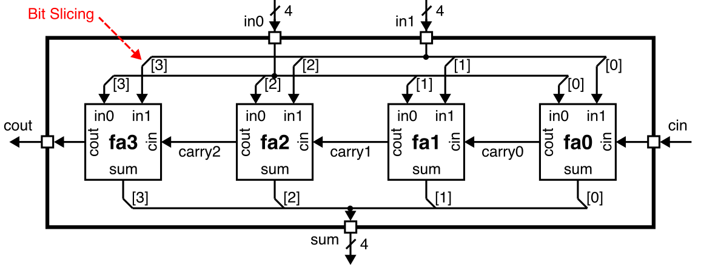

Section 4: Lab 2 Head Start
==========================================================================

In this discussion section you will use what you have learned in the
previous discussion sections to get started on Lab 2. By the end of this
discussion section, you will have implemented a full adder, tested the
full adder using exhaustive testing, implemented a four-bit ripple-carry
adder, and tested the ripple-carry adder using directed and random
testing. Feel free to copy any code you would like from your work in this
discussion section into your lab group repo.

1. Logging Into `ecelinux` with VS Code
--------------------------------------------------------------------------

Follow the same process as previous discussion sections. Find a free
workstation and log into the workstation using your NetID and standard
NetID password. Then complete the following steps (described in more
detail in the last discussion section):

 - Start VS Code
 - Install the Remote-SSH, Verilog, and Surfer extensions
 - Use _View > Command Palette_ to execute _Remote-SSH: Connect Current
    Window to Host..._
 - Enter `netid@ecelinux.ece.cornell.edu`
 - Install the Verilog and Surfer extensions on the server
 - Use _View > Explorer_ to open your home directory on `ecelinux`
 - Use _View > Terminal_ to open a terminal on `ecelinux`

There is no need to fork the repo for today's discussion section. Simple
clone the repo as follows.

```bash
% source setup-ece2300.sh
% mkdir -p ${HOME}/ece2300
% cd ${HOME}/ece2300
% git clone git@github.com:cornell-ece2300/ece2300-sec04-lab2-head-start sec04
% cd sec04
% tree
```

The repo includes the following files:

 - `Makefile.in`: Makefile for the build system
 - `configure`: Configure script for the build system
 - `configure.ac`: Used to generate the configure script
 - `scripts`: Scripts used by the build system
 - `hw/FullAdder_GL.v`: Verilog for full adder
 - `hw/AdderRippleCarry_4b_GL.v`: Verilog for four-bit ripple-carry adder
 - `test/ece2300-test.v`: ECE 2300 unit testing library
 - `test/FullAdder_GL-test.v`: test cases for full adder
 - `test/AdderRippleCarry_4b_GL-test.v`: test cases for four-bit ripple-carry adder

Go ahead and create a build directory and run configure to generate a
Makefile.

```bash
% cd ${HOME}/ece2300/sec04
% mkdir -p build
% cd build
% ../configure
```

To make it easier to cut-and-paste commands from this handout onto the
command line, you can tell Bash to ignore the `%` character using the
following command:

```bash
% alias %=""
```

Now you can cut-and-paste a sequence of commands from this tutorial
document and Bash will not get confused by the `%` character which begins
each line.

2. Implementing a Full Adder
--------------------------------------------------------------------------

A full adder adds three one bit binary values and produces a two-bit
binary output.


Review your notes from lecture and fill out the following truth table for
a full adder. Make sure you completely understand this truth table before
continuing.

| in0 | in1 | cin | cout | sum |
|-----|-----|-----|------|-----|
| 0   | 0   | 0   |      |     |
| 0   | 0   | 1   |      |     |
| 0   | 1   | 0   |      |     |
| 0   | 1   | 1   |      |     |
| 1   | 0   | 0   |      |     |
| 1   | 0   | 1   |      |     |
| 1   | 1   | 0   |      |     |
| 1   | 1   | 1   |      |     |

We now want to implement this truth table in a Verilog hardware module.
We have provided you with the interface for a full adder in
`FullAdder_GL.v`.

```verilog
module FullAdder_GL
(
  (* keep=1 *) input  wire in0,
  (* keep=1 *) input  wire in1,
  (* keep=1 *) input  wire cin,
  (* keep=1 *) output wire cout,
  (* keep=1 *) output wire sum
);
```

The module has three input ports and two output ports. Notice we are
using the special `(* keep=1 *)` Verilog attribute with every port.
Without this attribute, the FPGA tools will "flatten" your entire design
(i.e., eliminate all module boundries) during the synthesis process.
While this can enable improved optimizations, it also complicates
analyzing the area and timing of your design. The `(* keep=1 *)`
attribute tells the FPGA tools to preserve the module hierarchy. We will
use `(* keep=1 *)` on all ports for Lab 2-4 and explore the potential
benefit of flattening in Lab 5. Open the `FullAdder_GL.v` Verilog file
using VS Code.

```bash
% cd ${HOME}/ece2300/sec04/build
% code ../hw/FullAdder_GL.v
```

!!! question "Activity 1: Implement a Full Adder"

    Complete the truth table for a full adder. Create a Verilog hardware
    design that implements a full adder using the logic gate or boolean
    equation layers of abstraction.

3. Testing a Full Adder
--------------------------------------------------------------------------

After implementing any Verilog hardware module, your next task must
always be to test that Verilog hardware module. **Never attempt to use a
Verilog hardware module before thoroughly testing its functionality!**
Since our full adder only has eight possible input values, we can use
exhaustive testing to verify its functionality.

We have provided you a Verilog test bench in `FullAdder_GL-test.v` with a
basic test case named `test_case_1_basic`.

```bash
% cd ${HOME}/ece2300/sec04/build
% code ../test/FullAdder_GL-test.v
```

!!! question "Activity 2: Test the Full Adder"

    Use your truth table to add checks to implement exhaustive testing in
    the test case named `test_case_2_exhaustive`.

Once you have finished writing your exhaustive test case, you can build
and run the test simulator like this:

```bash
% cd ${HOME}/ece2300/sec04/build
% make FullAdder_GL-test
% ./FullAdder_GL-test
% ./FullAdder_GL-test +test-case=2
```

4. Implementing a Ripple-Carry Adder
--------------------------------------------------------------------------

A ripple-carry adder chains together full adders to implement a multi-bit
binary adder. For example, we can chain four full adders together to
implement a four-bit binary adder.



Review your notes from lecture to fill in the following simulation table
for the four-bit ripple carry adder.

| in0  | in1  | cin | carry0 | carry1 | carry2 | cout | sum |
|------|------|-----|--------|--------|--------|------|-----|
| 0000 | 0000 | 0   |        |        |        |      |     |
| 0001 | 0001 | 0   |        |        |        |      |     |
| 0001 | 0001 | 1   |        |        |        |      |     |
| 0011 | 0011 | 0   |        |        |        |      |     |

We now want to implement this ripple-carry adder in a Verilog hardware
module. We have provided you with the interface for the adder in
`AdderRippleCarry_4b_GL.v`.

```verilog
module AdderRippleCarry_4b_GL
(
  (* keep=1 *) input  wire [3:0] in0,
  (* keep=1 *) input  wire [3:0] in1,
  (* keep=1 *) input  wire       cin,
  (* keep=1 *) output wire       cout,
  (* keep=1 *) output wire [3:0] sum
);
```

Notice that we are using multi-bit input and output ports. The block
diagram illustrates how we can "slice" the bus to connect each bit of the
multi-input ports to a different instances of the full adder module. The
carry chain is implemented using wires to connect the carry out of one
full adder to the carry in of the next full adder.

Take a minute to reflect on our use of the three abstraction principles:
_modularity:_ our ripple carry adder has a well-defined port-based
interface; _hierarchy:_ we have decomposed our ripple carry adder into a
full adder module; and _regularity:_ we have reused the same full adder
four times to implement the ripple carry adder.

Open the `AdderRippleCarry_4b_GL.v` Verilog file using VS Code.

```bash
% cd ${HOME}/ece2300/sec04/build
% code ../hw/AdderRippleCarry_4b_GL.v
```

!!! question "Activity 3: Implement a Ripple Carry Adder"

    Complete the simulation table for the ripple carry adder. Implement
    the ripple carry adder by instantiating four full adders and
    connecting the appropriately.

5. Testing a Ripple-Carry Adder
--------------------------------------------------------------------------

Since we have already thoroughly unit tested our full adder, we can now
focus on integration testing for our four-bit ripple-carry adder. Our
four-bit ripple carry adder has a total of `2^9` or 512 possible input
values which means exhaustive testing is not really feasible. We will
need to use directed and random testing to verify the functionality of
the ripple-carry adder.

We have provided you a Verilog test bench in
`AdderRippleCarry_4b_GL-test.v` with a basic test case named
`test_case_1_basic`.

```bash
% cd ${HOME}/ece2300/sec04/build
% code ../test/AdderRippleCarry_4b_GL-test.v
```

!!! question "Activity 4: Directed Testing for Ripple-Carry Adder"

    Add multiple directed test cases. Each directed test case should be
    designed to test a specific behavior. For example, you might want to
    write the following test cases:

     - Test inputs where cin is zero and cout is zero
     - Test inputs where cin is one and cout is zero
     - Test inputs where cin is zero and cout is one
     - Test inputs where cin is one and cout is one
     - Test inputs where every carry bit is one

After writing each directed test case, build and run the test simulator
like this:

```bash
% cd ${HOME}/ece2300/sec04/build
% make AdderRippleCarry_4b_GL-test && ./AdderRippleCarry_4b_GL-test
```

Once you have finished writing and running your directed test cases, move
on to random testing. Review what we learned in the previous discussion
section about how to write random tests. There are a couple of hints that
might be useful as you write the Verilog code to determine the correct
answer given random inputs.

First, you can use the `+` operator to perform addition in Verilog. Here
is a toy example that you can experiment with using `iverilog` or EDA
Playground.

```verilog
module Top();

  logic [3:0] a;
  logic [3:0] b;
  logic [3:0] sum;

  initial begin

    a = 4'd3;
    b = 4'd7;

    sum = a + b;

    $display( "%d + %d = %d", a, b, sum );

  end

endmodule
```

Second, Verilator will complain if you attempt to add signals of
different bitwidths; you can zero-extend signals to ensure they are all
the same bitwidth using the Verilog concatenation operator (`{}`). Here
is a toy example that you can experiment with using `iverilog` or EDA
Playground.

```verilog
module Top();

  logic [3:0] a;
  logic       b;
  logic [3:0] sum;

  initial begin

    a = 4'd7;
    b = 1'b1;

    sum = a + {3'b0,b};

    $display( "%d + %d = %d", a, b, sum );

  end

endmodule
```

Third, if you add two four-bit signals and write the result to a four-bit
signal you cannot check the final carry out; if you add two four-bit
signals and write the result to a five-bit signal then the
most-significant bit of the output is the final carry out. Here is a toy
example that you can experiment with using `iverilog` or EDA Playground.

```verilog
module Top();

  logic [3:0] a;
  logic [3:0] b;
  logic [4:0] result;
  logic       cout;
  logic [3:0] sum;

  initial begin

    a = 4'd15;
    b = 4'd3;

    result = a + b;
    cout   = result[4];
    sum    = result[3:0];

    $display( "%d + %d = %d (cout = %b)", a, b, sum, cout );

  end

endmodule
```

!!! question "Activity 5: Random Testing for Ripple-Carry Adder"

    Use the above hints to write a random test case for your four-bit
    ripple-carry adder. Choosing iterations of random values seems
    reasonable.

After writing a random test case, build and run the test simulator
like this:

```bash
% cd ${HOME}/ece2300/sec04/build
% make AdderRippleCarry_4b_GL-test && ./AdderRippleCarry_4b_GL-test
```

6. Clean Build
--------------------------------------------------------------------------

As a final step, do a clean build to verify everything is working
correctly.

```bash
% cd ${HOME}/ece2300/sec04
% trash build
% mkdir -p build
% cd build
% ../configure
% make check
```

