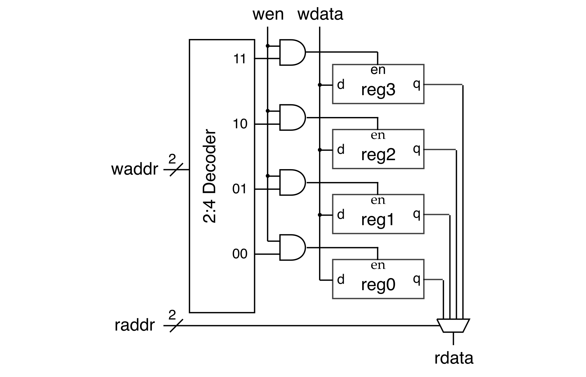

Section 7: Verilog Memory Arrays
==========================================================================

In this discussion section, you will use what you have learned in the
previous discussion sections to implement a simple register file memory
array at the register-transfer level (RTL). We will also learn about
implementing parameterized Verilog hardware modules. You will start by
implementing a parameterized 4-to-1 mux, parameterized decoder, and
parameterized register which are each parameterized by the input/output
bitwidth. You will then implement a 4-word 4-bit register file memory
array in two ways: (1) structurally by composing the mux, register, and
decoder; and (2) flat using a single `always_ff` and `always_comb` block.

In the past discussion sections, we have focused on how to use Verilog to
model combinational logic at both the gate-level and RTL. In this
discussion section, we will only be using RTL. **Remember from previous
discussion sections that it is critical that students _always_ know what
is the hardware they are modeling; students should understand what their
RTL would likely turn into at the gate-level.**

1. Logging Into `ecelinux` with VS Code
--------------------------------------------------------------------------

Follow the same process as previous discussion sections. Find a free
workstation and log into the workstation using your NetID and standard
NetID password. Then complete the following steps (described in more
detail in the last discussion section):

 - Start VS Code
 - Install the Remote-SSH, Verilog, and Surfer extensions
 - Use _View > Command Palette_ to execute _Remote-SSH: Connect Current
    Window to Host..._
 - Enter `netid@ecelinux.ece.cornell.edu`
 - Install the Verilog and Surfer extensions on the server
 - Use _View > Explorer_ to open your home directory on `ecelinux`
 - Use _View > Terminal_ to open a terminal on `ecelinux`

There is no need to fork the repo for today's discussion section. Simple
clone the repo as follows.

```bash
% source setup-ece2300.sh
% mkdir -p ${HOME}/ece2300
% cd ${HOME}/ece2300
% git clone git@github.com:cornell-ece2300/ece2300-sec07-verilog-mem sec07
% cd sec07
% tree
```

The repo includes the following files:

 - `Makefile.in`: Makefile for the build system
 - `configure`: Configure script for the build system
 - `configure.ac`: Used to generate the configure script
 - `scripts`: Scripts used by the build system
 - `Mux4_RTL.v`: Parameterized 4-to-1 mux in RTL
 - `Decoder_RTL.v`: Parameterized binary decoder in RTL
 - `Register_RTL.v`: Parameterized register with reset and enable in RTL
 - `RegfileStruct1r1w_4x4b_RTL.v`: Regster file using structural RTL
 - `RegfileFlat1r1w_4x4b_RTL.v`: Regster file using flat RTL
 - `test`: Directory with unit tests for each hardware module

Go ahead and create a build directory and run configure to generate a
Makefile.

```bash
% cd ${HOME}/ece2300/sec07
% mkdir -p build
% cd build
% ../configure
```

To make it easier to cut-and-paste commands from this handout onto the
command line, you can tell Bash to ignore the `%` character using the
following command:

```bash
% alias %=""
```

Now you can cut-and-paste a sequence of commands from this tutorial
document and Bash will not get confused by the `%` character which begins
each line.

2. Implementing and Testing a Parameterized 4-to-1 RTL Multiplexor
--------------------------------------------------------------------------

Our goal is to now implement a parameterized 4-to-1 multiplexor using RTL
modeling. Parameterized hardware modules have an additional list of
parameters as part of their interface. These parameters can be used to
specify the bitwidths of ports and declare internal wires. Here is a
trivial parameterized pass through module that simply connects
the input port to the output port. The pass through module is
parameterized by the bitwidths of the input and output ports.

```verilog
module PassThrough
#(
  parameter p_nbits = 1
)(
  input  logic [p_nbits-1:0] in,
  output logic [p_nbits-1:0] out
);

  assign out = in;

endmodule
```

Paarameters are specified as an additional list enclosed in `#()` before
the list of ports. By convention, we prefix all parameters with `p_`.
Parameters can have default values (the default value for `p_nbits` above
is 1). We need new syntax to insantate a module with parameters. The
following instantiates two pass through modules with a large module.

```verilog
module DoublePassThrough_8b
(
  input  logic [7:0] in,
  output logic [7:0] out
);

 logic [7:0] pt0_out;

 PassThrough
 #(
   .p_nbits(8)
 )
 pt0
 (
   .in  (in),
   .out (pt0_out)
 );

 PassThrough
 #(
   .p_nbits(8)
 )
 pt1
 (
   .in  (pt0_out),
   .out (out)
 );

endmodule
```

To specify parameter values when instantiating a hardware module we use
an extra `#()` before connecting the ports. Our coding conventions
require always using named port lists, and usually we always want to use
named parameter lists as well so there is no confusion what parmeters we
are setting. However, as special exception to our coding conventions, if
a module is _only_ parameterized by the bitwidth then you can just use
a positional parameter specification like this.

```verilog
module DoublePassThrough_8b
(
  input  logic [7:0] in,
  output logic [7:0] out
);

 logic [7:0] pt0_out;

 PassThrough#(8) pt0
 (
   .in  (in),
   .out (pt0_out)
 );

 PassThrough#(8) pt1
 (
   .in  (pt0_out),
   .out (out)
 );

endmodule
```

### 2.1. Implementing a Parameterized 4-to-1 Multiplexor

We have provided you the interface for a parameterized 4-to-1 mux
in `Mux4_RTL.v`.

```
module Mux4_RTL
#(
  parameter p_nbits = 1
)(
  input  logic [p_nbits-1:0] in0,
  input  logic [p_nbits-1:0] in1,
  input  logic [p_nbits-1:0] in2,
  input  logic [p_nbits-1:0] in3,
  input  logic         [1:0] sel,
  output logic [p_nbits-1:0] out
);
```

!!! question "Activity 1: Implement a Parameterized 4-to-1 Mux"

    Use what you have learned to create a Verilog hardware design that
    implements a parameterized 2-to-1 mux. You should have a single
    `always_comb` block. Although it is possible to use if/else
    conditional operators, try using a case statemet instead.

### 2.2. Testing a Parameterized 4-to-1 Multiplexor

Testing parameterized hardware modules is more challenging since we need
to instantiate the design under test with many different parameters and
then throughly test each instance. We have provided you a test bench in
`Mux4_RTL-test.v`. Notice how we have a separate parameterized test
module; the test cases in the test module are all parameterized so we can
use the same test cases to test modules with different parameter values.

You can run the test simulator for the mux as follows. Currently we are
only testing a 1-bit 4-to-1 mux.

```bash
% cd ${HOME}/ece2300/sec07/build
% make Mux4_RTL-test
% ./Mux4_RTL-test
```

!!! question "Activity 2: Test Parameterized 4-to-1 Mux"

    Instantiate `TestMux4` two more times to test a 5-bit 4-to-1 mux and
    a 32-bit 4-to-1 test. Use `run_test_suite` in the top-level initial
    block to run these two new test suites. Build and run the updated
    test simulator to verify the parameterized mux works for a variety of
    different parameters.

3. Implementing and Testing a Parameterized RTL Decoder
--------------------------------------------------------------------------

We will now implement a parameterized binary decoder using RTL modeling.
Recall that a decoder takes as input a binary number and produces a
one-hot encoding of that binary number. If the input is 0, then bit 0
should be 1 and the remaining bits should be 0. If the input is 1, then
bit 1 should be 1 and the remaining bits should be 0.

We will need to start understanding the _static elaboration_ phase of
hardware modeling. Static elaboration involves _generating_ hardware, and
is a form of _meta-programming_ (i.e., programs that generate programs).
Static elaboration is not about _modeling_ hardware; it is about
_generating_ hardware. Static elaboration happens once when we construct
the hardware (or construct a simulator); static elaboration is very
seperate from _runtime_ when the hardware is actually executing. Let's
look at the interface for the parameterized mux.

```
module Decoder_RTL
#(
  parameter p_nbits = 4
)(
  input  logic [$clog2(p_nbits)-1:0] in,
  output logic         [p_nbits-1:0] out
);
```

`$clog2()` is a new Verilog construct that returns the ceiling log base 2
of its input. This enables us to specify a 2-to-4 decoder: we specify
`p_nbits` as 4 and the input port will be automatically determined to
hvae a bitwidth of 2 at _static elaboration_ time. `$clog2()` has nothing
to do with _modeling_ hardware. It is only used for _generating_
hardware. Here it is used to determine a bitwidth based on a parameter
value.

### 3.1. Implementing a Parameterized Decoder

We have provided you the interface for a parameterized decoder in
`Decoder_RTL.v`.

!!! question "Activity 3: Implement a Parameterized Decoder"

    Use what you have learned to create a Verilog hardware design that
    implements a parameterized decoder. You should have a single
    `always_comb` block. Then run the tests in `Decoder_RTL-test.v`.

4. Implementing and Testing a Parameterized RTL Register
--------------------------------------------------------------------------

We will now implement a parameterized register using RTL modeling.

### 4.1. Implementing a Parameterized Register

We have provided you the interface for a parameterized register in
`Register_RTL.v`.

```
module Register_RTL
#(
  parameter p_width = 1
)(
  input  logic               clk,
  input  logic               rst,
  input  logic               en,
  input  logic [p_width-1:0] d,
  output logic [p_width-1:0] q
);
```

!!! question "Activity 4: Implement a Parameterized Register"

    Use what you have learned to create a Verilog hardware design that
    implements a parameterized register. You should have a single
    `always_ff` block with an if/else conditional operation to handle the
    reset and enable signals. Then run the tests in
    `Register_RTL-test.v`.

5. Implementing and Testing a Structural Register File
--------------------------------------------------------------------------

A memory array is a two-dimensional array of sequential logic gates (also
called "bit cells"). A register file is a specific kind of memory array
where D flip-flops are used as the sequental logic gates. We can
implement a register file structurally using the mux, decodier, and
register developed earlier in this discussion section.



This register file has four "words" and each word is 4-bits. The register
file has one write port and one read port (i.e., we can do a 4-bit write
and a 4-bit read at the same time). The read port is combinational; if we
set the read address then the read data comes back that same cycle (i.e.,
combinationally).

We have provided you the following Verilog structural template for this
register file in `RegfileStruct1r1w_4x4b_RTL.v`:

```verilog
module RegfileStruct1r1w_4x4b_RTL
(
  input  logic       clk,
  input  logic       rst,

  input  logic       wen,
  input  logic [1:0] waddr,
  input  logic [3:0] wdata,

  input  logic [1:0] raddr,
  output logic [3:0] rdata
);

  // Write Address Decoder

  logic [3:0] regfile_en;

  Decoder_RTL#(4) waddr_decoder
  (
    .in  (waddr),
    .out (regfile_en)
  );

  // Register file array

  logic [3:0] regfile_q [4];

  genvar i;
  generate
    for ( i = 0; i < 4; i = i + 1 ) begin : regfile

     //''' ACTIVITY ''''''''''''''''''''''''''''''''''''''''''''''''''''''
     // Instantate a 4-bit register and connect appropriately
     //>''''''''''''''''''''''''''''''''''''''''''''''''''''''''''''''''''

    end
  endgenerate

  // Read mux

  Mux4_RTL#(4) mux
  (
    .in0 (regfile_q[0]),
    .in1 (regfile_q[1]),
    .in2 (regfile_q[2]),
    .in3 (regfile_q[3]),
    .sel (raddr),
    .out (rdata)
  );

endmodule
```

This template is again making use of _static elaboration_. The generate
loop is a new Verilog construct which can be used to programmatically
instantiate hardware modules at _static elaboration_ time. Generate loops
do _not_ happen at _runtime_ when the hardware is actually executing. The
generate loop in this template is used to instantiate four registers.
These kind of generate statemts can greatly simplify complex hardware
(especially complex parameterized hardware).

The following construct from the template creates an _array_ of signals:

```verilog
  logic [3:0] regfile_q [4];
```

This creates an array of four signals, each signal is four-bits.

!!! question "Activity 5: Implement and Test Structural Register File"

    Instantiate your 4-bit register using your parameterized register in
    the template. Verify your register file works using the provided test
    bench in `RegfileStruct1r1w_4x4b_RTL-test.v`.

6. Implementing and Testing a Flat Register File
--------------------------------------------------------------------------

We can also implement a register file flat using a single `always_ff`
block for the write ports and a single `always_comb` block for the read
port. We will use an _array_ of signals to act as the state.

```
  logic [3:0] regfile [4];
```

You can read and write four-bit signals from this array by simply
indexing into it. So the following will write the binary value 0011 into
the second signal in this array.

```
  always_comb begin
    regfile[1] = 4'b0011;
  end
```

!!! question "Activity 6: Implement and Test Flat Register File"

    Implement the flat register file using a single `always_ff` block and
    a single `always_comb` block. Verify your register file works using
    the provided test bench in `RegfileFlat1r1w_4x4b_RTL-test.v`.

7. Clean Build
--------------------------------------------------------------------------

As a final step, do a clean build to verify everything is working
correctly.

```bash
% cd ${HOME}/ece2300/sec07
% trash build
% mkdir -p build
% cd build
% ../configure
% make check
```

