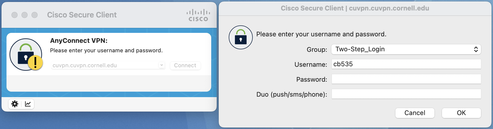

Tutorial 0: ECE Linux Server Remote Access
==========================================================================

All of the laboratory assignments for this course will be completed by
remotely logging into a cluster of `ecelinux` servers. The `ecelinux`
servers all run the Red Hat Enterprise Linux 8 operating system, and they
all use an identical setup. You do not need to do anything special to
create an `ecelinux` account. You will be using your NetID and Cornell
password to login, and an `ecelinux` account will be automatically
created for you when you first login. Any student enrolled in any ECE
class should automatically be granted access to the `ecelinux` servers.
Having said this, if you cannot log into the `ecelinux` servers please
reach out to the course staff for assistance.

Later tutorials will discuss how to use the Linux development environment
and the Git distributed version control system. In this tutorial, we
focus on how to setup remote access to the `ecelinux` servers by first
connecting to the Cornell VPN and then using two different options to
remotely access the `ecelinux` servers. The first remote access option is
based on using PowerShell (for Windows OS users) or Mac Terminal (for Mac OS
X users) and only supports primitive text-based interaction. We recommend
using PowerShell or Mac Terminal as backup options to debug connection
issues to the `ecelinux` servers. The primary remote access option
recommended in this course is through Visual Studio Code (VS Code) which
provides a very nice interface with support for working at the command
line, graphic text editing, and graphic file browsing.

1. Connecting to the Cornell VPN
--------------------------------------------------------------------------

If you are logging into the `ecelinux` servers from on campus (i.e.,
using the Cornell wired or wireless network), then you do not need to
enable the Cornell virtual private network (VPN). However, if you are off
campus, then you will need to enable the Cornell VPN whenever you want to
log into the `ecelinux` servers. The VPN provides very secure access to
all on-campus network resources. More information about the Cornell VPN
is available here:

 - <https://it.cornell.edu/cuvpn>

Simply follow the instructions at the following link to install the Cisco
VPN software for the appropriate operating system you use on your
laptop/workstation:

 - <https://it.cornell.edu/landing-page-kba/2605/5273>

Once the Cornell VPN is installed, then connect to the Cornell VPN by
following these instructions and using your Cornell NetID and password:

 - <https://it.cornell.edu/landing-page-kba/2605/823>

The Cornell VPN uses the Cisco Secure Client shown below.



2. Remote Access via PowerShell or Mac Terminal
--------------------------------------------------------------------------

PowerShell is part of Windows OS and Mac Terminal is part of Mac OS X. Both
enable interacting with your system from the command line (i.e., a
powerful text-based environment where users type commands to manipulate
files and directories and execute applications). Both also enable
remotely accessing other systems (e.g., the `ecelinux` servers) via the
command line using SSH, a highly secure network protocol and associated
client/server program. Both will enable you to log into the `ecelinux`
servers and to then manipulate files and directories and execute
applications remotely on the `ecelinux` servers using the Linux command
line.

### 2.1. Starting PowerShell or Mac Terminal

First, if you are off campus, then you must be connected to the Cornell
VPN before attempting to use X2Go to access the `ecelinux` servers (see
Section 1). To start PowerShell click the _Start_ menu then search for
_Windows PowerShell_. To start Mac Terminal go to your _Applications_
folder and choose _Utilities > Terminal_, or open Spotlight, type
_Terminal_, and press enter.

### 2.2. Logging into `ecelinux` Servers with PowerShell or Mac Terminal

After starting PowerShell or Mac Terminal, type in the following command
at the prompt to log into the `ecelinux` servers using SSH.

```bash
% ssh netid@ecelinux.ece.cornell.edu
```

Replace `netid` with your Cornell NetID in the command above. You should
not enter the `%` character. We use the `%` character to indicate what
commands we should enter on the command line. Executing the command will
prompt you to enter your Cornell NetID password, and then you should be
connected to the `ecelinux` servers.

The very first time you log into the `ecelinux` servers you may see a
warning like this:

     The authenticity of host ’ecelinux.ece.cornell.edu (128.253.51.206)’
     can’t be established. ECDSA key fingerprint is
     SHA256:smwMnf9dyhs5zW5I279C5oJBrTFc5FLghIJMfBR1cxI.
     Are you sure you want to continue connecting (yes/no)?

The very first time you log into the `ecelinux` servers it is okay to
enter _yes_, but from then on if you continue to receive this warning
please contact the course staff.

Once you have opened a terminal, the very first thing you need to do
after logging into the `ecelinux` servers is source the course setup
script. This will ensure your environment is setup with everything you
need for working on the laboratory/programming assignments. Enter the
following command on the command line:

```bash
% source setup-ece2300.sh
```

Again, you should not enter the `%` character. You should now see a blue
`ECE 2300` in your prompt which means your environment is setup for the
course. The following figure shows what your prompt should look like if
you have sourced the course setup script. See the final section of this
tutorial for more on how to automatically source the setup script every
time you log into the `ecelinux` servers.

### 2.3. Nano Text Editor

Nano is a text-based editor installed on the `ecelinux` servers. The
editor is easy to learn and use, but very simple. To experiment with
Nano, we will first grab a text file using the `wget` command. The next
tutorial discusses this command in more detail.

```bash
% wget http://www.csl.cornell.edu/courses/ece2300/overview.txt
```

You can start nano by typing the command `nano` at the Linux command line
and optionally specifying the filename you want to view and edit.

```bash
% nano overview.txt
```

Notice that the editor specifies most of the useful commands at the
bottom of the terminal screen. The symbol `\^` indicates the `CONTROL`
key. To type any text you want, just move the cursor to the required
position and use the keyboard. To save your changes press `CONTROL+O1
(i.e., press the `CONTROL1 key and the `O1 key at the same time) and
press the `<ENTER>1 key after specifying the filename you want to save
to. You can quit by pressing `CONTROL+X1. Use `CONTROL+G1 for help.


3. Remote Access via VS Code
--------------------------------------------------------------------------

While combining PowerShell or Mac Terminal with a text-based editor like
Nano can certainly work, it is not the most productive development setup.
We strongly recommend using VS Code as your primary remote access option
for code development. VS Code offers a nice balance of productive
features while also working well with moderate internet speeds.

VS Code uses a unique approach where the GUI interface runs completely on
your local laptop/workshop and then automatically handles copying files
back and forth between your local laptop/workshop and the `ecelinux`
servers. VS Code is portable across many operating systems and has a
thriving ecosystem of extensions and plugins enabling it to function as a
full-featured IDE for languages from C to Javascript. More information
about VS Code is here:

 - <https://code.visualstudio.com>
 - <https://code.visualstudio.com/docs>

### 3.1. Installing VS Code on Your Laptop/Workstation

You can download VS Code by simply going to the main VS Code webpage:

 - <https://code.visualstudio.com>

There should be an obvious link that says ``Download for Windows'' or
``Download for MacOS''. Click on that link. On Mac OS X, you will need to
drag the corresponding _Visual Student Code.app_ to your _Applications_
folder.

### 3.2. Starting and Configuring VS Code

First, if you are off campus, then you must be connected to the Cornell
VPN before attempting to use VS Code to access the `ecelinux` servers
(see Section 1). Start by opening VS Code. The exact way you do this will
depend on whether you are using a Windows OS or Mac OS X
laptop/workstation.

The key to VS Code is installing the correct extensions. You will need
extensions for the Verilog hardware description language (HDL). We also
want to install a special extension which will enable remotely accessing
the `ecelinux` servers using SSH. Choose _View > Extensions_ from the
menubar. Enter the name of the extension in the ``Search Extensions in
Marketplace'' and then click the blue \IT{Install} button. Here are the
names of the extensions to install:

 - Remote - SSH (use the one from Microsoft)
 - Verilog (use the one from Masahiro Hiramori)


### 3.3. Logging into `ecelinux` Servers with VS Code

After starting VS Code, choose _View > Command Palette_ from the menubar.
Enter the following command in the command palette:

    Remote-SSH: Connect Current Window to Host..

As you start typing matching commands will be displayed and you can just
click the command when you see it. VS Code will then ask you to _Select
configured SSH host or enter user@host_, and you should enter the
following:

    netid@ecelinux.ece.cornell.edu

Replace `netid` with your Cornell NetID in the command above. If you are
on a Windows OS laptop/workstation, then you may see a pop-up which stays
that the _Windows Defender Firewall as blocked some features of this
app_. This is not a problem. Simply click _Cancel_.

You might also see a drop down which asks you to choose the operating
system of the remote server with options like _Linux_ and _Windows_.
Choose _Linux_.

Finally, the very first time you log into the `ecelinux` servers you
may see a warning like this:

    "ecelinux.ece.cornell.edu" has fingerprint
    "SHA256:YCh2FiadeTXEzuSkC0AOdglBgPciwc8WvcCPncvr2Fs"
    Are you sure you want to continue?
    Continue
    Cancel

The very first time you log into the `ecelinux` servers it is okay to
enter _yes_, but from then on if you continue to receive this warning
please contact the course staff.

Hopefully, VS Code will now prompt you to enter your Cornell NetID
password, and then you should be connected to the `ecelinux` servers.

Also the very first time you log into the `ecelinux` servers you will see
a pop up dialog box in the lower right-hand corner which says _Setting up
SSH host ecelinux.ece.cornell.edu (details) Initializing..._. It might
take up to a minute for everything to be setup; please be patient! Once
the pop up dialog box goes away and you see _SSH:
ecelinux.ece.cornell.edu_ in the lower left-hand corner of VS Code then
you know you are connected to the `ecelinux` servers.

The final step is to make sure your extensions for the Verilog HDL are
also installed on the server. Choose _View > Extensions_ from the
menubar. Use the "Search Extensions in Marketplace" to search for the
same Verilog HDL extensions that we installed earlier. Instead of saying
_Install_ it should now say _Install in SSH: ecelinux.ece.cornell.edu_.
Install the Verilog HDL extension on the `ecelinux` servers. You only
need to do this once, and then next time this extension will already be
installed on the `ecelinux` servers.

### 3.4. Using VS Code

VS Code includes an integrated file explorer which makes it very
productive to browse and open files. Choose _View > Explorer_ from the
menubar, and then click on _Open Folder_. VS Code will then ask you to
_Open File Or Folder_ with a default of `/home/netid`. Click _OK_.

You might see a pop-up which asks you _Do you trust the authors of the
  files in this folder?_ Since you will only be browsing your own files
  on the `ecelinux` server, it is fine to choose _Yes, I trust the
  authors_.

This will reload VS Code, and you should now you will see a file explore
in the left sidebar. You can easily browse your directory hierarchy, open
files by clicking on them, create new files, and delete files.

VS Code includes an integrated terminal which will give you access to the
Linux command line on the `ecelinux` servers. Choose _Terminal > New
Terminal_ from the menubar. You should see the same kind of Linux command
line prompt that you saw when using either PowerShell or Mac Terminal.
The very first thing you need to do after logging into the `ecelinux`
servers is source the course setup script. This will ensure your
environment is setup with everything you need for working on the
laboratory/programming assignments. Enter the following command on the
command line:

```bash
% source setup-ece2300.sh
```

Again, you should not enter the `%` character. You should now see a blue
`ECE 2300` in your prompt which means your environment is setup for the
course. See the final section of this tutorial for more on how to
automatically source the setup script every time you log into the
`ecelinux` servers.

To experiment with VS Code, we will first grab a text file using the
`wget` command. The next tutorial discusses this command in more detail.
Type the following command in the VS Code integrated terminal.

```bash
% wget http://www.csl.cornell.edu/courses/ece2300/overview.txt
```

You can open a file in the integrated text editor using the `code`
command like this:

```bash
% code overview.txt
```

The following figure shows what VS Code should look like if you have
sourced the course setup script and opened the `overview.txt` file.
Notice how the `overview.txt` file opened in a new tab at the top and the
terminal remains at the bottom. This enables you to have easy access to
editing files and the Linux command line at the same time.


### 3.5. Troubleshooting Remote Access via VS Code

There may be issues where sometimes VS Code just keeps asking you for
your password or VS Code just hangs when you try and connect to the
`ecelinux` servers. This might mean VS Code is getting wedged. You can
definitely ask the course staff to help, but you can also try to fix it
on your own.

One thing to try is to kill the VS Code server on the host.
Choose _View > Command Palette_ from the menubar. Enter the following
command in the command palette:

    Remote-SSH: Kill VS Code Server on Host...

Another thing to try is to delete the `.vscode-server` directory on the
sever. Of course, how can you delete this directory if you cannot use VS
Code to access the `ecelinux` servers? You can use PowerShell or Mac
Terminal to log into the `ecelinux` servers (see Section 2 or 3).

Once you have gained access to the Linux command line on the
`ecelinux` servers using either PowerShell or Mac Terminal, then you
can delete the `.vscode-server` directory like this:

```bash
% rm -rf .vscode-server
```

Be very careful with the `rm` command since it can permanently delete
files!

Note that using the `Remote-SSH: Add new SSH host...` option does not
always seem to work on Microsoft Windows OS laptops/workstations. This is
why we recommend just using `Remote-SSH: Connect Current Window to
Host...` directly.

Sometimes VS Code can take a very long time to save a file. This is
usually because VS Code is trying to auto-format the file on the
`ecelinux` servers. To turn off auto-formatting, open the VS Code
settings menu. On Windows OS, choose _File > Preferences > Settings_ from
the menubar. On Mac OS X, choose _Code > Preferences > Settings_ from the
menubar. Click on _Text Editor_ and then _Formatting_. Make sure _Format
On Save_ is not checked.

4. Sourcing Course Setup Script with Auto Setup
--------------------------------------------------------------------------

The previous sections have demonstrated how to remotely access the
`ecelinux` servers, get to the Linux command line, and source the course
setup script. *Again, you must source the course setup script before
doing any work related to this course!* The course setup script
configures everything so you have the right environment to work on the
laboratory/programming assignments.

Since it can be tedious to always remember to source the course setup
script, you can also use auto setup which will automatically source the
course setup for you when you open a terminal. Note that if the
environment for ECE 2300 conflicts with the environment required by a
different course then you will need to manually source the setup script
when you are working on this course. Enter the following command on the
command line to use auto setup:

```bash
 % source setup-ece2300.sh --enable-auto-setup
```

Now completely logout of the `ecelinux` servers then log back in and get
to the Linux command line. The exact way to do this depends on which
remote access option you using. You should see `ECE 2300` in the prompt
meaning your environment is automatically setup for the course. If at
anytime you need to disable auto setup you can use the following command:

```bash
 % source setup-ece2300.sh --disable-auto-setup
```

Again, if for any reason running the setup script prevents you from using
tools for another course, you cannot use the auto setup. You will need to
run the setup script manually every time you want to work on a
laboratory/programming assignment for this course.

