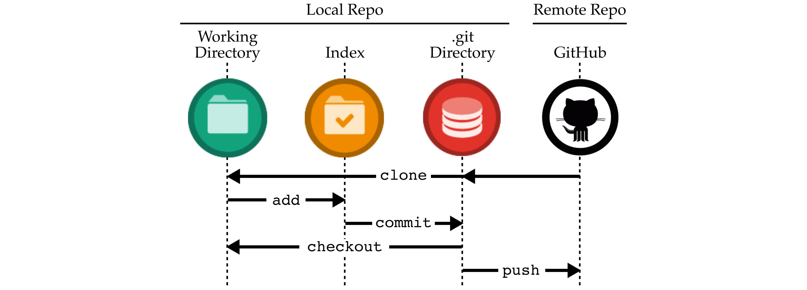
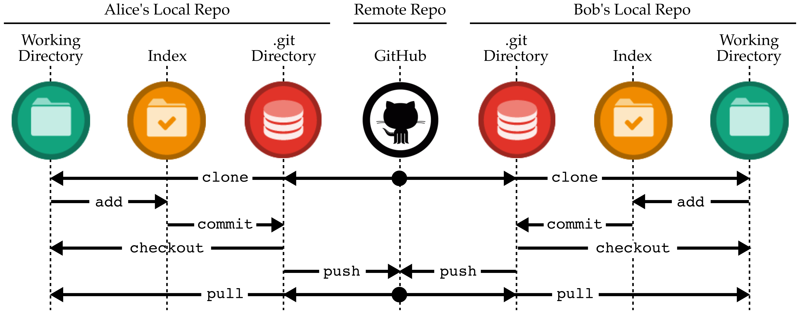

Tutorial 2: Git Distributed Version Control System
==========================================================================

In this course, we will be using Git as our revision control and source
code management system. We will be using GitHub for centralized online
repository hosting, and GitHub Actions for online continuous integration
testing. These tools will enable us to adopt an agile hardware
development methodology so your group can rapidly collaborate and iterate
on the design, verification, and evaluation of the lab assignments. This
tutorial covers how to: setup your GitHub account, use Git for basic
incremental development, use GitHub to collaborate with your group,
manage Git branches and GitHub pull requests, and use GitHub actions.
This tutorial assumes that you have completed the remote access and Linux
tutorials.

Before you begin, make sure that you have **logged into the `ecelinux`
servers** as described in the remote access tutorial. You will need to
open a terminal and be ready to work at the Linux command line using VS
Code. To follow along with the tutorial, type the commands without the
`%` character. In addition to working through the commands in the
tutorial, you should also try the more open-ended activities.

Before you begin, make sure that you have **sourced the setup-ece2300.sh
script** or that you have enabled auto setup. Sourcing the setup script
sets up the environment required for this tutorial.

1. Setting up Your GitHub Account
--------------------------------------------------------------------------

GitHub is an online service that hosts centralized Git repositories for a
growing number of open-source projects. It has many useful features
including a web-based source browser, history browser, branch management,
merge requests, code review, issue tracking, and even a built-in wiki
attached to every repository. We have created a dedicated GitHub
organization for the course located here:

 - <https://github.com/cornell-ece2300>

The course staff will add all officially registered students to the
course organization. For most of this tutorial you will be using a public
repository in your own personal GitHub account, but you will be using a
private repository in our course GithHub organization for all of your lab
assignments. Note that we will _not_ be using the version of GitHub
hosted at Cornell We will instead be using the public version of GitHub
at `github.com`. You can check to see if you have a GitHub account on the
public version of GitHub here:

 - <https://github.com/githubid>

where `githubid` is your GitHub username on the public version of GitHub.
**You must replace `githubid` with your real GitHub username for this
link to work!** If the above link still does not work, then you do not
have an account on the public version of GitHub. You will need to create
one here:

 - <https://github.com/join>

Your NetID makes a great GitHub username. Be sure to use your Cornell
University email address. Once your account is setup, please make sure
you set your full name so we can know who you are on GitHub. Please also
consider uploading a profile photo to GitHub; it makes it more fun to
interact on GitHub if we all know what each other look like. Go to the
following page and enter your first and last name in the _Name_ field,
and then consider uploading a profile photo.

 - <https://github.com/settings/profile>

Once you have a GitHub username, please fill out the following form on
Canvas so the instructors know the mapping from your NetID to your GitHub
username.

 - <http://www.csl.cornell.edu/courses/ece2300/githubid>

Before you can begin using GitHub, you need to create an SSH key pair on
an `ecelinux` machine and upload the corresponding SSH public key to
GitHub. GitHub uses these keys for authentication. The course setup
script takes care of creating an SSH key pair which you can use. Login to
an `ecelinux` machine, source the course setup script, and then view the
contents of your public key using the following commands:

```bash
% source setup-ece2300.sh
% cat ~/.ssh/ece2300-github.pub
```

Use the following page to upload the public key to GitHub:

 - <https://github.com/settings/ssh>

Click on _New SSH Key_, and then cut-and-paste the public key you
displayed using `cat` into the _key_ textbox. Give the key the title
"ece2300-github". Then click _Add SSH key_. To test things out try the
following on an `ecelinux` machine.

```bash
% ssh -T git@github.com
```

You may see a warning about the authenticity of the host. Don't worry,
this is supposed to happen the first time you access GitHub using your
new key. Just enter "yes". The GitHub server should output some text
including your GitHub username. Verify that the GitHub username is
correct, and then you should be all set. There are two good GitHub Guides
you might want to take a look at:

 - <https://guides.github.com/activities/hello-world>
 - <https://guides.github.com/introduction/flow>

GitHub has two integrated tools that students might find useful: an issue
tracker and a wiki. Consider using the GitHub issue tracker to track bugs
you find in your code or to manage tasks required to complete the
lab assignment. You can label issues, comment on issues, and
attach them to commits. See the following links for more information
about GitHub issues:

 - <https://help.github.com/articles/about-issues>

Consider using the GitHub per-repository wiki to create task lists,
brainstorm design ideas, rapidly collaborate on text for the lab
assignment report, or keep useful command/code snippets. See the
following links for more information about GitHub wikis:

 - <https://help.github.com/articles/about-github-wikis>

2. Git and GitHub
--------------------------------------------------------------------------

In this section, we begin with a basic single-user workflow before
demonstrating how Git and Github can be used for effective collaboration
among multiple users. We discuss how to resolve conflicts and how to
manage branches and pull requests.

### 2.1. Single-User Workflow

In this section, we cover some basic Git commands and illustrate a simple
Git workflow. We have created a Git repository that we will be using as
an initial template, so the first step is to _fork_ this tutorial
repository. Forking is the process of making a personal copy of someone
else's repository on GitHub. Start by going to the GitHub page for the
tutorial repository located here:

 - <https://github.com/cornell-ece2300/ece2300-tut02-git>


Click on _Fork_ in the upper right-hand corner. If asked where to fork
this repository, choose your personal GitHub account. After a few
seconds, you should have a brand new repository in your account:

 - <https://github.com/githubid/ece2300-tut02-git>

Where `githubid` is your GitHub username on the public version of GitHub.
Now that you have your own copy of the tutorial repository, the next step
is to _clone_ this repository to an `ecelinux` machine so you can
manipulate the content within the repository. We call the repository on
GitHub the _remote repository_ and we call the repository on the
`ecelinux` machine the _local repository_. A local repository is a
first-class mirror of the remote repository with the entire history of
the repository, and thus almost all operations are essentially local
requiring no communication with GitHub. The following commands write an
environment variable with your GitHub username, create a subdirectory for
this tutorial in your home directory before using the `git clone` command
to clone the remote repository and thus create a local repository.

```bash
% source setup-ece2300.sh
% GITHUBID="githubid"
% mkdir -p ${HOME}/ece2300
% cd ${HOME}/ece2300
% git clone git@github.com:${GITHUBID}/ece2300-tut02-git tut02
% cd tut02
% TUTROOT=${PWD}
```

Where again `githubid` is your GitHub username on the public version of
GitHub. The `git clone` command takes two command line arguments. The
first argument specifies the remote repository on GitHub you would like
to clone, and the second argument specifies the name to give to the new
local repository. Note that we created an environment variable with the
directory path to the local repository to simplify navigating the file
system in the rest of this tutorial.

The repository currently contains two files: a `README` file, and
`overview.txt` which contains an overview of the course. These files are
contained within what we call the _working directory_. The repository
also includes a special directory named `.git` which contains all of the
extra repository metadata. You should never directly manipulate anything
within the `.git` directory.

```bash
% cd ${TUTROOT}
% ls -la
```

Let's assume we want to create a new file that contains a list of fruits,
and that we want to manage this file using Git version control. First, we
create the new file.

```bash
% cd ${TUTROOT}
% echo "apple" > fruit.txt
```

To manage a file using Git, we need to first use the `git add` command to
tell Git that it should track this file from now on. We can then use `git
commit` to commit our changes to this file into the repository, and `git
log` to confirm the result.

```bash
% cd ${TUTROOT}
% git add fruit.txt
% git commit -m "initial fruit list"
% git log
```

The `-m` command line option with the `git commit` command enables you to
specify a _commit message_ that describes this commit. All commit
messages should include a "subject line" which is a single _short_ line
briefly describing the commit. Many commits will just include a subject
line (e.g., the above commit). If you want to include more information in
your commit message then skip the `-m` command line option and Git will
launch Nano. You still want to include a subject line at the top of your
commit message, but now you can include more information separated from
the subject line by a blank line.

Note, you can learn about any Git command and its usage by typing `git
help command`, where `command` should be substituted by the actual name
of the command. This would display the output similar to the manual pages
for a Linux command, as seen in Tutorial 1. Students are encouraged to
learn more about each Git command beyond the details covered in this
tutorial.

The `git log` command displays information about the commit history. The
beginning of the output from `git log` should look something like this:

```bash
commit a8ac41ea8dba1371888ec7a2341f79de20521a4d (HEAD -> main)
Author: cb <cb535@cornell.edu>
Date:   Mon Sep 2 13:17:32 2024 -0400

    initial fruit list
```

Conceptually, we should think of each commit as a copy of all of the
tracked files in the project at the time of the commit. This commit just
included changes to one file, but as we add more files each commit will
include more and more information. The history of a git repository is
just a long sequence of commits that track how the files in the
repository have evolved over time. Notice that Git has recorded the name
of who made the commit, the date and time of the commit, and the log
message. The first line is the commit id which uniquely identifies this
commit. Git does not use monotonically increasing revision numbers like
other version control systems, but instead uses a 40-digit SHA1 hash as
the commit id. This is a hash of _all_ the files included as part of
this commit (not just the changes). We can refer to a commit by the full
hash or by just the first few digits as long as we provide enough digits
to unambiguously reference the commit. Now let's add a fruit to our list
and commit the change.

```bash
% cd ${TUTROOT}
% echo "mango" >> fruit.txt
% git commit -m "added mango to fruit list"
```

Unfortunately, this doesn't work. The output from `git commit`
indicates that there have been no changes since the last commit so there
is no need to create a new commit. Git has a concept of an _index_
which is different compared to other version control systems. We must
"stage" files (really we stage content not files) into the index, and
then `git commit` will commit that content into the repository. We can
see this with the `git status` command.

```bash
% cd ${TUTROOT}
% git status
```

which should show that `fruit.txt` is modified but not added to the
index. We stage files in the index with `git add` like this:

```bash
% cd ${TUTROOT}
% git add fruit.txt
% git status
```

Now `git status` should show that the file is modified and also added
to the index. Our commit should now complete correctly.

```bash
% cd ${TUTROOT}
% git commit -m "added mango to fruit list"
% git status
```

So even though Git is tracking `fruit.txt` and knows it has changed,
we still must explicitly add the files we want to commit. You definitely
want to avoid using something like `git add .` to add all files, since
this will inevitably end up adding files that you don't really want to
commit. There is a short cut which uses the `-a` command line option
with the `git commit` command. This command line option tells Git to
add any file which has changed and was previously added to the repository
before doing the commit.

```bash
% cd ${TUTROOT}
% echo "orange" >> fruit.txt
% git commit -a -m "added orange to fruit list"
% git status
```

Staging files is a useful way to preview what we will commit before we
actually do the commit. This helps when we have many changes in our
working directory but we don't want to commit them all at once. Instead
we might want to break them into smaller, more meaningful commits or we
might want to keep working on some of the modified files while committing
others.

The following figure illustrates how the commands we have used so far
create a single-user development workflow. The `git clone` command copies
the remote repository to create a local repository which includes both
the working directory and the special `.git` directory. The `git add`
command adds files to the index from the working directory. The `git
commit` command moves files from the index into the special `.git`
directory. The `-a` command line option with the `git commit` command can
commit files directly from the working directory to the special `.git`
directory.



Now that we have made some changes, we can use `git log` to view the
history of last few commits and then add another line to the
`fruit.txt` file.

```bash
% cd ${TUTROOT}
% git log
% echo "plum" >> fruit.txt
% cat fruit.txt
```

Imagine you didn't like your changes and want to revert the changes, you
would use the `git checkout` command as below.

```bash
% cd ${TUTROOT}
% git checkout fruit.txt
% cat fruit.txt
```

As illustrated in the above single-user development workflow figure, the
`git checkout` command resets any a file or directory to the state it was
in at the time of the last commit. The output from the `git status`
command should look something like this:

```bash
% cd ${TUTROOT}
% git status
 On branch main
 Your branch is ahead of 'origin/main' by 3 commits.
   (use "git push" to publish your local commits)
 nothing to commit, working directory clean
```

The `git status` command is telling us that the local clone of the
repository now has more commits than the remote repository on GitHub. If
you visit the GitHub page for this repository you will not see any
changes. This is a critical difference from other centralized version
control systems. In Git, when we use the `git commit` command it only
commits these changes to your _local repository_.

If we have done some local work that we are happy with, we can push these
changes to the _remote repository_ on GitHub using the `git push`
command.

```bash
% cd ${TUTROOT}
% git push
% git status
```

Notice that the output of the `git status` command indicates that our
local repository is up-to-date with the remote repository on GitHub. The
above single-user development workflow figure shows visually the idea
that the `git push` command moves commits from your local repository to
the remote repository on GitHub. Visit the GitHub page to verify that our
new commits have been pushed to the remote repository:

 - <https://github.com/githubid/ece2300-tut02-git>

Click on _commits_ at the top of the GitHub page to view the log of
commits. You can browse who made each commit, what changed in each
commit, and the state of the repository at each commit. Return to the
main GitHub page for the repository and click on the `fruit.txt` file
to view it.

!!! question "Activity 1: Experiment with Commiting Files"

    Create a new file called `shapes.txt` that includes a list of
    different shapes. Commit the new file, make some edits, and commit
    these edits. Use `git status` and `git log` to keep track of your
    changes. Push your changes to GitHub and browse the updated files on
    GitHub.

### 2.2. Multi-User Workflow

Since your tutorial repository is public on GitHub, any other user can
also clone this repository. If you would like to collaborate with another
GitHub user, you would need to give that user read/write permission. The
instructors will take care of setting up the appropriate teams for the
lab assignments when you work with a partner. To emulate how
collaboration with GitHub works, we will "pretend" to be different users
by cloning extra copies of the tutorial repository.

```bash
% cd ${HOME}/ece2300
% git clone git@github.com:${GITHUBID}/ece2300-tut02-git tut02-alice
% cd tut02-alice
% ALICE=${PWD}
% cd ${HOME}/ece2300
% git clone git@github.com:${GITHUBID}/ece2300-tut02-git tut02-bob
% cd tut02-bob
% BOB=${PWD}
```

We can now emulate different users by simply working in these different
local repositories: when we work in `ALICE` we will be acting as the user
Alice, and when we work in `BOB` we will be acting as the user Bob. The
following figure illustrates a multi-user development environment: both
Alice and Bob have their own separate local repositories (including their
own working directories, index, and special `.git` directories), yet they
will both communicate with the same centralized remote repository on
GitHub.



Let's have Alice add another entry to the `fruit.txt` file, commit her
changes to her local repository, and then push those commits to the
remote repository on GitHub:

```bash
% cd ${ALICE}
% echo "banana" >> fruit.txt
% git commit -a -m "ALICE: added banana to fruit list"
% git log --oneline
% git push
% cat fruit.txt
```

If you view the GitHub page for this repository it will appear that you
are the one making the commit (remember we are just pretending to be
Alice), which is why we used `ALICE:` as a prefix in the commit message.

Now let's assume Bob wants to retrieve the changes that Alice just made
to the repository. Bob can use the `git pull` command to pull all new
commits from the remote repository into his local repository. The `git
pull` command performs two actions, it first fetches all the updates and
then merges or applies them to the local project. If there are no
conflicts in the file contents, the command executes successfully. If
there are conflicts, the command does not merge all the changes and
reports the conflicting content. We will learn how to resolve conflicts
in a later section.

```bash
% cd ${BOB}
% git pull
% git log --oneline
% cat fruit.txt
```

The multi-user development workflow figure shows visually the idea that
the `git pull` command moves commits from the remote repository on GitHub
to your local repository. Bob's copy of tutorial repository should
contain Alice's most recent commit and his copy of the `fruits.txt` file
should include `banana`. Now let's assume Bob also wants to make some
changes and push those changes to the remote repository on GitHub:

```bash
% cd ${BOB}
% echo "peach" >> fruit.txt
% git commit -a -m "BOB: added peach to fruit list"
% git log --oneline
% git push
% cat fruit.txt
```

Similar to before, Alice can now retrieve the changes that Bob just made
to the repository using the `git pull` command.

```bash
% cd ${ALICE}
% git pull
% git log --oneline
% cat fruit.txt
```

This process is at the key to collaborating via GitHub. Each student
works locally on his or her part of the lab assignment and
periodically pushes/pulls commits to synchronize with the remote
repository on GitHub.

!!! question "Activity 2: Experimenting with a Multi-User Workflow"

    Create a new file called `letters.txt` in Bob's local repository that
    includes a list of letters from A to M, one per line. Commit the new
    file, make some edits to add say more letters from say M to Z, and
    commit these edits. Use `git push` to push these commits to the
    centralized repository. Switch to Alice's local repository and use
    `git pull` to pull in the new commits. Verify that all of your files
    and commits are in both Bob's and Alice's local repositories.

### 2.3. Resolving Conflicts

Of course the real challenge occurs when both Alice and Bob modify
content at the same time. There are two possible scenarios: Alice and Bob
modify different content such that it is possible to combine their
commits without issue, or Alice and Bob have modified the exact same
content resulting in a conflict. We will address how to resolve both
scenarios.

Let us assume that Alice wants to add `lemon` to the list and Bob would
like to create a new file named `vegetables.txt`. Alice would go ahead
and first pull from the central repository to grab any new commits from
the remote repository on GitHub. On seeing that there are no new commits,
she edits the file, commits, and pushes this new commit.

```bash
% cd ${ALICE}
% git pull
% echo "lemon" >> fruit.txt
% git commit -a -m "ALICE: added lemon to fruit list"
% git push
```

Since Bob recently pulled from the remote repository on GitHub, let's say
he assumes that there have been no new commits. He would then go ahead
and create his new file, commit, and attempt to push this new commit.

```bash
% cd ${BOB}
% echo "spinach"  >  vegetables.txt
% echo "broccoli" >> vegetables.txt
% echo "turnip"   >> vegetables.txt
% git add vegetables.txt
% git commit -m "BOB: initial vegetable list"
% git push
 To git@github.com:githubid/ece2300-tut02-git
  ! [rejected]        main -> main (fetch first)
 error: failed to push some refs to 'git@github.com:githubid/ece2300-tut02-git'
 hint: Updates were rejected because the remote contains work that you do
 hint: not have locally. This is usually caused by another repository pushing
 hint: to the same ref. You may want to first integrate the remote changes
 hint: (e.g., 'git pull ...') before pushing again.
 hint: See the 'Note about fast-forwards' in 'git push --help' for details.
```

On executing the sequence of commands above, you should notice that Git
does not allow Bob to push his changes to the central repository as the
version of the central repository has been updated by Alice. You should
see a message similar to the one above. Git suggests us to merge the
remote commits before pushing the local commits. We can do so by first
using the `git pull` command to merge the local commits.

```bash
% cd ${BOB}
% git pull
```

Git will launch Nano because we need to _merge_ your local commits and
the remote commits. You will need to enter a commit message, although
usually the default message provided by Git is fine. We can take a look
at the Git history using `git log` to see what happened.

```bash
% cd ${BOB}
% git log --oneline --graph
 *   f5c1361 (HEAD -> main) Merge branch 'main' of github.com:githubid/ece2300-tut02-git
 |\
 | * c13f30e (origin/main, origin/HEAD) ALICE: added lemon to fruit list
 * | 3ef8c85 BOB: initial vegetable list
 |/
 * 5877142 BOB: added peach to fruit list
 * 7896fff ALICE: added banana to fruit list
```

The `--graph` command line option with the `git log` command will display
a visual graph of the commit history. You can see that Bob and Alice
worked on two different commits at the same time. Alice worked on commit
`c13f30e` while Bob was working on commit `3ef8c85`. Bob then merged
these two sets of commits using a new commit `f5c1361`. Your exact commit
hashes might be different. Bob can now push his changes to the remote
repository in GitHub.

```bash
% cd ${BOB}
% git push
```

GitHub has a nice commit history viewer which shows a similar commit
graph as we saw above:

 - <https://github.com/githubid/ece2300-tut02-git/network>

Sometimes Alice and Bob are editing the exact same lines in the exact
same file. In this case, Git does not really know how to resolve this
_conflict_. It does not know how to merge the two sets of commits to
create a consistent view of the repository. The user will have to
manually resolve the conflict. Let's explore what happens when Alice and
Bob want to add a new fruit to the `fruits.txt` file at the exact same
time. First, Alice adds `kiwi` and pushes her updates to the remote
repository on GitHub.

```bash
% cd ${ALICE}
% git pull
% echo "kiwi" >> fruit.txt
% git commit -a -m "ALICE: added kiwi to fruit list"
% git push
```

Now Bob adds `date` and tries to push his update to the remote
repository on GitHub.

```bash
% cd ${BOB}
% echo "date" >> fruit.txt
% git commit -a -m "BOB: added date to fruit list"
% git push
 To git@github.com:githubid/ece2300-tut02-git
  ! [rejected]        main -> main (fetch first)
```

Let's see what happens if Bob uses the `git pull` command to pull and
merge the commits from the remote repository on GitHub.

```bash
% cd ${BOB}
% git pull
 Unpacking objects: 100% (3/3), done.
 From github.com:cbatten/ece2300-tut02-git
    f5c1361..3d43934  main     -> origin/main
 Auto-merging fruit.txt
 CONFLICT (content): Merge conflict in fruit.txt
 Automatic merge failed; fix conflicts and then commit the result.
```

Git indicates that it was not able to complete the merge. There is a
conflict in the `fruit.txt` file. We can also use the `git status`
command to see which files have conflicts. They will be marked as `both
modified`:

```bash
% cd ${BOB}
% git status
```

Git instructs Bob to first resolve the conflict and then use the `git
commit` command to finish the merge. If you take a look at the
`fruit.txt` file you will see that it now includes conflict markers
showing exactly where the conflict occurred.

```bash
% cd ${BOB}
% cat fruit.txt
 apple
 mango
 orange
 banana
 peach
 lemon
 <<<<<<< HEAD
 date
 =======
 kiwi
 >>>>>>> 3d43934f045d6ab3c354893a97fd4967997bcb35
```

This shows that the commit from the local repository has `date` on the
last line in the file, while the remote repository on GitHub has `kiwi`
as the last line in the file. To resolve the conflict we can directly
edit this file so that it reflects how we want to merge. We can choose
one fruit over the other, choose to include neither fruit, or choose to
include both fruit. Edit the file using VS Code to remove the lines with
markers `<<<<`, `===`, and `>>>>` so that the file includes both fruit.

```bash
% cd ${BOB}
% code fruit.txt
% cat fruit.txt
 apple
 mango
 orange
 banana
 peach
 lemon
 date
 kiwi
```

Now that we have resolved the conflict we just need to commit these new
changes.

```bash
% cd ${BOB}
% git status
% git commit -a -m "fixed conflict"
% git push
% git status
% git log --oneline --graph
```

Resolving conflicts is tedious, so to avoid conflicts you should
communicate with your group members which student is going to be
executing which files. Try to avoid having multiple students working on
the same file at the same time, or at least avoid having multiple
students working on the same lines of the same file at the same time.

!!! question "Activity 3: Experimenting with Resolving Conflicts"

    Experiment with both Alice and Bob editing the same lines in the
    `overview.txt` file at the same time. Try to force a conflict, and
    then carefully resolve the conflict.

### 2.4. Branches and Pull Requests

In this section, we describe branches and pull requests which are
slightly more advanced topics but tremendously useful. Students could
probably skim this section initially, and then revisit this information
later in the semester. Branches and pull requests enable different
students to work on different aspects at the project at the same time
while keeping their commits separated in the remote repository on GitHub.
So far, all of our work has been on the _main_ branch. The main branch is
the primary default branch. Creating additional branches can enable one
student to work on a new feature while also fixing bugs on the main
branch, or branches can enable students to experiment with some more
advanced ideas but easily revert back to the "stable" main branch.

Let's say that Alice wants to work on a new list of animals in Alice and
Bob's shared repository, but she wants to keep her work separate from the
primary work they are focusing on. Alice can create a branch called
`alice-animals` and commit her new ideas on that branch. It is usually
good practice to prefix branch names with your NetID to ensure that
branch names are unique. The following commands will first display the
branches in the local repository using the `git branch` command before
creating a new branch called `alice-animals`.

```bash
% cd ${ALICE}
% git pull
% git branch
% git checkout -b alice-animals
% git branch
% git status
```

The `git branch` command uses an asterisk (`*`) to indicate the
current branch. The `git status` command also indicates the current
branch. Alice can now create a new file and commit her changes to this
new branch.

```bash
% cd ${ALICE}
% git branch
% echo "cow"  > animals.txt
% echo "pig" >> animals.txt
% echo "dog" >> animals.txt
% git add animals.txt
% git commit -m "ALICE: initial animal list"
% git log --oneline --graph
```

It should be clear that the `alice-animals` branch is one commit ahead of
the `main` branch. Pushing this branch to the remote repository on GitHub
requires a slightly more complicated syntax. We need to specify which
branch to push to which remote repository:

```bash
% cd ${ALICE}
% git push -u origin alice-animals
% cat animals.txt
```

The name `origin` refers to the remote repository that the local
repository was originally cloned from (i.e., the remote repository on
GitHub). You can now see this new branch on GitHub here:

 - <https://github.com/githubid/ece2300-tut02-git/branches>

You can browse the commits and source code in the `alice-animals` just
like the `main` branch. If Bob wants to checkout Alice's new branch, he
needs to use a slightly different syntax.

```bash
% cd ${BOB}
% git pull
% git checkout --track origin/alice-animals
% git branch
% cat animals.txt
```

Alice and Bob can switch back to the `main` branch using the `git
checkout` command.

```bash
% cd ${ALICE}
% git checkout main
% git branch
% ls
% cd ${BOB}
% git checkout main
% git branch
% ls
```

The `git branch` command should indicate that both Alice and Bob are now
on the `main` branch, and there should no longer be an `animals.txt` file
in the working directory. One strength of Git is that it makes it very
easy to switch back and forth between branches.

Once Alice has worked on her new branch, she might be ready to merge that
branch back into the `main` branch so it becomes part of the primary
project. GitHub has a nice feature called _pull requests_ that simply
this process. To create a pull request, Alice would first go to the
branch page on GitHub for this repository.

 - <https://github.com/githubid/ece2300-tut02-git/branches>

She then just needs to click on the three dots next to her branch and
choose _New pull request_. _You must carefully select the base fork!_ If
you simply choose the default you will try to merge your branch into the
repository that is part of the `cornell-ece2300` GitHub organization.
Click on _base fork_ and select _githubid/ece2300-tut02-git_. Alice can
leave a comment about what this new branch does. Other students can use
the pull request page on GitHub to comment on and monitor the new branch.

 - <https://github.com/githubid/ece2300-tut02-git/pull/1>

Users can continue to develop and work on the branch until it is ready to
be merged into `main`. When the pull request is ready to be accepted,
a user simply clicks on _Merge pull request_ on the GitHub pull
request page. When this is finished the Git history for this example
would look like this:

```bash
% cd ${ALICE}
% git pull
% git log --oneline --graph
*   3e523c8 (HEAD -> main, origin/main, origin/HEAD) Merge pull request #1 fr>
|\
| * 651eb8c (origin/alice-animals, alice-animals) ALICE: initial animal list
|/
*   e6c85c3 fixed conflict
|\
| * 3d43934 ALICE: added kiwi to fruit list
* | 9d12ba9 BOB: added date to fruit list
|/
*   f5c1361 Merge branch 'main' of github.com:cbatten/ece2300-tut02-git
|\
| * c13f30e ALICE: added lemon to fruit list
* | 3ef8c85 BOB: initial vegetable list
|/
* 5877142 BOB: added peach to fruit list
* 7896fff ALICE: added banana to fruit list
* bf6a25f added orange to fruit list
* bc0e024 added mango to fruit list
* a8ac41e initial fruit list
* bb9506b initial import
```

!!! question "Activity 4: Experimenting with Branches"

    Have Bob create his own branch for development, and then create a new
    file named `states.txt` with the names of states. Have Bob commit his
    changes to a new branch and push this branch to the remote repository
    on GitHub. Finally, have Alice pull this new branch into her local
    repository.

3. GitHub Actions for Continuous Integration
--------------------------------------------------------------------------

GitHub Actions is an online continuous integration service that is
integrated within GitHub. GitHub Actions will automatically run all tests
for a student's lab assignment every time the students push their code to
GitHub. We will be using the results reported by GitHub Actions to
evaluate the code functionality of the lab assignments. In this section,
we do a small experiment to illustrate how GitHub Actions work.

GitHub Actions looks for specials file in the `.github/workflows`
subdirectory in the top of your repository to determine how to build and
test your project. We have already created one of those files for you,
and you can see it here:

```bash
% cd ${TUTROOT}
% cat .github/workflows/git-tutorial.yml
```

The `git-tutorial.yml` file for this tutorial is very simple. It just
uses the `grep` command to check if the fruit `blueberry` is in the
`fruit.txt` file. If the `blueberry` is present then the test passes,
otherwise the test fails. Click on the _Actions_ tab in your repository
on GitHub and click _I understand my workflows, go ahead and enable them_
as shown in the following figure.


Let's add `melon` to the list of fruits in our local repository and
then push the corresponding commit to the remote repository on GitHub.

```bash
% cd ${TUTROOT}
% git pull
% echo "melon" >> fruit.txt
% git commit -a -m "added melon to fruit list"
% git push
```

Notice how we first use the `git pull` command to ensure our local
repository has all of the commits from the remote repository on GitHub.
To see the results of the workflow run go to the _Actions_ tab for the
corresponding repository on GitHub. You can also use a link like this:

 - <https://github.com/githubid/ece2300-tut02-git/actions>

where `githubid` is your GitHub username on the public version of GitHub.
You should be able to see a list of workflow runs as illustrated below.


Each run corresponds to a push to GitHub. A green checkmark means that
run passed, while a red X means that run failed. If you click on the name
of a run, and then click on _check_ you can see a list of steps that
GitHub actions ran. Click on the little `>` next to _Run grep blueberry
fruit.txt_ to see the output from running `grep`.


The test should fail because `blueberry` is not currently in the
`fruit.txt` file. Now let's add `blueberry` and then push the
corresponding to commit to trigger another build on GitHub Actions.

```bash
% cd ${TUTROOT}
% echo "blueberry" >> fruit.txt
% git commit -a -m "added blueberry to fruit list"
% git push
```

If you revisit the GitHub Actions page for this repository, you should
now see that the check has passed!

Using GitHub Actions to perform continuous integration testing is a key
component of an agile development methodology. It means the entire group
can quickly spot commits which break certain tests, and always be certain
that their `main` branch is passing all tests before submitting the lab
assignment. The course staff will actually be using GitHub Actions to
grade your lab assignments. The staff will be able to look at the build
log in GitHub Actions to see if your assignment is passing your own test
suite, and then the staff can add more tests to see if your assignment
passes a more exhaustive test suite.

!!! question "Activity 5: Experimenting with GitHub Actions"

    Edit the `git-tutorial.yml` file to search for `apple` instead.
    Experiment with removing and adding `apple` from the `fruits.txt`
    file to see the tests on GitHub Actions pass and fail.

4. Course-Specific Git Scripts
--------------------------------------------------------------------------

This section describes some useful scripts we have installed that make it
easier to use Git. Each script is invoked by typing the name along with
the standard `git` command.

### 4.1. Using `git xstatus` to Compactly See Status Information

The `git xstatus` command produces a status output somewhat similar to
subversion's status command. It first shows the status of all tracked
files which are modified, deleted, or added, then shows the status of all
files in the index (marked with an asterisk), and finally shows which
files and directories are untracked. Here is an example output:

```bash
% cd ${TUTROOT}
% echo "cyan" >> colors.txt
% echo "rabbit" >> animals.txt
% git add colors.txt animals.txt
% git commit -m "added some colors and animals"
% echo "grape" >> fruit.txt
% git add fruit.txt
% echo "strawberry" >> fruit.txt
% echo "bird" >> animals.txt
% echo "tulip"  >> flowers.txt
% rm colors.txt
% git xstatus
  M animals.txt
  D colors.txt
  M fruit.txt
 *M fruit.txt
  ? flowers.txt
```

This shows that the file `colors.txt` has been deleted from the working
directory, but this deletion has not been added to the index yet
(`colors.txt` is not listed with an asterisk). The file `animals.txt` has
been modified buy not added to the index yet. Note that the file named
`fruit.txt` has been modified and added to the index, but it has been
modified _since_ it was added to the index as indicated by its double
listing. The file named `flowers.txt` is currently untracked.

The possible status codes are as follows:

```bash
 - A : addition of a file
 - C : copy of a file into a new one
 - D : deletion of a file
 - M : modification of the contents or mode of a file
 - R : renaming of a file
 - T : change in the type of the file
 - U : file is unmerged (you must complete the merge before commit)
 - ? : file is untracked (you need to add it if you want to track it)
```

### 4.2. Using `git xadd` to Add All Changed Files

The `git xadd` command adds all files which are currently tracked and
display the new status in a format similar to the `git xstatus` command.
You can use this to quickly stage files for commit and see what would be
committed before actually executing the commit.

```bash
% cd ${TUTROOT}
% git xstatus
% git xadd
```

### 4.3. Using `git xlog` to Compactly See Log Information

The `git xlog` command displays a compact log format with one commit per
line and a graph representing the commit history. This script passes
along whatever the additional options are included straight onto `git
log`. Here is a simple example of the log output.

```bash
% cd ${TUTROOT}
% git xlog
* be57e36 cb added some colors and animals
* d2c0ecd cb added blueberry to fruit list
* 1e4792f cb added melon to fruit list
*   3e523c8 cb Merge pull request #1 from cbatten/alice-animals
|\
| * 651eb8c cb ALICE: initial animal list
|/
*   e6c85c3 cb fixed conflict
|\
| * 3d43934 cb ALICE: added kiwi to fruit list
* | 9d12ba9 cb BOB: added date to fruit list
|/
*   f5c1361 cb Merge branch 'main' of github.com:cbatten/ece2300-tut02-git
|\
| * c13f30e cb ALICE: added lemon to fruit list
```

You can see one line per commit along with the commit hash, the
committer's name, and the short commit message. The graph shows a merge
between commits `3d43934` and `6ee31c69d12ba9`.

